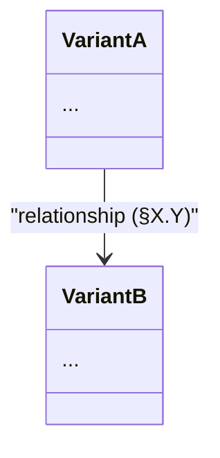

# Contributing Guidelines

This document describes the conventions for articles, proofs, and code in this repository.

## Article Structure

### Formal Articles (Finished)

Formal articles follow a consistent structure:

1. **Title**: Descriptive title starting with "Formal Verification of..."
2. **Author Info**: Name, affiliation, email, GitHub
3. **Abstract**: Wrapped in `<div align="justify"><p style="text-align: justify">`
4. **Numbered Sections**: 1. Introduction, 2. Preliminaries, 3. Main Content, etc.
5. **Mathematical Proofs**: LaTeX notation with step-by-step derivations
6. **Stainless Code**: Formal verification code alongside the math
7. **References**: HTML anchors with links to companion articles

### Draft Articles

- Prefix filename with `draft-` (e.g., `draft-sieve-foundation.md`)
- Same structure as formal articles
- Remove prefix when article is finalized

### Example Structure

```markdown
# Formal Verification of [Topic] from First Principles

**Author:** Mata, T. H.
Independent Researcher  
**Email:** [email](mailto:email)  
**GitHub:** [@thiagomata](https://github.com/thiagomata)

## Abstract

<div align="justify">
<p style="text-align: justify">
...
</p>
</div>

## 1. Introduction

This article verifies:

- Property group A — §3
- Property group B — §3
- Property group C — §4

## 2. Preliminaries

## 3. [Main Content]

### 3.1 First Definition

### 3.2 Second Definition



## 4. Conclusion

## 5. Future Work

## References

<a name="ref1" id="ref1" href="#ref1">[1]</a>
...
```

## Directory Structure

Articles mirror the code chapter layout:

```
articles/
  chapter2/   modulo.md            (depends on nothing)
  chapter3/   list.md              (depends on ch2)
  chapter4/   cycle.md             (depends on ch2, ch3)
              integral.md          (depends on ch3)
              integral-cycle.md    (depends on ch2, ch3, ch4)
  chapter5/   euclid-theorem.md    (depends on ch2, ch3, ch4)
  chapter6/   sieve-sequence.md    (depends on ch2, ch3, ch4)
              gap-dynamics.md
  deprecated/
  learnings/
```

Dependencies flow forward: an article in chapter N may only reference articles in chapters < N.

## Cross-Referencing Rules

### Direction

- **Only reference prerequisites** (articles you build on)
- **Never reference dependents** (articles that build on you)

This follows standard academic convention where citations flow forward in time.

### Format

- Use formal citations in References section for prerequisites
- Use informal "companion article" language for forward mentions (optional)

### Future Work Section

- Mention research areas generally
- Do not cite specific upcoming articles

**Correct:**
> Applications to prime sieving remain valuable research directions.

**Incorrect:**
> See the companion article [5] for sieve foundations.

## Article Quality Checklist

Every article must pass these checks before publication:

1. **Compact group list** — End of the Introduction contains a short bullet list
   of property groups with section numbers, replacing any standalone Properties
   Index table at the top of the article.

2. **Per-chapter bullet summaries** — Each content chapter opens with a framing
   prose sentence followed by a bullet list summarizing the lemmas in that chapter.
   No chapter starts with a bare bullet point.

3. **No meta-labels** — The words "Intuition:", "Why This Matters:", and "Proved:"
   are writing guides for the author, not article text. The content under them
   should stand as natural prose. This also covers the "Population:",
   "Scope and quantifier:", and "Status:" triplet some notes have used as a
   subsection preamble — it is a drafting checklist, not a template to
   publish. See PROOF_GUIDE.md's "Anti-Pattern: Labeled Blocks Are Not Prose"
   for a worked before/after example.

4. **No ticket references** — Articles are self-contained. Never reference ticket
   files, "the companion ticket", or "ticket XYZ".

5. **No forward references or future-facing framing** — An article in chapter N
   may cite articles in chapters < N. It may reference established mathematical
   concepts (Eratosthenes' sieve, Chinese Remainder Theorem) but never this
   project's own later chapters. Avoid abstract, introduction, and conclusion
   prose that justifies the article by what it will support later, such as
   "used by later sieve proofs" or "needed downstream." The article should stand
   on the definitions and properties it proves now. Future Work sections are the
   only place for future directions, and even there they should discuss
   mathematical extensions rather than repository sequencing.

6. **Conclusion completeness** — Every property from the intro group list appears
   in the conclusion math block. The prose count matches the actual number of
   verified properties. No duplicates.

7. **List cons and concatenation notation** — Use `h :: t` when the left side is
   a single element and the right side is a list. Use
   `A \mathbin{\texttt{++}} B` only when both sides are lists. In prose and code
   backticks, plain `++` is acceptable for Scala list append. In article math,
   avoid singleton-list construction such as `[x]`, `[e]`, or `[L_t]` when the
   expression is really cons or insertion; prefer `x :: L_e`,
   `e :: suffix`, or `A \mathbin{\texttt{++}} (e :: B)`. Display lists such as
   `[v_0,\dots,v_{n-1}]` and set-builder/range lists remain fine.

8. **Standard references** — When citing Eratosthenes' sieve or the Chinese
   Remainder Theorem, use Hardy & Wright (1979), *An Introduction to the Theory
   of Numbers* (5th ed.), §5.4 and §15.1.

9. **OBJECTS.md parity** — Significant verified lemmas, helpers, and
   properties listed in OBJECTS.md should appear in the article. If one is
   intentionally omitted, flag it as a known gap.

10. **Proof-code embedding** — Follow the `cycle.md` pattern: article sections
    keep prose, math, and source links. Small inline Scala blocks are fine when
    they show the core idea with a good signal/noise ratio. Longer proof bodies
    belong in an appendix only when they are worth keeping close to the article;
    otherwise link to the source. Any Scala code excerpt placed in an appendix
    must include a nearby Markdown source link to the repository file that owns
    the maintained proof. The same applies to source excerpts kept in the main
    body: include a nearby source link before or immediately after the block.
    When prose points to an appendix item, verify the item number still matches
    the current appendix.

11. **Preliminaries over dependency maps** — Prefer a plain `## 2.
    Preliminaries` section with prose and prerequisite links. Do not add ASCII
    arrow dependency diagrams such as "Prerequisite Structure" blocks to
    articles.

12. **No coding-strategy sections** — Articles should explain the mathematics,
    definitions, verified properties, and source-backed proof code. Solver
    tactics, cache behavior, verification workflow, and coding-strategy
    discoveries belong in `LEARNINGS.md` or tickets, not as article sections.

13. **No tutorial voice for verification mechanics** — Do not write article
    prose like "the `.holds` annotation tells Stainless..." or explain basic
    verifier mechanics as if teaching the tool. State the theorem or property
    established by the source proof. This does not mean hiding formal
    verification: when a property has been formally verified, say so clearly in
    the abstract, introduction, conclusion, and verification reference. Formal
    verification is part of the result; only low-level tool mechanics should
    stay out of the article narrative.

14. **Inline math uses math spans** — Use `$...$` for mathematical prose such
    as $d \cdot d \le d \cdot q = n$, $d^2 \le n$, and
    $\text{mod}(n,d)=0$. Reserve backticks for code identifiers, source
    expressions, and literal Scala syntax. Do not use unsupported LaTeX macros
    such as `\operatorname`; use `\text{...}` or established infix notation
    instead. For strict comparisons, avoid compact raw forms such as `a<b` or
    `x<N` in article math because `<b` or `<N` can be read as HTML-like markup
    by GitHub or VS Code. Write spaced raw comparisons such as `a < b`, or use
    `\lt` and `\gt` when spacing would make the expression awkward.

15. **Definition vs equality notation** — Use `:=` in article math only when
    introducing a definition, local alias, or notation convention, such as
    $S := \text{DivMod}(a,b,0,a).\text{solve}$ or
    $\text{sum}(L) := \cdots$. Use `=` for mathematical equalities, theorem
    statements, and proof derivation steps. Do not use `:=` merely because the
    line appears near a definition; it should mean "is defined as."

16. **Math-first theorem articles** — The main body of a theorem article should
    present the mathematical argument and then state where the property is
    verified in source. Do not write the article as a Scala source walkthrough;
    put code excerpts in an appendix only when they add high-signal context.

17. **Helper lemmas as properties** — When helper lemmas matter to the
    article, give them property names, mathematical statements, proof blocks,
    and source references. Do not present them as code-name inventory bullets
    with "used to..." descriptions.

18. **Properties before methods** — Article sections are organized around
    mathematical properties. Source methods are verification references for
    those properties, not first-class subjects of the prose.

19. **Conclusion and future work prose** — Conclusion and future-work sections
    should close the article in prose. Avoid simple bullet lists that merely
    restate completed tasks or name possible next projects. The conclusion
    must synthesize what was proven and why it matters, then bring back the
    core proved properties and proof structure in mathematical form. Include a
    compact math recap of the main theorem, definitions, and supporting
    properties that the article established, following the `list.md`,
    `integral-cycle.md`, and `euclid-theorem.md` pattern: one property (or a
    small group of directly related rows, such as a shift law's `mod` and
    `div` forms) per `` ```math `` block, each row ending in a trailing
    `&&\text{[Property Name]}` label naming that row's property — the same
    double-ampersand label syntax as PROOF_GUIDE.md's proof-step labels, but
    naming the property itself rather than justifying a derivation step (see
    PROOF_GUIDE.md's "Labels" section). Keep each block scoped to one property
    group rather than merging unrelated properties into a single shared
    `\begin{aligned}` environment: KaTeX/MathJax size every row's `&` column
    to the widest row sharing that environment, so packing a short one-line
    identity next to a long nested-parentheses identity stretches the short
    row to the long row's width — fine on screen (which can scroll
    horizontally) but liable to overflow a printed or exported page (which
    cannot).
    Future work should explain the next mathematical directions and their
    relationship to the article's scope.

20. **Mermaid diagrams** — For multi-variant definitions (cycle, integral),
    include a Mermaid `classDiagram` block after the intro bullets showing
    classes, key fields, and relationships with section references on the arrows.
    Use `name: Type` for fields, `method(Type) ReturnType` for methods (Mermaid
    auto-adds the `:` before return types, so omit it in source).

21. **Layering** — Each article stands alone within its chapter. It may cite
    earlier-chapter articles and other repo files as prerequisites. Link with
    an absolute GitHub URL once the target already exists on `master`:
    `https://github.com/thiagomata/prime-numbers/blob/master/<path>` for text
    links (append `#anchor` for a specific symbol/section), and
    `https://raw.githubusercontent.com/thiagomata/prime-numbers/master/<path>`
    for images, so they keep rendering inline. Use a relative path
    (`../chapterN/file.md`) only while the target exists solely on the
    current feature branch and not yet on `master`; convert it to the
    absolute form once the branch merges. It must not contain forward
    dependencies on later chapters' code constructs.

22. **AGENTS.md rules** — The `three-representations`, `framing-integrity`,
    `property-completeness`, and `no-ticket-references` rules in AGENTS.md
    apply to all articles.

23. **Section numbering** — Use standard chapter.section numbering (e.g., `3.1`,
    `4.2`). Never use letter suffixes (`4.3a`). Never nest deeper than two levels
    (i.e., `## Chapter`, `### Section`; no `#### 5.2.3.1`).

24. **No status columns in tables** — Property summary tables contain only
    verified facts; the default assumption is verification. Do not include
    `[Verified]`, `[Open]`, or `[Unverified]` markers in table columns.
    Open or unverified items belong in Future Work or a dedicated "Unproven
    Prerequisites" section. Never publish verification-condition counts
    (`36/36 VCs`, `11472/11472 VCs`) in articles — those belong in
    `logs/verify.log` only. A concise appendix may confirm that the described
    properties verify and link to the log for readers who want to inspect it.
    This also covers repeated per-property status tags outside tables (e.g.
    "**Mathematically proved, Stainless verification pending**" stamped after
    every property) — see VOCABULARY.md's Evidence and Proof Status list for
    how to state verification status once, as a plain fact, rather than as a
    recurring disclaimer. A note that never claims full Stainless verification
    does not need to apologize for that in every section.

25. **Voice and style match the earliest articles** — See PROOF_GUIDE.md's
    "Voice and Style" section: first person plural ("we prove"), close proofs
    with `\blacksquare`/`[Q.E.D.]` rather than `\boxed{...}`, bold for defining
    a term once rather than labeling every claim, sentence case for inline
    concept names in prose (headers and citation labels keep Title Case, per
    existing convention), and varied rather than formulaic contrastive
    phrasing. This applies to every article, including version drafts and
    figure-comparison drafts that aren't literally named `draft-*.md` — the
    "Draft Articles" section above already requires the same structure as
    finished articles; that includes voice.

## README Updates

### When to Add

- After a new lemma is formally verified
- When it represents a "best of the best" result

## Format

Follow the existing section structure:

```markdown
### [Category] Properties

The article [Title](./articles/chapterN/file.md) establishes...

```math
\begin{aligned}
...definitions...
\end{aligned}
```

From these definitions, it mathematically proves and formally verifies the following properties:

```math
\begin{aligned}
...properties with labels...
\end{aligned}
```
```

## Creating Verifiable Proofs

For detailed guidance on writing mathematical proofs with Stainless verification, 
see [PROOF_GUIDE.md](./PROOF_GUIDE.md).

## Testing and Verification Policy

Every piece of code in this repository — Scala or otherwise — must be **tested
or verified**. Writing the code is not enough; one of the two must actually
pass before the work counts as done.

1. **Lemmas and properties** (anything with a `.holds` target under
   `src/main/scala/`) must be **verified**, not merely written. A lemma only
   counts once `just verify` (or `just verify functionName`) passes green for
   it — see `AGENTS.md`'s `green-to-green` rule. If Stainless verification for
   a lemma is impractical (known timeout, cross-instance call blowup per
   `LEARNINGS.md` §19), fall back to an empirical Scala runner (`LEARNINGS.md`
   §16.1) or mark it explicitly as unverified per `property-completeness` rule
   8 — do not leave it silently unchecked either way.
2. **Everything else** — Scala helpers with no `.holds` target, and all
   non-Scala code (Python figure/data scripts, shell scripts, etc.) — must
   have **unit tests**. A script that checks generated output against expected
   values (e.g. `figures/verify.py`) verifies the *data*, not the *code*; it is
   not a substitute for unit tests of the code's own logic (rendering,
   encoding, parsing, helper functions). Both are needed where both apply.
3. Code with neither a passing verification nor a passing test is not done.
   Do not merge or publish it as if it were.

Both rules below apply to **touched code**: any method or variable you add or
modify must comply, even if the surrounding file predates the rule and is not
yet compliant elsewhere. Do not use "the rest of the file already looks like
this" as a reason to add a new violation; do not go out of your way to fix
unrelated pre-existing violations in the same change either — bring only what
you touch into compliance.

1. **Javadoc on every method** — Every method, `def`, and lemma in
   `src/main/scala/` must have a javadoc comment stating what it does (and,
   for lemmas, what property it establishes). Use plain ASCII math notation
   per `AGENTS.md`'s `javadoc-math` rule — no LaTeX. A method with only a
   name and no javadoc is not done; add the comment in the same change that
   introduces the method, not as follow-up cleanup.
2. **No one-letter variable names** — except conventional loop/math indices
   (`i`, `j`, `k` for loop counters; `n`, `p`, `q`, `d`, `a`, `b` for the
   mathematical quantities they conventionally denote — count, prime,
   quotient, divisor, and the two operands of a binary operation such as
   `gcd(a, b)` or `mod(a, b)`), plus `x`, `y`, `w`, `h`, `r` in graphics/SVG
   code for the coordinate, width/height, and radius they conventionally
   denote. Anything else — accumulators, intermediate results, function
   parameters, collected lists — needs a name that says what it holds
   (`survivors`, not `s`; `gapCycle`, not `g`). A letter reused for a
   different meaning than its conventional one (e.g. `r` for a row index
   rather than a radius) does not qualify for the exception and should be
   spelled out. This applies to Scala, Python, and any other code in the
   repository.
