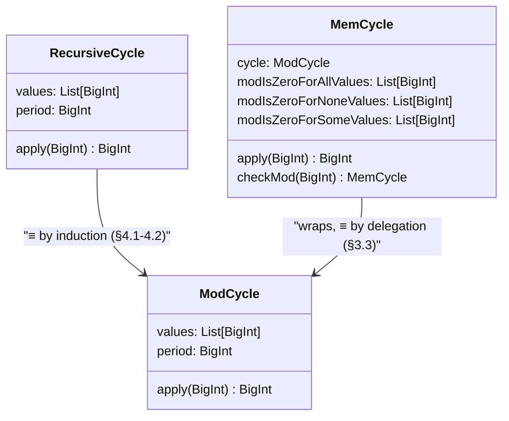

# Formal Verification of Cyclic Lists

**Author:** Mata, T. H.
Independent Researcher  
**Email:** [thiago.henrique.mata@gmail.com](mailto:thiago.henrique.mata@gmail.com)  
**GitHub:** [@thiagomata](https://github.com/thiagomata)

## Abstract

<div align="justify">
<p style="text-align: justify">
In previous articles, we defined bounded Lists and Integrals of <code>BigInt</code>
from scratch, relying only on core type constructs and recursion, 
with no prior knowledge of Scala's collections required.
From that, we proved and formally verified some properties related to them as size, append, concat,
slice and sum.
This article uses that as a foundation to define Cycles — unbounded List of Integers
created from a bounded List, where the values of the Cycle are the values of the
List in repetition using recursion.
Then, we formally defined and verified key properties such as
cycle equivalence between definitions, element access via modular indexing, and periodic invariance
using the Stainless verification system. 
All properties are expressed and proved within a minimal framework using only elementary arithmetic,
recursion, and pure Scala code.
This work bridges mathematical foundations and executable verification, 
offering a self-contained, verifiable approach of modular arithmetic.
 </p>
</div>

## 1. Introduction

Unbounded lists in cycles, are a fundamental concept in computer science and mathematics, often used to model
repetitive structures or processes. They can be thought of as infinite lists that repeat a finite sequence of elements.

```math
L = [x_0, x_1, x_2, \ldots, x_{n-1}]  \mid x_n \in 𝕊, L \in 𝕃\\
\text{Cycle}(L) = [x_0, x_1, x_2, \ldots, x_{n-1}, x_0, x_1, \ldots] \\
```

In this article, we present discrete definition of Cycle
operations over finite integer lists, defined recursively and verified some of
its properties using the Stainless system.
Our approach follows a zero-prior-knowledge philosophy, building on a previously
verified foundation for recursive list structure.
The result is a verified, from-scratch implementation of cycle operations,
suitable as a foundation for higher-level numeric reasoning over unbounded lists.

This article verifies:

- Cycle definitions: recursive, modulo, and memory — §3
- Equivalence: recursive and modulo produce identical values at every position — §4
- Element access: modular indexing, small-position direct lookup — §5
- Periodic invariance: value unchanged by adding cycle-period multiples — §5
- Mod propagation: remainder computed from base-cycle values — §5
- Repeated-cycle invariance: repeating the base list preserves all lookups — §5
- Cycle value positivity: all values ≥ 0 at every position — §5
- Cycle rotation: rotates base list, shifts index — §5

## 2. Preliminaries

We reuse several basic list operations and their verified properties from the companion articles
[Using Formal Verification to Prove Properties of Lists Recursively Defined](https://github.com/thiagomata/prime-numbers/blob/master/articles/chapter3/list.md) [[1]](#ref1)
and [Formal Verification of Discrete Integration Properties from First Principles](https://github.com/thiagomata/prime-numbers/blob/master/articles/chapter4/integral.md) [[2]](#ref2).

These articles also defined and verified their properties using the same zero-prior-knowledge methodology,
and are treated here as foundational primitives.

### List Definitions and Properties

For any list $L$ of numeric values $x_i \in 𝕊$ where $𝕊$ is a set of all numeric values,
$𝕃$ is the the set of all lists,
and $n$ is the size of the list, we define:

```math
\begin{aligned}
L_{e} & \in 𝕃 \\
L_{e} & = [] \\
\end{aligned}
```

```math
\begin{aligned}
&\text{ head } &\in 𝕊 \\
&\text{ tail } &\in 𝕃 \\
&L_{node}(\text{head}, \text{tail}) \in 𝕃_{node} \\
\end{aligned}
```

```math
\begin{aligned}
&𝕃 &= \{ L_e \}  \cup \{ L_{node}(\text{head}, \text{tail}) &\mid \text{head} \in 𝕊,\ \text{tail} \in 𝕃 \} \\
\end{aligned}
```

```math
\begin{aligned}
L = [x_0, x_1, \dots, x_{n-1}] \in 𝕊^n \\
\end{aligned}
```

```math
\begin{aligned}
& &\text{size}(L) &:= \begin{cases}
0 & \text{ if } L = L_{e} \\
1 + \text{size}(tail(L)) & \text{otherwise} \\
\end{cases} \\
& &sum(L) &:= \begin{cases}
0 & \text{if } L = L_e \\
head(L) + sum(tail(L)) & \text{otherwise} \\
\end{cases} \\
\end{aligned}
```

```math
\begin{aligned}
|L| > 0 &\implies &\text{last}(L) &:= \begin{cases}
\text{head}(L) & \text{if } |L| = 1 \\
\text{last}(\text{tail}(L)) & \text{otherwise} \\
\end{cases} \\
|L| > 0 &\implies &\text{slice}(L, f, t) &:=  \begin{cases}
[ L_j ] & \text{if } f = t \\
\text{slice}(L, f, t - 1) \mathbin{\texttt{++}} [ L_t ] & \text{if } f < t \\
\end{cases}
\end{aligned}
\forall \ f, t \in ℕ \text{ where } 0 \leq f \leq t \\
```

```math
\begin{aligned}
&A \mathbin{\texttt{++}} B &:= \begin{cases}
B & \text{if } A = L_e \\
L_{node}(head(A), tail(A) \mathbin{\texttt{++}} B) & \text{otherwise} \\
\end{cases} \\
\end{aligned}
```

```math
\begin{aligned}
\forall \ L, A, B \in  𝕃 \\
\end{aligned}
```

From these definitions, the authors [[1]](#ref1) mathematically proves and formally verifies the following properties of lists:

```math
\begin{aligned}
&\forall\, L, A, B \in  𝕃,\quad &\forall\, v \in 𝕊,\quad &\forall\, i, f, t \in ℕ \\
\end{aligned}
```

```math
\begin{aligned}
f > t, \quad 0 \leq i < |L|\\
\\
\end{aligned}
```

```math
\begin{aligned}
&|L| &> 0 &\implies \text{tail}(L) &= &L[x_1, x_2, \dots, x_{n-1}] \quad &\text{[Tail Identity]} \\
&|L| &> 0 &\implies L_{0} &= &\text{ }\text{head}(L) \quad &\text{[Head Identity]} \\
&|L| &> 0 &\implies L_{|L|-1} &= &\text{ }\text{last}(L) \quad &\text{[Last Element Identity]} \\
&|L| - 1 &> i > 0 &\implies L_i &= &\text{ }\text{tail}(L)_{i-1} \quad &\text{[Access Tail Shift Left]} \\
&|L| - 2 &> i > 1 \text{ } &\implies \text{tail}(L)_i &= &L_{i+1} \quad &\text{[Access Tail Shift Right]} \\
\end{aligned}
```

```math
\begin{aligned}
&|L| &= &\text{size}(L)                        \quad &\text{[Size Identity]} \\
&\sum L &= &\text{sum}(L)                      \quad &\text{[Sum matches Summation]} \\
&\sum (v :: L) &= &v + \sum L                 \quad &\text{[Left Append Preserves Sum]} \\
&\sum (A \mathbin{\texttt{++}} B) &= &\sum A + \sum B              \quad &\text{[Sum over Concatenation]} \\
&\sum (A \mathbin{\texttt{++}} B) &= &\sum (B \mathbin{\texttt{++}} A)                 \quad &\text{[Commutativity of Sum over Concatenation]} \\
&L[f \dots t] &= &L[f \dots {(t - 1)}] \mathbin{\texttt{++}} [L_t] \quad &\text{[Slice Append Consistency]} \\
\end{aligned}
```

## 3. Cycle Definitions

Building on the definitions and properties of lists, we now define Cycles.

A Cycle is an unbounded list that repeats a finite sequence of elements from a bounded list.
In this study, we restrict our universe of values $𝕊$ to be the set of non-negative integers, i.e., $𝕊 = ℕ_0$.

- Recursive: values at $i$ where $i < n$ come from the base list, otherwise recurse on $i - n$ — the definitional spec
- Modulo: values come directly from the base list at position $i \bmod n$ — efficient access
- Memory: wraps ModCycle, adds classification tracking via `checkMod(d)` — remembers which divisors produce all-zero, some-zero, or none-zero residue patterns



### 3.1 Recursive Cycle

```math
\begin{aligned}
\forall \ L \in  𝕃, \quad \forall \ v &\in ℕ_0,\quad \forall \ i \in ℕ_0 \\
L &:= [v_0, v_1, \dots, v_{n-1}] \in ℕ_0^n \\
n &= |L| \\
\text{RecCycle}_i &= \begin{cases}
L_i & \text{if } i < n \\
\text{RecCycle}_{i - n} & \text{if } i \geq n \\
\end{cases} \ , |L| > 0 \\
\therefore \\
RecCycle &= [v_0, v_1, \dots, v_{n-1}, v_0, v_1, \dots] \\
\end{aligned}
```

The recursive cycle is defined at [RecursiveCycle](https://github.com/thiagomata/prime-numbers/blob/master/src/main/scala/v1/chapter4/cycle/recursive/RecursiveCycle.scala):

```scala
case class RecursiveCycle(values: List[BigInt]) {
  require(values.nonEmpty)
  require(CycleUtils.checkPositiveOrZero(values))

  def period: BigInt = values.size

  def apply(position: BigInt): BigInt = {
    decreases(position)
    require(position >= 0)

    if (position < period) {
      values(position)
    } else {
      apply(position - values.size)
    }
  }
}
```

### 3.2 Modulo Cycle

A Cycle can also be defined using modulo arithmetic, which is a common approach in computer science to handle cyclic structures.

```math
\begin{aligned}
\forall \ L \in  𝕃, \quad \forall \ v &\in ℕ_0,\quad \forall \ i \in ℕ_0 \\
L &:= [v_0, v_1, \dots, v_{n-1}] \in ℕ_0^n \\
n &= |L| \\
\text{ModCycle}_i &= L[i \text{ mod } n] \ , |L| > 0 \\
\therefore \\
\text{ModCycle} &= [v_0, v_1, \dots, v_{n-1}, v_0, v_1, \dots] \\
\end{aligned}
```

The modulo cycle is defined at [ModCycle](https://github.com/thiagomata/prime-numbers/blob/master/src/main/scala/v1/chapter4/cycle/mod/ModCycle.scala):

```scala
case class ModCycle(values: List[BigInt]) {
  require(CycleUtils.checkPositiveOrZero(values))
  require(values.nonEmpty)

  def apply(position: BigInt): BigInt = {
    require(position >= 0)
    val index = Calc.mod(position, values.size)
    assert(index >= 0)
    assert(index < values.size)
    values(index)
  }

  def period: BigInt = values.size

  def sum(): BigInt = ListUtils.sum(values)
}
```

### 3.3 Memory Cycle

The third representation, `MemCycle`, wraps a `ModCycle` and adds
classification state: three lists tracking which divisors produce all-zero,
some-zero, or none-zero residue patterns across the cycle's values.

Like ModCycle, positional lookup uses modular indexing; value access delegates
directly to the wrapped ModCycle. Positional equivalence between the two is
immediate by construction: `MemCycle.apply(position)` calls the wrapped
`cycle(position)`, and `MemCycle(values)` constructs that wrapped cycle as
`ModCycle(values)`.

```math
\begin{aligned}
\text{MemCycle}(L)_i
  &= \text{MemCycle}(L).\text{cycle}_i && \text{[By MemCycle.apply]} \\
  &= \text{ModCycle}(L)_i              && \text{[By MemCycle construction]}
\end{aligned}
```

The bounded bridge [
  CycleProperties::assertModCycleEqualsMemCycle
](https://github.com/thiagomata/prime-numbers/blob/master/src/main/scala/v1/chapter4/cycle/properties/CycleProperties.scala)
verifies the same lookup equality over one physical period for a `ModCycle` and
a `MemCycle` sharing the same values and period.

This gives the full equality chain used throughout the article. Section 4
proves that `RecursiveCycle(L)` and `ModCycle(L)` return the same value for
every position. `MemCycle(L)` returns the same values as `ModCycle(L)` by
definition: it stores `ModCycle(L)` and delegates every lookup to it. Therefore,
for every valid position `i`,

```math
\begin{aligned}
\text{RecCycle}(L)_i
  &= \text{ModCycle}(L)_i && \text{[By §4]} \\
  &= \text{MemCycle}(L)_i && \text{[By MemCycle.apply]} \\
\therefore\quad
\text{RecCycle}(L)_i
  &= \text{ModCycle}(L)_i
   = \text{MemCycle}(L)_i && \text{[Three-Way Equality]}
\end{aligned}
```

The cycle is immutable. Calling `checkMod(d)` returns a *new* `MemCycle` with
`d` added to the appropriate classification list. The original is unchanged.
Values are never modified; classification is metadata accumulated across calls.

```scala
case class MemCycle private (
  cycle: ModCycle,
  modIsZeroForAllValues: List[BigInt] = List.empty,
  modIsZeroForNoneValues: List[BigInt] = List.empty,
  modIsZeroForSomeValues: List[BigInt] = List.empty,
) {
  def apply(position: BigInt): BigInt = cycle(position)
  def values: List[BigInt] = cycle.values
  def period: BigInt = cycle.period
  def checkMod(dividend: BigInt): MemCycle = { /* returns new MemCycle */ }
}
```

The memory cycle is defined at [MemCycle](https://github.com/thiagomata/prime-numbers/blob/master/src/main/scala/v1/chapter4/cycle/memory/MemCycle.scala). Classification lemmas are verified in
[CycleCheckMod](https://github.com/thiagomata/prime-numbers/blob/master/src/main/scala/v1/chapter4/cycle/memory/properties/CycleCheckMod.scala).

## 4. Cycle Equivalence

Both definitions produce the same sequence of values. We prove this by induction on the position $i$.

- Base case ($i < n$): both definitions consult the base list directly at the same position
- Inductive step ($i \geq n$): the recursive definition reduces to $i - n$, wrapping to the same modulo position

```math
\begin{aligned}
\forall \ L \in  𝕃, \quad \forall \ v &\in ℕ_0,\quad \forall \ i \in ℕ_0 \\
L &:= [v_0, v_1, \dots, v_{n-1}] \in ℕ_0^n \\
n &= |L| \\
\text{ModCycle}_i &= L[i \text{ mod } n] \ , |L| > 0 \\
\text{RecCycle}_i &= \begin{cases}
L_i & \text{if } i < n \\
\text{RecCycle}_{i - n} & \text{if } i \geq n \\
\end{cases} \ , |L| > 0 \\
\end{aligned}
```

### 4.1 Base Case ($i < n$)

When the position is within the first cycle, both definitions return the list element directly.

```math
\begin{aligned}
i < n \implies i \text{ mod } n &= i                  \quad &\text{[Trivial Mod For Small Dividend]} \\
\text{ModCycle}_i &= L_{(i \text{ mod } n)}           \quad &\text{[ModCycle Definition]} \\
                  &= L_i                              \quad &\text{[Since } i < n \text{, } i \text{ mod } n = i \text{]} \\
\text{RecCycle}_i &= L_i                              \quad &\text{[Since } i < n \text{, by RecCycle Definition]} \\
\therefore \\
i < n \implies\text{ModCycle}_i &= \text{RecCycle}_i  \quad \blacksquare  &\text{[Q.E.D.]} \\
\end{aligned}
```

The lemma [Trivial Mod for Small Dividend](https://github.com/thiagomata/prime-numbers/blob/master/articles/chapter2/modulo.md#61-trivial-case) was proved and verified in the article [Division and Modulo from Recursive Normalization](https://github.com/thiagomata/prime-numbers/blob/master/articles/chapter2/modulo.md) [[3]](#ref3).

This property is verified in the [
RecursiveCycleMatchesModCycle::assertCycleAndRecursiveCycleMathForSmallValues
](https://github.com/thiagomata/prime-numbers/blob/master/src/main/scala/v1/chapter4/cycle/recursive/properties/RecursiveCycleMatchesModCycle.scala). The full Scala verification code is in Appendix A.1.

### 4.2 Inductive Step ($i \geq n$)

For positions beyond the first cycle, both definitions reduce the position by the cycle period and rely on the inductive hypothesis.

```math
\begin{aligned}
\text{ModCycle}_{(i - n)}           &= \text{RecCycle}(i - n)   \quad &\text{[By Induction Hypothesis]} \\
i \geq n \implies i \text{ mod } n  &= (i - n) \text{ mod } n  \quad &\text{[Quotient Invariance Under Linear Shift]} \\
\text{ModCycle}_i   &= L_{(i \text{ mod } n)}        \quad &\text{[ModCycle Definition]} \\
                    &= L_{((i - n) \text{ mod } n)}  \quad &\text{[Since } i \geq n \text{, } i \text{ mod } n = (i - n) \text{ mod } n \text{]} \\
                    &= \text{ModCycle}_{(i - n)}     \quad &\text{[By Definition]} \\
                    &= \text{RecCycle}_{(i - n)}     \quad &\text{[By Substitution]} \\
\text{RecCycle}_{i} &= \text{RecCycle}_{(i - n)}     \quad &\text{[By RecCycle Definition]} \\
                    &= \text{ModCycle}_{i}           \quad &\text{[By Substitution]} \\
\therefore \\
i \geq n \implies \text{ModCycle}_i &= \text{RecCycle}_i  \quad \blacksquare &\text{[Q.E.D.]} \\
\end{aligned}
```

The lemma [Quotient Invariance Under Linear Shift](https://github.com/thiagomata/prime-numbers/blob/master/articles/chapter2/modulo.md#65-quotient-invariance-under-linear-shift) was proved and verified in the article [Division and Modulo from Recursive Normalization](https://github.com/thiagomata/prime-numbers/blob/master/articles/chapter2/modulo.md) [[3]](#ref3).

This property is verified in the [
RecursiveCycleMatchesModCycle::assertCycleAndRecursiveCycleMathForAnyValues
](https://github.com/thiagomata/prime-numbers/blob/master/src/main/scala/v1/chapter4/cycle/recursive/properties/RecursiveCycleMatchesModCycle.scala). The full Scala verification code is in Appendix A.2.

## 5. Cycle Properties

In this section, we prove and verify the main properties of Cycles. Each
property is stated mathematically, then shown to hold via a corresponding
verified lemma in Scala using the Stainless system.

- Element access: `cycle(key) == cycle.values(mod(key, period))` — §5.1
- Small-value direct lookup: `key < period ⇒ cycle(key) == cycle.values(key)` — §5.2
- Periodicity: `cycle(key) == cycle(key + period·m)` for any number of loops — §5.3
- Multi-loop consistency: value at `key` is independent of which multiple of the period is added — §5.4
- Mod propagation: remainder modulo `d` at any position equals remainder at the base position — §5.5
- Repeated-cycle invariance: repeating the base list preserves all lookups — §5.6
- Value positivity: non-negative base values guarantee non-negative cycle values — §5.7
- Rotation: rotating the base list shifts the cycle index by the same amount — §5.8
- MemCycle-level restatements: the key access and modulo properties are also verified directly for the memory-backed representation — §5.9

### 5.1 Cycle Element Access

The value of any element in a cycle equals the value of the underlying list at the position modulo the cycle period.

```math
\begin{aligned}
\forall \ L \in  𝕃, \quad \forall \ v &\in ℕ_0,\quad \forall \ i \in ℕ_0 \\
L &:= [v_0, v_1, \dots, v_{n-1}] \in ℕ_0^n, |L| > 0 \\
Cycle &:= [v_0, v_1, \dots, v_{n-1}, v_0, v_1, \dots] \\
n &= |L| \\
\text{ModCycle}_i &= \text{Cycle}_i \quad &\text{[Cycle Equivalence]} \\
\text{ModCycle}_i &= L[i \text{ mod } n]  \quad &\text{[ModCycle Definition]} \\
\therefore \\
\text{Cycle}_i &= L[i \text{ mod } n]  \quad  \blacksquare \quad &\text{[Q.E.D]} \\
\end{aligned}
```

The [Cycle Equivalence](#4-cycle-equivalence) property was proved and verified in Section 4.

This property is verified in the [
CycleProperties::findValueInCycle
](https://github.com/thiagomata/prime-numbers/blob/master/src/main/scala/v1/chapter4/cycle/properties/CycleProperties.scala). The full Scala verification code is in Appendix A.3.

### 5.2 Small Value in Cycle

For positions smaller than the cycle period, the cycle value equals the list value at that position directly.

```math
\begin{aligned}
\forall \ L \in  𝕃, \quad \forall \ v &\in ℕ_0,\quad \forall \ i \in ℕ_0 \\
L &:= [v_0, v_1, \dots, v_{n-1}] \in ℕ_0^n, |L| > 0 \\
Cycle &:= [v_0, v_1, \dots, v_{n-1}, v_0, v_1, \dots] \\
n &= |L| \\
\text{ModCycle}_i &= \text{RecCycle}_i = \text{Cycle}_i \quad &\text{[Cycle Equivalence]} \\
i < n \implies \text{RecCycle}_i &= L_i \quad &\text{[RecCycle Definition]} \\
\therefore \\
i < n \implies \text{Cycle}_i &= L_i  \quad  \blacksquare \quad &\text{[Q.E.D]} \\
\end{aligned}
```

The [Cycle Equivalence](#4-cycle-equivalence) property was proved and verified in Section 4.

This property is verified in the [
CycleProperties::smallValueInCycle
](https://github.com/thiagomata/prime-numbers/blob/master/src/main/scala/v1/chapter4/cycle/properties/CycleProperties.scala). The full Scala verification code is in Appendix A.4.

### 5.3 Value Match After Many Loops

Cycle values remain invariant when adding any multiple of the cycle period to the access key.

```math
\begin{aligned}
\forall \ L \in  𝕃, \quad \forall \ v &\in ℕ_0,\quad \forall \ i, m \in ℕ \\
L &:= [v_0, v_1, \dots, v_{n-1}] \in ℕ_0^n, |L| > 0 \\
Cycle &:= [v_0, v_1, \dots, v_{n-1}, v_0, v_1, \dots] \\
n &= |L| \\
(i + n \cdot m) \text{ mod } n &= i \text{ mod } n  \quad  &\text{[Quotient Invariance Under Linear Shift by Multiplier]} \\
\text{ModCycle}_i &= \text{RecCycle}_i = \text{Cycle}_i \quad &\text{[Cycle Equivalence]} \\
\text{ModCycle}_{(i + n \cdot m)} &= L[(i + n \cdot m) \text{ mod } n] \quad &\text{[ModCycle Definition]} \\
\text{ModCycle}_i &= L[i \text{ mod } n] \quad &\text{[Substitution]} \\
\therefore \\
\text{Cycle}_{(i + n \cdot m)} &= L[i \text{ mod } n]  \quad  \blacksquare \quad &\text{[Q.E.D]} \\
\end{aligned}
```

The lemma [Quotient Invariance Under Linear Shift](https://github.com/thiagomata/prime-numbers/blob/master/articles/chapter2/modulo.md#65-quotient-invariance-under-linear-shift) and its multiplier variant were proved and verified in [Division and Modulo from Recursive Normalization](https://github.com/thiagomata/prime-numbers/blob/master/articles/chapter2/modulo.md) [[3]](#ref3).

This property is verified in the [
CycleProperties::valueMatchAfterManyLoops
](https://github.com/thiagomata/prime-numbers/blob/master/src/main/scala/v1/chapter4/cycle/properties/CycleProperties.scala). The full Scala verification code is in Appendix A.5.

### 5.4 Two Multiples of Cycle Size

When two different multiples of the cycle period are added to the key, the cycle value remains consistent between both.

```math
\begin{aligned}
\forall \ L \in  𝕃, \quad \forall \ v &\in ℕ_0,\quad \forall \ i, m_1, m_2 \in ℕ \\
L &:= [v_0, v_1, \dots, v_{n-1}] \in ℕ_0^n, |L| > 0 \\
Cycle &:= [v_0, v_1, \dots, v_{n-1}, v_0, v_1, \dots] \\
n &= |L| \\
\text{ModCycle}_i &= \text{RecCycle}_i = \text{Cycle}_i \quad &\text{[Cycle Equivalence]} \\
\text{ModCycle}_{(i + n \cdot m_1)} &= L[ i \text{ mod } n] \quad &\text{[Value Match After Many Loops]} \\
\text{ModCycle}_{(i + n \cdot m_2)} &= L[ i \text{ mod } n] \quad &\text{[Value Match After Many Loops]} \\
\therefore \\
\text{Cycle}_{(i + n \cdot m_1)} &= \text{Cycle}_{(i + n \cdot m_2)} = L[ i \text{ mod } n ] \quad \blacksquare \quad &\text{[Q.E.D]} \\
\end{aligned}
```

This property is verified in the [
CycleProperties::valueMatchAfterManyLoopsInBoth
](https://github.com/thiagomata/prime-numbers/blob/master/src/main/scala/v1/chapter4/cycle/properties/CycleProperties.scala). The full Scala verification code is in Appendix A.6.

### 5.5 Propagate Modulo from Value to Cycle

The modulo operation applied to a cycle value can be equivalently applied to the
underlying list value at the modular index. Since the previous sections prove
that the cycle representations agree at every position, we can use the modulo
cycle definition directly: cycle lookup first reduces the position to
`i mod n`, and taking a remainder by any positive divisor `d` preserves that
same base-position reduction.

```math
\begin{aligned}
\forall \ L \in  𝕃,\quad \forall \ i \in ℕ,\quad \forall \ d \in ℕ^+ \\
L &:= [v_0, v_1, \dots, v_{n-1}] \in ℕ_0^n, |L| > 0 \\
Cycle &:= [v_0, v_1, \dots, v_{n-1}, v_0, v_1, \dots] \\
n &= |L| \\
\text{Cycle}_i
  &= \text{ModCycle}_i &&\text{[Cycle Equivalence]} \\
  &= L_{i \bmod n} &&\text{[ModCycle Definition]} \\
\therefore \\
\text{Cycle}_i \bmod d
  &= L_{i \bmod n} \bmod d \quad \blacksquare &&\text{[Substitution, Q.E.D.]}
\end{aligned}
```

This property is verified in the [
CycleProperties::propagateModFromValueToCycle
](https://github.com/thiagomata/prime-numbers/blob/master/src/main/scala/v1/chapter4/cycle/properties/CycleProperties.scala). The
related idempotence restatement, `cycle(position) == cycle(position mod period)`,
is verified in [
CycleProperties::assertCycleOfPosEqualsCycleOfModPos
](https://github.com/thiagomata/prime-numbers/blob/master/src/main/scala/v1/chapter4/cycle/properties/CycleProperties.scala). The full Scala verification code is in Appendix A.7.

### 5.6 Repeated-Cycle Invariance

When a cycle's base list is repeated $x$ times to form a longer physical
period, the values read at every position remain identical. The repeated cycle
is structurally a concatenation of $x$ copies of the original list; the extra
length is invisible at any index because modular indexing composes correctly
across the nested periods.

```math
\begin{aligned}
C &\text{ — original MemCycle}, \quad V = C.\text{values}, \quad n = |V| \\
C_t &\text{ — repeated cycle}, \quad C_t.\text{values} = \text{repeat}(V, t)
  \quad\text{with } t > 0 \\
\text{period} &= t \cdot n
\end{aligned}
```

**Proof:**

```math
\begin{aligned}
C_t(\text{pos}) &= \text{repeat}(V, t)(\text{mod}(\text{pos},\; \text{period}))
  && \text{[MemCycle access via modular index]} \\
  &= V(\text{mod}(\text{mod}(\text{pos},\; t \cdot n),\; n))
  && \text{[Repeated list access pattern]} \\
  &= V(\text{mod}(\text{pos},\; n))
  && \text{[ModOperations::modByPositiveMultipleThenBase]} \\
  &= C(\text{pos})
  && \text{[Original cycle access]} \\
  &\quad\blacksquare && \text{[Q.E.D.]}
\end{aligned}
```

The proof separates construction from lookup. Callers must build a valid
`MemCycle` from the repeated values; this lemma only says that once such a
cycle exists, the larger physical period does not change any lookup.

### Stainless Verification

```scala
def assertRepeatedValuesCycleMatches(
  cycle: MemCycle,
  repeatedCycle: MemCycle,
  times: BigInt,
  position: BigInt
): Boolean = {
  require(times > BigInt(0))
  require(position >= BigInt(0))
  require(cycle.period > BigInt(0))
  require(repeatedCycle.values == ListRepeatProperties.repeat(cycle.values, times))
  // ... inductive proof via mod composition ...
  repeatedCycle(position) == cycle(position)
}.holds
```

This property is verified in the [
MemCycleProperties::assertRepeatedValuesCycleMatches
](https://github.com/thiagomata/prime-numbers/blob/master/src/main/scala/v1/chapter4/cycle/memory/properties/MemCycleProperties.scala).

The same repeated-cycle principle is the foundation for later cycle-integral
reasoning, where repeated gap storage should preserve the integrated values
read from the cycle.

### 5.7 Cycle Value Positivity

When every value in the base list is non-negative, every position in the cycle
returns a non-negative value. This guarantees that cycle lookups never produce
negative numbers, which is essential for integral and gap reasoning.

```math
\begin{aligned}
(\forall x \in L,\ x \geq 0) \;\land\; |L| > 0 \;\implies\; \text{cycle}(\text{pos}) \geq 0
  \quad \text{[Q.E.D.]}
\end{aligned}
```

This property is verified in the [
  CycleProperties::cycleValuePositiveOrZero
](https://github.com/thiagomata/prime-numbers/blob/master/src/main/scala/v1/chapter4/cycle/properties/CycleProperties.scala). The full Scala verification code is in Appendix A.9.

### 5.8 Cycle Rotation

Rotating a cycle's base list by $k$ positions and then accessing index $i$
gives the same value as accessing the original cycle at index $i + k$. This
connects cycle structure directly to the list rotation concept from chapter 3.

```math
\begin{aligned}
\text{cycle.rotateAt}(k)(i) = \text{cycle}(i + k) \quad
\text{for } k \geq 0,\ i \geq 0 \quad \text{[Q.E.D.]}
\end{aligned}
```

This property is verified in the [
  CycleProperties::rotateAtValue
](https://github.com/thiagomata/prime-numbers/blob/master/src/main/scala/v1/chapter4/cycle/properties/CycleProperties.scala). The full Scala verification code is in Appendix A.10.

### 5.9 MemCycle-Level Restatement

Sections 5.1-5.5 state element access, small-value lookup, periodic
invariance, multi-loop consistency, and mod propagation for `ModCycle`.
Since `MemCycle` is the representation actually used elsewhere in the
codebase (it is the one that carries residue-classification metadata), each
of those five properties is independently re-proved directly against
`MemCycle` rather than derived from the `ModCycle` result by delegation:

```math
\begin{aligned}
\text{cycle}(key) &= \text{cycle.values}(key \bmod \text{cycle.period})
  &&\text{[Element Access]} \\
key < \text{cycle.period} &\implies \text{cycle}(key) = \text{cycle.values}(key)
  &&\text{[Small Value Lookup]} \\
\text{cycle}(key) &= \text{cycle}(key + \text{cycle.period} \cdot m)
  &&\text{[Periodic Invariance]} \\
\text{cycle}(key + \text{cycle.period} \cdot m_1) &= \text{cycle}(key + \text{cycle.period} \cdot m_2)
  &&\text{[Multi-Loop Consistency]} \\
(\text{cycle}(key) \bmod d) &= (\text{cycle.values}(key \bmod \text{cycle.period}) \bmod d)
  &&\text{[Mod Propagation]}
\end{aligned}
```

These are verified in the [
  MemCycleProperties::findValueInCycle
](https://github.com/thiagomata/prime-numbers/blob/master/src/main/scala/v1/chapter4/cycle/memory/properties/MemCycleProperties.scala), [
  MemCycleProperties::smallValueInCycle
](https://github.com/thiagomata/prime-numbers/blob/master/src/main/scala/v1/chapter4/cycle/memory/properties/MemCycleProperties.scala), [
  MemCycleProperties::valueMatchAfterManyLoops
](https://github.com/thiagomata/prime-numbers/blob/master/src/main/scala/v1/chapter4/cycle/memory/properties/MemCycleProperties.scala), [
  MemCycleProperties::valueMatchAfterManyLoopsInBoth
](https://github.com/thiagomata/prime-numbers/blob/master/src/main/scala/v1/chapter4/cycle/memory/properties/MemCycleProperties.scala), and [
  MemCycleProperties::propagateModFromValueToCycle
](https://github.com/thiagomata/prime-numbers/blob/master/src/main/scala/v1/chapter4/cycle/memory/properties/MemCycleProperties.scala).

The mod-idempotence identity from §5.5's proof (that `Cycle_i` equals
`Cycle_{(i mod n) mod n}`) has its own `MemCycle` restatement in [
  MemCycleProperties::assertCycleOfPosEqualsCycleOfModPos
](https://github.com/thiagomata/prime-numbers/blob/master/src/main/scala/v1/chapter4/cycle/memory/properties/MemCycleProperties.scala).

## 6. Conclusion

This article presented the definitions and properties of Cycles, a fundamental concept that enables representation of repeating sequences of values. We defined Cycles using two approaches — a recursive definition and a modulo-based definition — and proved their equivalence for all positions. We further verified eight properties: element access via modular indexing, direct access for small positions, invariance under addition of cycle-period multiples, consistency across distinct multiples, modulo propagation from values to cycle access, repeated-cycle invariance, value positivity, and rotation invariance.

```math
\begin{aligned}
&\forall \ L \in  𝕃, \quad \forall \ v \in ℕ_0,\quad \forall \ i, m_1, m_2 \in ℕ_0 \\
L &:= [v_0, v_1, \dots, v_{n-1}] \in ℕ_0^n, |L| > 0 \\
Cycle &:= [v_0, v_1, \dots, v_{n-1}, v_0, v_1, \dots] \\
n &= |L| \\
\end{aligned}
```
```math
\begin{aligned}
\text{RecCycle}_i = \text{ModCycle}_i = \text{MemCycle}_i \quad &\text{[Three-Way Equivalence]} \\
\end{aligned}
```
```math
\begin{aligned}
\text{Cycle}_{(i + n \cdot m)} &= L [i \bmod n] \quad &\text{[Value Match After Many Loops]} \\
\text{Cycle}_{(i + n \cdot m_1)} &= \text{Cycle}_{(i + n \cdot m_2)} \quad &\text{[Two Multiples]} \\
\text{Cycle}_{i} \bmod d &= \text{Cycle}_{(i \bmod n)} \bmod d \quad &\text{[Mod Propagation]} \\
\text{key} < n &\implies \text{Cycle}_\text{key} = L_\text{key} \quad &\text{[Small Value Direct Lookup]} \\
(\forall x \in L,\ x \geq 0) &\implies \text{Cycle}(\text{pos}) \geq 0 \quad &\text{[Cycle Value Positivity]} \\
\text{repeat}(V, x)(\text{pos}) &= \text{Cycle}_\text{pos} \quad \forall x > 0 \quad &\text{[Repeated-Cycle Invariance]} \\
\text{cycle.rotateAt}(k)(i) &= \text{cycle}(i + k) \quad &\text{[Rotation Invariance]} \\
\end{aligned}
```

All properties were formally verified using Scala Stainless, ensuring their correctness and reliability. The full verification code is in Appendix A.

## 7. Future Work

Future work may include exploring more complex properties of Cycles, such as their behavior under various operations like concatenation and filtering, and their applications in algorithms and data structures. Additionally, we can investigate discrete integration of Cycles, similar to the work done for lists [[1]](#ref1) and integrals [[2]](#ref2).

## References

<a name="ref1" id="ref1" href="#ref1">[1]</a>
Mata, T. H. (2026). _Using Formal Verification to Prove Properties of Lists Recursively Defined_. Unpublished manuscript.  
Available at: [https://github.com/thiagomata/prime-numbers/blob/master/articles/chapter3/list.md](https://github.com/thiagomata/prime-numbers/blob/master/articles/chapter3/list.md)

<a name="ref2" id="ref2" href="#ref2">[2]</a>
Mata, T. H. (2026). _Formal Verification of Discrete Integration Properties from First Principles_. Unpublished manuscript.  
Available at: [https://github.com/thiagomata/prime-numbers/blob/master/articles/chapter4/integral.md](https://github.com/thiagomata/prime-numbers/blob/master/articles/chapter4/integral.md)

<a name="ref3" id="ref3" href="#ref3">[3]</a>
Mata, T. H. (2026). _Division and Modulo from Recursive Normalization_. Unpublished manuscript.  
Available at: [https://github.com/thiagomata/prime-numbers/blob/master/articles/chapter2/modulo.md](https://github.com/thiagomata/prime-numbers/blob/master/articles/chapter2/modulo.md)

## Appendix A: Scala Verification Code

### A.1 Cycle Equivalence — Base Case

Source: [RecursiveCycleMatchesModCycle::assertCycleAndRecursiveCycleMathForSmallValues](https://github.com/thiagomata/prime-numbers/blob/master/src/main/scala/v1/chapter4/cycle/recursive/properties/RecursiveCycleMatchesModCycle.scala)

```scala
  def assertCycleAndRecursiveCycleMathForSmallValues(
    cycle: ModCycle,
    position: BigInt
  ): Boolean = {
    val list = cycle.values

    require(position >= 0)
    require(position < list.size)

    val recursiveCycle = RecursiveCycle(list)
    assert(position >= 0)
    assert(position < list.size)
    assert(list.size == cycle.period)
    assert(list.size == recursiveCycle.period)
    assert(ModSmallDividend.modSmallDividend(position, list.size))
    assert(Calc.mod(position, list.size) == position)
    cycle(position) == recursiveCycle(position)
  }.holds
```

### A.2 Cycle Equivalence — Inductive Step

Source: [RecursiveCycleMatchesModCycle::assertCycleAndRecursiveCycleMathForAnyValues](https://github.com/thiagomata/prime-numbers/blob/master/src/main/scala/v1/chapter4/cycle/recursive/properties/RecursiveCycleMatchesModCycle.scala)

```scala
  def assertCycleAndRecursiveCycleMathForAnyValues(
    cycle: ModCycle,
    position: BigInt
  ): Boolean = {
    decreases(position)
    val list = cycle.values

    require(position >= 0)
    require(list.size > 0)

    val recCycle = RecursiveCycle(list)

    if (position < list.size) {
      // base case
      assertCycleAndRecursiveCycleMathForSmallValues(cycle, position)
    } else {
      // inductive step
      assertCycleAndRecursiveCycleMathForAnyValues(cycle, position - list.size)
      assert(cycle(position - list.size) == recCycle(position - list.size))
      assert(ModSum.checkValueShift(position, list.size))
      assert(Calc.mod(position, list.size) == Calc.mod(position - list.size, list.size))
      assert(cycle(position) == cycle(position - list.size))
      assert(recCycle(position) == recCycle(position - list.size))
    }
    cycle(position) == recCycle(position)
  }.holds
```

### A.3 Cycle Element Access — findValueInCycle

Source: [CycleProperties::findValueInCycle](https://github.com/thiagomata/prime-numbers/blob/master/src/main/scala/v1/chapter4/cycle/properties/CycleProperties.scala)

```scala
  def findValueInCycle(cycle: ModCycle, key: BigInt): Boolean = {
    require(key >= 0)
    require(cycle.period > 0)
    cycle(key) == cycle.values(Calc.mod(key, cycle.period))
  }.holds
```

### A.4 Small Value in Cycle — smallValueInCycle

Source: [CycleProperties::smallValueInCycle](https://github.com/thiagomata/prime-numbers/blob/master/src/main/scala/v1/chapter4/cycle/properties/CycleProperties.scala)

```scala
  def smallValueInCycle(cycle: ModCycle, key: BigInt): Boolean = {
    require(key >= 0)
    require(key < cycle.period)
    require(cycle.period > 0)
    cycle(key) == cycle.values(key)
  }.holds
```

### A.5 Value Match After Many Loops — valueMatchAfterManyLoops

Source: [CycleProperties::valueMatchAfterManyLoops](https://github.com/thiagomata/prime-numbers/blob/master/src/main/scala/v1/chapter4/cycle/properties/CycleProperties.scala)

```scala
  def valueMatchAfterManyLoops(cycle: ModCycle, key: BigInt, m: BigInt): Boolean = {
    require(key >= 0)
    require(cycle.period > 0)
    require(m >= 0)
    AdditionAndMultiplication.ATimesBSameMod(key, cycle.period, m)
    cycle(key) == cycle(key + cycle.period * m)
  }.holds
```

### A.6 Two Multiples of Cycle Size — valueMatchAfterManyLoopsInBoth

Source: [CycleProperties::valueMatchAfterManyLoopsInBoth](https://github.com/thiagomata/prime-numbers/blob/master/src/main/scala/v1/chapter4/cycle/properties/CycleProperties.scala)

```scala
  def valueMatchAfterManyLoopsInBoth(cycle: ModCycle, key: BigInt, m1: BigInt, m2: BigInt): Boolean = {
    require(key >= 0)
    require(cycle.period > 0)
    require(m1 >= 0)
    require(m2 >= 0)
    AdditionAndMultiplication.ATimesBSameMod(key, cycle.period, m1)
    AdditionAndMultiplication.ATimesBSameMod(key, cycle.period, m2)
    assert(cycle(key) == cycle(key + cycle.period * m1))
    assert(cycle(key) == cycle(key + cycle.period * m2))
    AdditionAndMultiplication.APlusMultipleTimesBSameMod(key, cycle.period, m1)
    AdditionAndMultiplication.APlusMultipleTimesBSameMod(key, cycle.period, m2)
    assert(Calc.mod(key, cycle.period) == Calc.mod(key + cycle.period * m1, cycle.period))
    assert(Calc.mod(key, cycle.period) == Calc.mod(key + cycle.period * m2, cycle.period))
    assert(cycle(key + cycle.period * m1) == cycle(key))
    assert(cycle(key + cycle.period * m2) == cycle(key))
    assert(cycle(key + cycle.period * m2) == cycle(Calc.mod(key,cycle.period)))
    assert(cycle(key + cycle.period * m1) == cycle(key + cycle.period * m2))
  }.holds
```

### A.7 Propagate Modulo — propagateModFromValueToCycle / assertCycleOfPosEqualsCycleOfModPos

Source: [CycleProperties::propagateModFromValueToCycle](https://github.com/thiagomata/prime-numbers/blob/master/src/main/scala/v1/chapter4/cycle/properties/CycleProperties.scala) and [CycleProperties::assertCycleOfPosEqualsCycleOfModPos](https://github.com/thiagomata/prime-numbers/blob/master/src/main/scala/v1/chapter4/cycle/properties/CycleProperties.scala)

```scala
  def propagateModFromValueToCycle(cycle: ModCycle, dividend: BigInt, key: BigInt): Boolean = {
    require(key >= 0)
    require(dividend > 0)
    require(cycle.period > 0)
    val modKeySize = Calc.mod(key, cycle.period)
    Calc.mod(cycle(key),dividend) == Calc.mod(cycle.values(modKeySize),dividend)
  }.holds

  def assertCycleOfPosEqualsCycleOfModPos(cycle: ModCycle, position: BigInt): Boolean = {
    require(position >= 0)
    require(cycle.period > 0)

    val period = cycle.period

    assert(cycle(position) == cycle.apply(position))
    assert(cycle(position) == cycle.values(Calc.mod(position, period)))

    assert(ModIdempotence.modIdempotence(position, period))
    assert(Calc.mod(Calc.mod(position, period),period) == Calc.mod(position, period))
    assert(cycle(position) == cycle(Calc.mod(position, period)))
  }.holds
```

### A.8 Repeated-Cycle Invariance — assertRepeatedValuesCycleMatches

Source: [MemCycleProperties::assertRepeatedValuesCycleMatches](https://github.com/thiagomata/prime-numbers/blob/master/src/main/scala/v1/chapter4/cycle/memory/properties/MemCycleProperties.scala)

```scala
  def assertRepeatedValuesCycleMatches(
    cycle: MemCycle,
    repeatedCycle: MemCycle,
    times: BigInt,
    position: BigInt
  ): Boolean = {
    require(times > BigInt(0))
    require(position >= BigInt(0))
    require(cycle.period > BigInt(0))
    require(repeatedCycle.values == ListRepeatProperties.repeat(cycle.values, times))
    val values = cycle.values
    val repeatedIndex = Calc.mod(position, values.size * times)
    val originalIndex = Calc.mod(position, values.size)
    assert(ListRepeatProperties.assertRepeatSize(values, times))
    assert(repeatedCycle.period == values.size * times)
    assert(findValueInCycle(repeatedCycle, position))
    assert(repeatedCycle(position) == repeatedCycle.values(repeatedIndex))
    assert(ListRepeatProperties.assertRepeatedIndex(values, times, repeatedIndex))
    assert(repeatedCycle.values(repeatedIndex) == values(Calc.mod(repeatedIndex, values.size)))
    assert(ModOperations.modByPositiveMultipleThenBase(position, values.size, times))
    assert(Calc.mod(repeatedIndex, values.size) == originalIndex)
    assert(repeatedCycle.values(repeatedIndex) == values(originalIndex))
    assert(findValueInCycle(cycle, position))
    assert(cycle(position) == values(originalIndex))
    repeatedCycle(position) == cycle(position)
  }.holds
```

### A.9 Cycle Value Positivity — cycleValuePositiveOrZero

Source: [CycleProperties::cycleValuePositiveOrZero](https://github.com/thiagomata/prime-numbers/blob/master/src/main/scala/v1/chapter4/cycle/properties/CycleProperties.scala)

```scala
  def cycleValuePositiveOrZero(cycle: ModCycle, pos: BigInt): Boolean = {
    require(pos >= 0)
    require(cycle.period > 0)
    findValueInCycle(cycle, pos)
    val idx = Calc.mod(pos, cycle.period)
    assert(idx >= 0)
    assert(idx < cycle.period)
    CycleUtils.checkPositiveOrZeroAtIndex(cycle.values, idx)
    cycle(pos) >= 0
  }.holds
```

### A.10 Cycle Rotation — rotateAtValue

Source: [CycleProperties::rotateAtValue](https://github.com/thiagomata/prime-numbers/blob/master/src/main/scala/v1/chapter4/cycle/properties/CycleProperties.scala)

```scala
  def rotateAtValue(cycle: ModCycle, k: BigInt, i: BigInt): Boolean = {
    require(k >= 0)
    require(i >= 0)
    require(cycle.period > 0)

    val size = cycle.period
    val rotatedCycle = cycle.rotateAt(k)

    findValueInCycle(rotatedCycle, i)
    val modI = Calc.mod(i, size)
    assert(rotatedCycle(i) == rotatedCycle.values(modI))

    CycleUtils.collectRotatedValueAt(cycle.values, k, size, modI)
    assert(rotatedCycle.values(modI) == cycle.values(Calc.mod(k + modI, size)))

    ModIdempotence.modIdempotence(i, size)
    ModOperations.modAdd(k, size, Calc.mod(i, size))
    ModOperations.modAdd(k, size, i)
    assert(Calc.mod(k + modI, size) == Calc.mod(k + i, size))

    findValueInCycle(cycle, k + i)
    assert(cycle(k + i) == cycle.values(Calc.mod(k + i, size)))

    rotatedCycle(i) == cycle(k + i)
  }.holds
```

## Appendix B: Stainless Verification Log Output

The latest `just verify` run verifies all the described properties without errors. The full log output is available at: [logs/verify.log](https://github.com/thiagomata/prime-numbers/blob/master/logs/verify.log)
