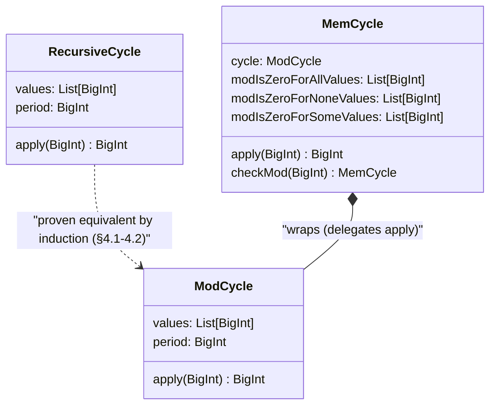

# Verificação Formal de Listas Cíclicas

**Autor:** Thiago Henrique Ramos da Mata<br>
Pesquisador independente<br>
**Email:** [thiago.henrique.mata@gmail.com](mailto:thiago.henrique.mata@gmail.com)  
**ORCID:** [0009-0002-7366-939X](https://orcid.org/0009-0002-7366-939X)    
**GitHub:** [@thiagomata](https://github.com/thiagomata)  
**Licença:** [CC BY 4.0](../LICENSE)<br>
**Publicado:** [Zenodo:10.5281/zenodo.22865441](https://doi.org/10.5281/zenodo.22865441)

## Resumo

<div align="justify">
<p style="text-align: justify">
Em artigos anteriores, definimos do zero Listas limitadas e Integrais de
<code>BigInt</code>, apoiando-nos apenas em construções centrais de tipos e em
recursão, sem exigir conhecimento prévio das coleções de Scala. A partir disso,
provamos e verificamos formalmente propriedades relacionadas a elas, como
tamanho, append, concatenação, fatia e soma. Este artigo usa essa base para
definir Ciclos — Listas ilimitadas de Inteiros criadas a partir de uma Lista
limitada, em que os valores do Ciclo são os valores da Lista repetidos por meio
de recursão. Em seguida, definimos e verificamos formalmente propriedades-chave,
como equivalência entre definições de ciclo, acesso a elementos por indexação
modular e invariância periódica, usando o sistema de verificação Stainless. Todas
as propriedades são expressas e provadas dentro de um framework mínimo usando
apenas aritmética elementar, recursão e código Scala puro. Este trabalho conecta
fundamentos matemáticos e verificação executável, oferecendo uma abordagem
autocontida e verificável para aritmética modular.
 </p>
</div>

## 1. Introdução

Listas ilimitadas em ciclos são um conceito fundamental em ciência da computação
e matemática, frequentemente usado para modelar estruturas ou processos
repetitivos. Elas podem ser entendidas como listas infinitas que repetem uma
sequência finita de elementos.

```math
L = [x_0, x_1, x_2, \ldots, x_{n-1}]  \mid x_n \in 𝕊, L \in 𝕃\\
\text{Cycle}(L) = [x_0, x_1, x_2, \ldots, x_{n-1}, x_0, x_1, \ldots]
```

Neste artigo, apresentamos uma definição discreta de operações de Ciclo sobre
listas finitas de inteiros, definidas recursivamente, e verificamos algumas de
suas propriedades usando o sistema Stainless. Nossa abordagem segue uma filosofia
de conhecimento prévio zero, construída sobre uma base previamente verificada
para estruturas recursivas de listas. O resultado é uma implementação verificada,
do zero, de operações de ciclo, adequada como fundação para raciocínio numérico
de nível mais alto sobre listas ilimitadas.

Este artigo verifica:

- Definições de ciclo: recursiva, por módulo e com memória — [§3](#3-cycle-definitions)
- Equivalência: recursiva e por módulo produzem valores idênticos em toda posição — [§4](#4-cycle-equivalence)
- Acesso a elementos: indexação modular, busca direta em posições pequenas — [§5.1](#51-cycle-element-access)–[5.2](#52-small-value-in-cycle)
- Invariância periódica: valor inalterado ao somar múltiplos do período do ciclo — [§5.3](#53-value-match-after-many-loops)–[5.4](#54-two-multiples-of-cycle-size)
- Propagação de módulo: resto computado a partir de valores do ciclo-base — [§5.5](#55-propagate-modulo-from-value-to-cycle)
- Invariância de ciclo repetido: repetir a lista-base preserva todas as consultas — [§5.6](#56-repeated-cycle-invariance)
- Positividade dos valores do ciclo: todos os valores são ≥ 0 em toda posição — [§5.7](#57-cycle-value-positivity)
- Rotação do ciclo: rotaciona a lista-base, desloca o índice — [§5.8](#58-cycle-rotation)
- Classificação de resíduos: classificações de divisores todo-zero, nenhum-zero e algum-zero são transferidas da lista-base para toda posição do ciclo — [§5.10](#510-all-zero-residue-transfers-to-the-cycle)–[5.12](#512-some-zero-residue-transfers-to-the-cycle)

### Trabalhos Relacionados

Rotação finita já tem um tratamento formal substancial na Mathlib do Lean: ela
inclui rotação reduzida módulo o comprimento da lista, leis de rotação indexada
e uma relação de equivalência que identifica listas rotacionadas [[4]](#ref4).
Esses resultados fornecem um ponto formal próximo de contato para a rotação da
lista-base e as leis de indexação modular deste artigo.

Também há trabalho mais amplo sobre tipos de dados cíclicos como estruturas de
programação recursiva. Hamana estuda listas cíclicas e dados relacionados módulo
bissimulação, com uma explicação semântica de suas regras de computação
[[5]](#ref5). Esse cenário é mais geral e diferente da sequência periódica
presente gerada por uma lista finita de inteiros. Em conjunto, essas fontes
posicionam o desenvolvimento em Stainless entre rotação de listas finitas e
teoria geral de dados cíclicos, enquanto este artigo verifica a equivalência de
suas apresentações recursiva e modular e as propriedades de período, resíduo e
consulta de seu modelo periódico concreto.

## 2. Preliminares

Reutilizamos várias operações básicas de listas e suas propriedades verificadas
dos artigos companheiros [Usando Verificação Formal para Provar Propriedades de Listas Definidas Recursivamente](https://rxiverse.org/abs/2609.0023) [[1]](#ref1)
e [Verificação Formal de Propriedades de Integração Discreta a partir de Primeiros Princípios](https://doi.org/10.5281/zenodo.22746792) [[2]](#ref2).

Esses artigos também definiram e verificaram suas propriedades usando a mesma
metodologia de conhecimento prévio zero, e são tratados aqui como primitivas
fundamentais.

Para qualquer lista $L$ de valores numéricos $x_i \in 𝕊$, em que $𝕊$ é um
conjunto de todos os valores numéricos, $𝕃$ é o conjunto de todas as listas, e
$n$ é o tamanho da lista, definimos:

```math
\begin{aligned}
L_{e} & \in 𝕃 \\
L_{e} & = [] \\
\end{aligned}
```

```math
\begin{aligned}
&\text{ head } &\in 𝕊 \\
&\text{ tail } &\in 𝕃 \\
&L_{node}(\text{head}, \text{tail}) &\in 𝕃_{node} \\
\end{aligned}
```

```math
\begin{aligned}
&𝕃 &= \{ L_e \}  \cup \{ L_{node}(\text{head}, \text{tail}) &\mid \text{head} \in 𝕊,\ \text{tail} \in 𝕃 \} \\
\end{aligned}
```

```math
\begin{aligned}
L = [x_0, x_1, \dots, x_{n-1}] \in 𝕊^n \\
\end{aligned}
```

```math
\begin{aligned}
& &\text{size}(L) &:= \begin{cases}
0 & \text{ if } L = L_{e} \\
1 + \text{size}(tail(L)) & \text{otherwise} \\
\end{cases} \\
& &sum(L) &:= \begin{cases}
0 & \text{if } L = L_e \\
head(L) + sum(tail(L)) & \text{otherwise} \\
\end{cases} \\
\end{aligned}
```

```math
\begin{aligned}
|L| > 0 &\implies &\text{last}(L) &:= \begin{cases}
\text{head}(L) & \text{if } |L| = 1 \\
\text{last}(\text{tail}(L)) & \text{otherwise} \\
\end{cases} \\
|L| > 0 &\implies &\text{slice}(L, f, t) &:=  \begin{cases}
[ L_j ] & \text{if } f = t \\
\text{slice}(L, f, t - 1) \mathbin{\texttt{++}} [ L_t ] & \text{if } f < t \\
\end{cases} \\
\forall \ f, t \in ℕ \text{ where } 0 \leq f \leq t
\end{aligned}
```

```math
\begin{aligned}
&A \mathbin{\texttt{++}} B &:= \begin{cases}
B & \text{if } A = L_e \\
L_{node}(head(A), tail(A) \mathbin{\texttt{++}} B) & \text{otherwise} \\
\end{cases} \\
\end{aligned}
```

```math
\begin{aligned}
\forall \ L, A, B \in  𝕃 \\
\end{aligned}
```

A partir dessas definições, os autores [[1]](#ref1) provam matematicamente e
verificam formalmente as seguintes propriedades de listas:

```math
\begin{aligned}
&\forall\, L, A, B \in  𝕃,\quad &\forall\, v \in 𝕊,\quad &\forall\, i, f, t \in ℕ \\
\end{aligned}
```

```math
\begin{aligned}
f > t, \quad 0 \leq i < |L|\\
\\
\end{aligned}
```

```math
\begin{aligned}
&|L| &> 0 &\implies \text{tail}(L) &= &L[x_1, x_2, \dots, x_{n-1}] \quad &\text{[Tail Identity]} \\
&|L| &> 0 &\implies L_{0} &= &\text{ }\text{head}(L) \quad &\text{[Head Identity]} \\
&|L| &> 0 &\implies L_{|L|-1} &= &\text{ }\text{last}(L) \quad &\text{[Last Element Identity]} \\
&|L| - 1 &> i > 0 &\implies L_i &= &\text{ }\text{tail}(L)_{i-1} \quad &\text{[Access Tail Shift Left]} \\
&|L| - 2 &> i > 1 \text{ } &\implies \text{tail}(L)_i &= &L_{i+1} \quad &\text{[Access Tail Shift Right]} \\
\end{aligned}
```

```math
\begin{aligned}
&|L| &= &\text{size}(L)                        \quad &\text{[Size Identity]} \\
&\sum L &= &\text{sum}(L)                      \quad &\text{[Sum matches Summation]} \\
&\sum (v :: L) &= &v + \sum L                 \quad &\text{[Left Append Preserves Sum]} \\
&\sum (A \mathbin{\texttt{++}} B) &= &\sum A + \sum B              \quad &\text{[Sum over Concatenation]} \\
&\sum (A \mathbin{\texttt{++}} B) &= &\sum (B \mathbin{\texttt{++}} A)                 \quad &\text{[Commutativity of Sum over Concatenation]} \\
&L[f \dots t] &= &L[f \dots {(t - 1)}] \mathbin{\texttt{++}} [L_t] \quad &\text{[Slice Append Consistency]} \\
\end{aligned}
```

<a id="3-cycle-definitions"></a>

## 3. Definições de Ciclo

Com base nas definições e propriedades de listas, agora definimos Ciclos.

Um Ciclo é uma lista ilimitada que repete uma sequência finita de elementos de
uma lista limitada. Neste estudo, restringimos nosso universo de valores $𝕊$ ao
conjunto dos inteiros não negativos, isto é, $𝕊 = ℕ_0$.

- Recursivo: valores em $i$ com $i < n$ vêm da lista-base; caso contrário, recorre em $i - n$ — a especificação definicional
- Módulo: valores vêm diretamente da lista-base na posição $i \bmod n$ — acesso eficiente
- Memória: encapsula `ModCycle`, adiciona rastreamento de classificação via `checkMod(d)` — lembra quais divisores produzem padrões de resíduos todo-zero, algum-zero ou nenhum-zero


```mermaid
classDiagram
    class RecursiveCycle {
        values: List[BigInt]
        period: BigInt
        apply(BigInt) BigInt
    }
    class ModCycle {
        values: List[BigInt]
        period: BigInt
        apply(BigInt) BigInt
    }
    class MemCycle {
        cycle: ModCycle
        modIsZeroForAllValues: List[BigInt]
        modIsZeroForNoneValues: List[BigInt]
        modIsZeroForSomeValues: List[BigInt]
        apply(BigInt) BigInt
        checkMod(BigInt) MemCycle
    }
    RecursiveCycle ..> ModCycle : "proven equivalent by induction (§4.1-4.2)"
    MemCycle *-- ModCycle : "wraps (delegates apply)"
```

<a id="31-recursive-cycle"></a>

### 3.1 Ciclo Recursivo

```math
\begin{aligned}
\forall \ L \in  𝕃, \quad \forall \ v &\in ℕ_0,\quad \forall \ i \in ℕ_0 \\
L &:= [v_0, v_1, \dots, v_{n-1}] \in ℕ_0^n \\
n &= |L| \\
\text{RecCycle}_i &= \begin{cases}
L_i & \text{if } i < n \\
\text{RecCycle}_{i - n} & \text{if } i \geq n \\
\end{cases} \ , |L| > 0 \\
\therefore \\
RecCycle &= [v_0, v_1, \dots, v_{n-1}, v_0, v_1, \dots] \\
\text{Cycle}_i &:= \text{RecCycle}_i \\
\end{aligned}
```

Tomamos esse desenrolar recursivo como a verdade formal para a imagem informal
da "sequência periódica infinita" usada ao longo deste artigo: daqui em diante,
`Cycle` significa `RecCycle`. Isso é uma escolha de nome, não um teorema — a
recursão remove uma cópia da lista-base por passo, que é exatamente o que a
sequência periódica significa. O que ainda precisa ser provado é se a definição
baseada em módulo abaixo computa os mesmos valores; essa equivalência é provada
na [Seção 4](#4-cycle-equivalence).

O ciclo recursivo é definido em [RecursiveCycle](https://github.com/thiagomata/prime-numbers/blob/master/src/main/scala/v1/chapter4/cycle/recursive/RecursiveCycle.scala):

```scala
case class RecursiveCycle(values: List[BigInt]) {
  require(values.nonEmpty)
  require(CycleUtils.checkPositiveOrZero(values))

  def period: BigInt = values.size

  def apply(position: BigInt): BigInt = {
    decreases(position)
    require(position >= 0)

    if (position < period) {
      values(position)
    } else {
      apply(position - values.size)
    }
  }
}
```

### 3.2 Ciclo por Módulo

Um Ciclo também pode ser definido usando aritmética modular, que é uma abordagem
comum em ciência da computação para lidar com estruturas cíclicas.

```math
\begin{aligned}
\forall \ L \in  𝕃, \quad \forall \ v &\in ℕ_0,\quad \forall \ i \in ℕ_0 \\
L &:= [v_0, v_1, \dots, v_{n-1}] \in ℕ_0^n \\
n &= |L| \\
\text{ModCycle}_i &= L[i \text{ mod } n] \ , |L| > 0 \\
\therefore \\
\text{ModCycle} &= [v_0, v_1, \dots, v_{n-1}, v_0, v_1, \dots] \\
\end{aligned}
```

Informalmente, isso se desenrola para a mesma imagem, mas nada até aqui mostra
que `ModCycle` e `RecCycle` — que [§3.1](#31-recursive-cycle) tomou como o
significado de `Cycle` — concordam em todo índice. Um recorre por subtração
repetida, o outro computa um único resto, e não é óbvio a priori que os dois
produzam a mesma sequência. A Seção 4 prova que sim, que é o que também permite
que `ModCycle` represente `Cycle`.

O ciclo por módulo é definido em [ModCycle](https://github.com/thiagomata/prime-numbers/blob/master/src/main/scala/v1/chapter4/cycle/mod/ModCycle.scala):

```scala
case class ModCycle(values: List[BigInt]) {
  require(CycleUtils.checkPositiveOrZero(values))
  require(values.nonEmpty)

  def apply(position: BigInt): BigInt = {
    require(position >= 0)
    val index = Calc.mod(position, values.size)
    assert(index >= 0)
    assert(index < values.size)
    values(index)
  }

  def period: BigInt = values.size

  def sum(): BigInt = ListUtils.sum(values)
}
```

<a id="33-memory-cycle"></a>

### 3.3 Ciclo com Memória

A terceira representação, `MemCycle`, encapsula um `ModCycle` e adiciona estado
de classificação: três listas que rastreiam quais divisores produzem padrões de
resíduos todo-zero, algum-zero ou nenhum-zero ao longo dos valores do ciclo.

Como `ModCycle`, a consulta posicional usa indexação modular; o acesso a valores
delega diretamente ao `ModCycle` encapsulado. A equivalência posicional entre os
dois é imediata por construção: `MemCycle.apply(position)` chama o
`cycle(position)` encapsulado, e `MemCycle(values)` constrói esse ciclo
encapsulado como `ModCycle(values)`.

```math
\begin{aligned}
\text{MemCycle}(L)_i
  &= \text{ModCycle}(L)_i && \text{[By MemCycle.apply delegating to its wrapped ModCycle]}
\end{aligned}
```

A ponte limitada [
  CycleProperties::assertModCycleEqualsMemCycle
](https://github.com/thiagomata/prime-numbers/blob/master/src/main/scala/v1/chapter4/cycle/properties/CycleProperties.scala)
verifica a mesma igualdade de consulta ao longo de um período físico para um
`ModCycle` e um `MemCycle` que compartilham os mesmos valores e período.

`MemCycle(L)` retorna os mesmos valores que `ModCycle(L)` por definição: ele
armazena `ModCycle(L)` e delega toda consulta a ele. A Seção 4 prova a peça
restante — que `RecursiveCycle(L)` e `ModCycle(L)` também concordam em toda
posição — após a qual a cadeia completa de igualdade entre as três
representações usada ao longo do artigo é montada ao final daquela seção.

O ciclo é imutável. Chamar `checkMod(d)` retorna um *novo* `MemCycle` com `d`
adicionado à lista de classificação apropriada. O original permanece
inalterado. Os valores nunca são modificados; a classificação é metadado
acumulado ao longo das chamadas.

```scala
case class MemCycle private (
  cycle: ModCycle,
  modIsZeroForAllValues: List[BigInt] = List.empty,
  modIsZeroForNoneValues: List[BigInt] = List.empty,
  modIsZeroForSomeValues: List[BigInt] = List.empty,
) {
  def apply(position: BigInt): BigInt = cycle(position)
  def values: List[BigInt] = cycle.values
  def period: BigInt = cycle.period
  def checkMod(dividend: BigInt): MemCycle = { /* returns new MemCycle */ }
}
```

O ciclo com memória é definido em [MemCycle](https://github.com/thiagomata/prime-numbers/blob/master/src/main/scala/v1/chapter4/cycle/memory/MemCycle.scala). Os lemas de classificação são verificados em
[CycleCheckMod](https://github.com/thiagomata/prime-numbers/blob/master/src/main/scala/v1/chapter4/cycle/memory/properties/CycleCheckMod.scala).

<a id="4-cycle-equivalence"></a>

## 4. Equivalência de Ciclos

A Seção 3.1 define `Cycle` como `RecCycle` — uma escolha de nome, não uma
afirmação. Esta seção prova a afirmação que de fato precisa ser provada: que
`ModCycle`, definido independentemente por uma única operação de módulo em vez
de desenrolamento recursivo, computa exatamente os mesmos valores que `RecCycle`
em toda posição. Essa equivalência é aquilo em que o restante do artigo se apoia
sempre que se move entre as duas representações, e ela não é imediata a partir
das duas definições lado a lado. Provamos por indução na posição $i$.

- Caso base ($i < n$): ambas as definições consultam a lista-base diretamente na mesma posição
- Passo indutivo ($i \geq n$): a definição recursiva reduz para $i - n$, retornando à mesma posição modular

```math
\begin{aligned}
\forall \ L \in  𝕃, \quad \forall \ v &\in ℕ_0,\quad \forall \ i \in ℕ_0 \\
L &:= [v_0, v_1, \dots, v_{n-1}] \in ℕ_0^n \\
n &= |L| \\
\text{ModCycle}_i &= L[i \text{ mod } n] \ , |L| > 0 \\
\text{RecCycle}_i &= \begin{cases}
L_i & \text{if } i < n \\
\text{RecCycle}_{i - n} & \text{if } i \geq n \\
\end{cases} \ , |L| > 0 \\
\end{aligned}
```

### 4.1 Caso Base (`i < n`)

Quando a posição está dentro do primeiro ciclo, ambas as definições retornam o
elemento da lista diretamente.

```math
\begin{aligned}
i < n \implies i \text{ mod } n &= i                  \quad &\text{[Trivial Mod For Small Dividend]} \\
\text{ModCycle}_i &= L_{(i \text{ mod } n)}           \quad &\text{[ModCycle Definition]} \\
                  &= L_i                              \quad &\text{[Since } i < n \text{, } i \text{ mod } n = i \text{]} \\
\text{RecCycle}_i &= L_i                              \quad &\text{[Since } i < n \text{, by RecCycle Definition]} \\
\therefore \\
i < n \implies\text{ModCycle}_i &= \text{RecCycle}_i  \quad \blacksquare  &\text{[Q.E.D.]} \\
\end{aligned}
```

O lema [Módulo Trivial para Dividendo Pequeno](https://github.com/thiagomata/prime-numbers/blob/cycle-article-v1.0.0/articles/chapter2/modulo.md#61-trivial-case) foi provado e verificado no artigo [Divisão e Módulo por Normalização Recursiva](http://ai.viXra.org/abs/2609.0009) [[3]](#ref3).

Esta propriedade é verificada em [
RecursiveCycleMatchesModCycle::assertCycleAndRecursiveCycleMathForSmallValues
](https://github.com/thiagomata/prime-numbers/blob/master/src/main/scala/v1/chapter4/cycle/recursive/properties/RecursiveCycleMatchesModCycle.scala). O código Scala completo de verificação está no Apêndice A.1.

### 4.2 Passo Indutivo (`i >= n`)

Para posições além do primeiro ciclo, ambas as definições reduzem a posição pelo
período do ciclo e dependem da hipótese indutiva.

```math
\begin{aligned}
\text{ModCycle}_{(i - n)}           &= \text{RecCycle}_{(i - n)}   \quad &\text{[By Induction Hypothesis]} \\
i \geq n \implies i \text{ mod } n  &= (i - n) \text{ mod } n  \quad &\text{[Quotient Invariance Under Linear Shift]} \\
\text{ModCycle}_i   &= L_{(i \text{ mod } n)}        \quad &\text{[ModCycle Definition]} \\
                    &= L_{((i - n) \text{ mod } n)}  \quad &\text{[Since } i \geq n \text{, } i \text{ mod } n = (i - n) \text{ mod } n \text{]} \\
                    &= \text{ModCycle}_{(i - n)}     \quad &\text{[By Definition]} \\
                    &= \text{RecCycle}_{(i - n)}     \quad &\text{[By Substitution]} \\
\text{RecCycle}_{i} &= \text{RecCycle}_{(i - n)}     \quad &\text{[By RecCycle Definition]} \\
                    &= \text{ModCycle}_{i}           \quad &\text{[By Substitution]} \\
\therefore \\
i \geq n \implies \text{ModCycle}_i &= \text{RecCycle}_i  \quad \blacksquare &\text{[Q.E.D.]} \\
\end{aligned}
```

O lema [Invariância do Quociente sob Deslocamento Linear](https://github.com/thiagomata/prime-numbers/blob/cycle-article-v1.0.0/articles/chapter2/modulo.md#65-quotient-invariance-under-linear-shift) foi provado e verificado no artigo [Divisão e Módulo por Normalização Recursiva](http://ai.viXra.org/abs/2609.0009) [[3]](#ref3).

Esta propriedade é verificada em [
RecursiveCycleMatchesModCycle::assertCycleAndRecursiveCycleMathForAnyValues
](https://github.com/thiagomata/prime-numbers/blob/master/src/main/scala/v1/chapter4/cycle/recursive/properties/RecursiveCycleMatchesModCycle.scala). O código Scala completo de verificação está no Apêndice A.2.

Com ambas as peças agora estabelecidas — `RecCycle` e `ModCycle` iguais por
esta seção, `MemCycle` e `ModCycle` iguais por delegação
([§3.3](#33-memory-cycle)) — as três representações concordam em toda posição:

```math
\begin{aligned}
\text{RecCycle}(L)_i
  &= \text{ModCycle}(L)_i && \text{[§4.1–4.2]} \\
  &= \text{MemCycle}(L)_i && \text{[§3.3]} \\
\therefore\quad
\text{RecCycle}(L)_i
  &= \text{ModCycle}(L)_i
   = \text{MemCycle}(L)_i && \text{[Three-Way Equality]}
\end{aligned}
```

## 5. Propriedades de Ciclos

Nesta seção, provamos e verificamos as principais propriedades de Ciclos. Cada
propriedade é enunciada matematicamente e então demonstrada por meio de um lema
correspondente verificado em Scala usando o sistema Stainless.

- Acesso a elementos: `cycle(key) == cycle.values(mod(key, period))` — [§5.1](#51-cycle-element-access)
- Consulta direta para valor pequeno: `key < period ⇒ cycle(key) == cycle.values(key)` — [§5.2](#52-small-value-in-cycle)
- Periodicidade: `cycle(key) == cycle(key + period·m)` para qualquer número de voltas — [§5.3](#53-value-match-after-many-loops)
- Consistência de múltiplas voltas: o valor em `key` independe de qual múltiplo do período é adicionado — [§5.4](#54-two-multiples-of-cycle-size)
- Propagação de módulo: o resto módulo `d` em qualquer posição é igual ao resto na posição-base — [§5.5](#55-propagate-modulo-from-value-to-cycle)
- Invariância de ciclo repetido: repetir a lista-base preserva todas as consultas — [§5.6](#56-repeated-cycle-invariance)
- Positividade de valores: valores-base não negativos garantem valores de ciclo não negativos — [§5.7](#57-cycle-value-positivity)
- Rotação: rotacionar a lista-base desloca o índice do ciclo pela mesma quantidade — [§5.8](#58-cycle-rotation)
- Reenunciados no nível de `MemCycle`: as propriedades de acesso por chave e módulo também são verificadas diretamente para a representação com memória — [§5.9](#59-memcycle-level-restatement)
- Transferência de classificação de resíduos: classificações de divisores todo-zero, nenhum-zero e algum-zero na lista-base valem em toda posição do ciclo — [§5.10](#510-all-zero-residue-transfers-to-the-cycle)–[5.12](#512-some-zero-residue-transfers-to-the-cycle)

Ao longo desta seção, $L$ é a lista finita subjacente, $n$ é o período, e
$Cycle$ é o fluxo periódico ilimitado que ela define — formalmente, `Cycle`
significa `RecCycle` ([§3.1](#31-recursive-cycle)), provado na
[Seção 4](#4-cycle-equivalence) como igual a `ModCycle` em toda posição:

```math
\begin{aligned}
\forall \ L \in  𝕃, \quad \forall \ v &\in ℕ_0,\quad \forall \ i \in ℕ_0 \\
L &:= [v_0, v_1, \dots, v_{n-1}] \in ℕ_0^n, \quad |L| > 0 \\
Cycle &:= [v_0, v_1, \dots, v_{n-1}, v_0, v_1, \dots] \\
n &:= |L|
\end{aligned}
```

<a id="51-cycle-element-access"></a>

### 5.1 Acesso a Elementos do Ciclo

O valor de qualquer elemento em um ciclo é igual ao valor da lista subjacente na
posição módulo o período do ciclo.

```math
\begin{aligned}
\text{Cycle}_i = L[i \bmod n]
\end{aligned}
```

**Prova.**

```math
\begin{aligned}
\text{Cycle}_i &= \text{RecCycle}_i \quad &\text{[§3.1 Definition]} \\
              &= \text{ModCycle}_i \quad &\text{[§4 Cycle Equivalence]} \\
              &= L[i \bmod n]      \quad &\text{[ModCycle Definition]}
\end{aligned}
```

```math
\therefore \ \text{Cycle}_i = L[i \bmod n] \quad \blacksquare\ \text{[Q.E.D.]}
```

A propriedade de [Equivalência de Ciclos](#4-cycle-equivalence) foi provada e
verificada na Seção 4.

Esta propriedade é verificada em [
CycleProperties::findValueInCycle
](https://github.com/thiagomata/prime-numbers/blob/master/src/main/scala/v1/chapter4/cycle/properties/CycleProperties.scala). O código Scala completo de verificação está no Apêndice A.3.

<a id="52-small-value-in-cycle"></a>

### 5.2 Valor Pequeno no Ciclo

Para posições menores que o período do ciclo, o valor do ciclo é diretamente
igual ao valor da lista nessa posição.

```math
\begin{aligned}
i < n \implies \text{Cycle}_i = L_i
\end{aligned}
```

**Prova.**

```math
\begin{aligned}
\text{Cycle}_i &= \text{RecCycle}_i \quad &\text{[§3.1 Definition]} \\
i < n \implies \text{RecCycle}_i &= L_i \quad &\text{[RecCycle Definition]}
\end{aligned}
```

```math
\therefore \ i < n \implies \text{Cycle}_i = L_i \quad \blacksquare\ \text{[Q.E.D.]}
```

Este passo precisa apenas da nomeação `Cycle := RecCycle` de
[§3.1](#31-recursive-cycle); o lado `ModCycle` da equivalência provada na
[Seção 4](#4-cycle-equivalence) não é necessário aqui.

Esta propriedade é verificada em [
CycleProperties::smallValueInCycle
](https://github.com/thiagomata/prime-numbers/blob/master/src/main/scala/v1/chapter4/cycle/properties/CycleProperties.scala). O código Scala completo de verificação está no Apêndice A.4.

<a id="53-value-match-after-many-loops"></a>

### 5.3 Valor Coincide Após Muitas Voltas

Valores do ciclo permanecem invariantes ao adicionar qualquer múltiplo do
período do ciclo à chave de acesso.

```math
\begin{aligned}
\text{Cycle}_{(i + n \cdot m)} = L[i \bmod n]
\end{aligned}
```

**Prova.**

```math
\begin{aligned}
\text{Cycle}_{(i + n \cdot m)} &= \text{RecCycle}_{(i + n \cdot m)} \quad &\text{[§3.1 Definition]} \\
                               &= \text{ModCycle}_{(i + n \cdot m)} \quad &\text{[§4 Cycle Equivalence]} \\
                               &= L[(i + n \cdot m) \bmod n]        \quad &\text{[ModCycle Definition]} \\
                               &= L[i \bmod n] \quad &\text{[Quotient Invariance Under Linear Shift by Multiplier]}
\end{aligned}
```

```math
\therefore \ \text{Cycle}_{(i + n \cdot m)} = L[i \bmod n] \quad \blacksquare\ \text{[Q.E.D.]}
```

O lema [Invariância do Quociente sob Deslocamento Linear](https://github.com/thiagomata/prime-numbers/blob/cycle-article-v1.0.0/articles/chapter2/modulo.md#65-quotient-invariance-under-linear-shift) e sua variante com multiplicador foram provados e verificados em [Divisão e Módulo por Normalização Recursiva](http://ai.viXra.org/abs/2609.0009) [[3]](#ref3).

Esta propriedade é verificada em [
CycleProperties::valueMatchAfterManyLoops
](https://github.com/thiagomata/prime-numbers/blob/master/src/main/scala/v1/chapter4/cycle/properties/CycleProperties.scala). O código Scala completo de verificação está no Apêndice A.5.

<a id="54-two-multiples-of-cycle-size"></a>

### 5.4 Dois Múltiplos do Tamanho do Ciclo

Deslocar a mesma chave por dois múltiplos diferentes do período do ciclo produz
o mesmo valor do ciclo em ambos os casos.

```math
\begin{aligned}
\text{Cycle}_{(i + n \cdot m_1)} = \text{Cycle}_{(i + n \cdot m_2)}
\end{aligned}
```

**Prova.** Por [§5.3](#53-value-match-after-many-loops), aplicado tanto em
$m_1$ quanto em $m_2$:

```math
\begin{aligned}
\text{Cycle}_{(i + n \cdot m_1)} &= L[i \bmod n] \quad &\text{[§5.3, Value Match After Many Loops]} \\
\text{Cycle}_{(i + n \cdot m_2)} &= L[i \bmod n] \quad &\text{[§5.3, Value Match After Many Loops]}
\end{aligned}
```

```math
\therefore \ \text{Cycle}_{(i + n \cdot m_1)} = \text{Cycle}_{(i + n \cdot m_2)} = L[i \bmod n] \quad \blacksquare\ \text{[Q.E.D.]}
```

Esta propriedade é verificada em [
CycleProperties::valueMatchAfterManyLoopsInBoth
](https://github.com/thiagomata/prime-numbers/blob/master/src/main/scala/v1/chapter4/cycle/properties/CycleProperties.scala). O código Scala completo de verificação está no Apêndice A.6.

<a id="55-propagate-modulo-from-value-to-cycle"></a>

### 5.5 Propagar Módulo do Valor para o Ciclo

A operação de módulo aplicada a um valor do ciclo pode ser aplicada
equivalentemente ao valor da lista subjacente no índice modular. Como as seções
anteriores provam que as representações de ciclo concordam em toda posição,
podemos usar diretamente a definição de ciclo por módulo: a consulta ao ciclo
primeiro reduz a posição para `i mod n`, e tomar o resto por qualquer divisor
positivo `d` preserva essa mesma redução à posição-base.

```math
\begin{aligned}
\text{Cycle}_i \bmod d = L_{i \bmod n} \bmod d
\end{aligned}
```

**Prova.**

```math
\begin{aligned}
\text{Cycle}_i
  &= \text{RecCycle}_i &&\text{[§3.1 Definition]} \\
  &= \text{ModCycle}_i &&\text{[§4 Cycle Equivalence]} \\
  &= L_{i \bmod n} &&\text{[ModCycle Definition]}
\end{aligned}
```

```math
\therefore \ \text{Cycle}_i \bmod d = L_{i \bmod n} \bmod d \quad \blacksquare\ \text{[Q.E.D.]}
```

Esta propriedade é verificada em [
CycleProperties::propagateModFromValueToCycle
](https://github.com/thiagomata/prime-numbers/blob/master/src/main/scala/v1/chapter4/cycle/properties/CycleProperties.scala). O
reenunciado relacionado de idempotência, `cycle(position) == cycle(position mod period)`,
é verificado em [
CycleProperties::assertCycleOfPosEqualsCycleOfModPos
](https://github.com/thiagomata/prime-numbers/blob/master/src/main/scala/v1/chapter4/cycle/properties/CycleProperties.scala). O código Scala completo de verificação está no Apêndice A.7.

<a id="56-repeated-cycle-invariance"></a>

### 5.6 Invariância de Ciclo Repetido

Quando a lista-base de um ciclo é repetida $t$ vezes para formar um período
físico mais longo, os valores lidos em toda posição permanecem idênticos. O
ciclo repetido é estruturalmente uma concatenação de $t$ cópias da lista
original; o comprimento extra é invisível em qualquer índice porque a indexação
modular compõe corretamente através dos períodos aninhados. A repetição usa a
mesma notação $t$-vezes que o $L^{(x)}$ de `integral-cycle.md` §6.1 (lista
repetida $x$ vezes), definida da mesma forma por desenrolar uma cópia por vez:

```math
\begin{aligned}
V^{(t)} &:= \begin{cases}
L_e & \text{if } t = 0 \\
V \mathbin{\texttt{++}} V^{(t-1)} & \text{otherwise}
\end{cases}
\end{aligned}
```

```math
\begin{aligned}
C &\text{ — original MemCycle}, \quad V = \text{values}(C), \quad n = |V| \\
C^{(t)} &\text{ — repeated cycle}, \quad \text{values}(C^{(t)}) = V^{(t)}
  \quad\text{with } t > 0 \\
\text{period} &= t \cdot n
\end{aligned}
```

**Prova:**

```math
\begin{aligned}
C^{(t)}(\text{pos}) &= V^{(t)}(\text{mod}(\text{pos},\; \text{period}))
  && \text{[MemCycle access via modular index]} \\
  &= V(\text{mod}(\text{mod}(\text{pos},\; t \cdot n),\; n))
  && \text{[Repeated list access pattern]} \\
  &= V(\text{mod}(\text{pos},\; n))
  && \text{[ModOperations::modByPositiveMultipleThenBase]} \\
  &= C(\text{pos})
  && \text{[Original cycle access]} \\
  &\quad\blacksquare && \text{[Q.E.D.]}
\end{aligned}
```

A prova separa construção de consulta. Chamadores devem construir um `MemCycle`
válido a partir dos valores repetidos; este lema apenas diz que, uma vez que tal
ciclo existe, o período físico maior não altera nenhuma consulta.

```scala
def assertRepeatedValuesCycleMatches(
  cycle: MemCycle,
  repeatedCycle: MemCycle,
  times: BigInt,
  position: BigInt
): Boolean = {
  require(times > BigInt(0))
  require(position >= BigInt(0))
  require(cycle.period > BigInt(0))
  require(repeatedCycle.values == ListRepeatProperties.repeat(cycle.values, times))
  // ... inductive proof via mod composition ...
  repeatedCycle(position) == cycle(position)
}.holds
```

Esta propriedade é verificada em [
MemCycleProperties::assertRepeatedValuesCycleMatches
](https://github.com/thiagomata/prime-numbers/blob/master/src/main/scala/v1/chapter4/cycle/memory/properties/MemCycleProperties.scala).
A derivação Scala completa está incluída no [Apêndice A.8](#a8-repeated-cycle-invariance--assertrepeatedvaluescyclematches).

<a id="57-cycle-value-positivity"></a>

### 5.7 Positividade dos Valores do Ciclo

Quando todo valor da lista-base é não negativo, toda posição do ciclo retorna um
valor não negativo. Isso garante que consultas ao ciclo nunca produzam números
negativos, o que é essencial para raciocínio sobre integrais e gaps.

```math
\begin{aligned}
(\forall x \in L,\ x \geq 0) \;\land\; |L| > 0 \;\implies\; \text{Cycle}_{\text{pos}} \geq 0
\end{aligned}
```

**Prova.** Por [§5.1](#51-cycle-element-access), `Cycle_pos = L[pos mod n]`, e `pos mod n` é um índice válido em `L` (em `[0, n)`). Logo, `Cycle_pos` é um dos valores de `L` — e todo valor de `L` é não negativo por hipótese, portanto `Cycle_pos >= 0`.

```math
\therefore \ (\forall x \in L,\ x \geq 0) \land |L| > 0 \implies \text{Cycle}_{\text{pos}} \geq 0 \quad \blacksquare\ \text{[Q.E.D.]}
```

Esta propriedade é verificada em [
  CycleProperties::cycleValuePositiveOrZero
](https://github.com/thiagomata/prime-numbers/blob/master/src/main/scala/v1/chapter4/cycle/properties/CycleProperties.scala), que se reduz ao auxiliar de nível de lista `CycleUtils::checkPositiveOrZeroAtIndex` — indexar uma lista não negativa em uma posição válida produz um valor não negativo. O código Scala completo de verificação está no Apêndice A.9.

O mesmo argumento fornece a forma verificada de cota inferior estrita: se todo
valor-base é maior que $x$, então todo valor do ciclo é maior que $x$.

```math
\begin{aligned}
(\forall y \in L,\ y > x) \;\land\; |L| > 0
  &\implies \text{Cycle}_{\text{pos}} > x.
\end{aligned}
```

**Prova.** O índice modular seleciona um valor de $L$, que é maior que $x$ por
hipótese:

```math
\begin{aligned}
\text{Cycle}_{\text{pos}} &= L[\text{pos} \bmod n] &&\text{[§5.1]} \\
L[\text{pos} \bmod n] &> x &&\text{[Base-list lower bound]} \\
\therefore\ \text{Cycle}_{\text{pos}} &> x.
  \quad \blacksquare\ \text{[Q.E.D.]}
\end{aligned}
```

Esse fortalecimento é verificado para `RecursiveCycle`, a representação de
`Cycle` do artigo, em [
RecursiveCycle::cycleValueBiggerThan
](https://github.com/thiagomata/prime-numbers/blob/master/src/main/scala/v1/chapter4/cycle/recursive/RecursiveCycle.scala#cycleValueBiggerThan).

<a id="58-cycle-rotation"></a>

### 5.8 Rotação do Ciclo

Rotacionar a lista-base de um ciclo por $k$ posições e então acessar o índice
$i$ dá o mesmo valor que acessar o ciclo original no índice $i + k$. Isso
conecta a estrutura de ciclo diretamente ao conceito de rotação de listas do
capítulo 3. A rotação é definida reindexando a lista-base a partir do
deslocamento $k$:

```math
\begin{aligned}
\text{rotateAt}(L, k) &:= \big[\, L[(k+j) \bmod n] \mid 0 \le j < n \,\big] \\
\text{rotateAt}(\text{Cycle}, k)_i &:= \text{rotateAt}(L, k)[i \bmod n]
\end{aligned}
```

```math
\begin{aligned}
\text{rotateAt}(\text{Cycle}, k)_i = \text{Cycle}_{i + k} \quad
\text{for } k \geq 0,\ i \geq 0
\end{aligned}
```

**Prova.**

```math
\begin{aligned}
\text{rotateAt}(\text{Cycle}, k)_i
  &= \text{rotateAt}(L, k)[i \bmod n]
  &&\text{[By Definition]} \\
  &= L[(k + (i \bmod n)) \bmod n]
  &&\text{[By Definition, since } i \bmod n \in [0, n) \text{]} \\
  &= L[(k + i) \bmod n]
  &&\text{[Modulo Idempotence + Distributivity over Addition]} \\
  &= \text{Cycle}_{i + k}
  &&\text{[§5.1 Cycle Element Access]}
\end{aligned}
```

```math
\therefore \ \text{rotateAt}(\text{Cycle}, k)_i = \text{Cycle}_{i + k} \quad
\text{for } k \geq 0,\ i \geq 0 \quad \blacksquare\ \text{[Q.E.D.]}
```

O terceiro passo compõe [Idempotência do Módulo](https://github.com/thiagomata/prime-numbers/blob/cycle-article-v1.0.0/articles/chapter2/modulo.md#68-modulo-idempotence)
e [Distributividade sobre Adição](https://github.com/thiagomata/prime-numbers/blob/cycle-article-v1.0.0/articles/chapter2/modulo.md#69-distributivity-over-addition),
ambas provadas e verificadas em [Divisão e Módulo por Normalização
Recursiva](http://ai.viXra.org/abs/2609.0009) [[3]](#ref3):
A identidade `mod(k + mod(i, n), n) = mod(k + i, n)` segue porque ambos os
lados reduzem a `mod(mod(k, n) + mod(i, n), n)`.

Esta propriedade é verificada em [
  CycleProperties::rotateAtValue
](https://github.com/thiagomata/prime-numbers/blob/master/src/main/scala/v1/chapter4/cycle/properties/CycleProperties.scala). O código Scala completo de verificação está no Apêndice A.10.

<a id="59-memcycle-level-restatement"></a>

### 5.9 Reenunciado no Nível de MemCycle

As Seções 5.1-5.5 enunciam acesso a elementos, consulta de valor pequeno,
invariância periódica, consistência de múltiplas voltas e propagação de módulo
para `ModCycle`. Como $\text{MemCycle}(L)_i = \text{ModCycle}(L)_i$ em toda
posição ([§3.3](#33-memory-cycle), montado ao final de [§4](#4-cycle-equivalence)),
todos os cinco resultados passam para `MemCycle` por substituição direta —
matematicamente, esta seção não acrescenta conteúdo além de §5.1-5.5. Ainda
assim, `MemCycle` é a representação efetivamente usada em outras partes do
código (é ela que carrega metadados de classificação de resíduos), e o Stainless
não tem como transferir um lema provado para um tipo concreto a um tipo wrapper
diferente que apenas concorda com ele ponto a ponto: cada resultado abaixo é
reprovado contra `MemCycle`, e seu corpo de prova espelha linha a linha o lema
correspondente de `ModCycle`, em vez de derivar algo novo:

```math
\begin{aligned}
\text{Cycle}_{key} &= L[key \bmod n]
  &&\text{[Element Access]} \\
key < n &\implies \text{Cycle}_{key} = L[key]
  &&\text{[Small Value Lookup]} \\
\text{Cycle}_{key} &= \text{Cycle}_{key + n \cdot m}
  &&\text{[Periodic Invariance]} \\
\text{Cycle}_{key + n \cdot m_1} &= \text{Cycle}_{key + n \cdot m_2}
  &&\text{[Multi-Loop Consistency]} \\
\text{Cycle}_{key} \bmod d &= L[key \bmod n] \bmod d
  &&\text{[Mod Propagation]}
\end{aligned}
```

Esses resultados são verificados em [
  MemCycleProperties::findValueInCycle
](https://github.com/thiagomata/prime-numbers/blob/master/src/main/scala/v1/chapter4/cycle/memory/properties/MemCycleProperties.scala), [
  MemCycleProperties::smallValueInCycle
](https://github.com/thiagomata/prime-numbers/blob/master/src/main/scala/v1/chapter4/cycle/memory/properties/MemCycleProperties.scala), [
  MemCycleProperties::valueMatchAfterManyLoops
](https://github.com/thiagomata/prime-numbers/blob/master/src/main/scala/v1/chapter4/cycle/memory/properties/MemCycleProperties.scala), [
  MemCycleProperties::valueMatchAfterManyLoopsInBoth
](https://github.com/thiagomata/prime-numbers/blob/master/src/main/scala/v1/chapter4/cycle/memory/properties/MemCycleProperties.scala), e [
  MemCycleProperties::propagateModFromValueToCycle
](https://github.com/thiagomata/prime-numbers/blob/master/src/main/scala/v1/chapter4/cycle/memory/properties/MemCycleProperties.scala).

A identidade de idempotência do módulo da prova de [§5.5](#55-propagate-modulo-from-value-to-cycle) (de que `Cycle_i` é igual a
`Cycle_(mod(i, n) mod n)`) tem seu próprio reenunciado para `MemCycle` em [
  MemCycleProperties::assertCycleOfPosEqualsCycleOfModPos
](https://github.com/thiagomata/prime-numbers/blob/master/src/main/scala/v1/chapter4/cycle/memory/properties/MemCycleProperties.scala).

`MemCycle` também classifica cada divisor pelo comportamento de seus resíduos ao
longo da lista-base. `MemCycle.checkMod(d)` ([§3.3](#33-memory-cycle)) conta
quantos valores de `L` são ≡ 0 mod `d`, via `countModZero` — uma passagem sobre
a lista, adicionando 1 onde quer que o valor seja ≡ 0 mod `d`:

```math
\begin{aligned}
\text{countModZero}(L, d) &:= \begin{cases}
0 & \text{if } L = L_e \\
1 + \text{countModZero}(\text{tail}(L), d) & \text{if } \text{head}(L) \bmod d = 0 \\
\text{countModZero}(\text{tail}(L), d) & \text{otherwise}
\end{cases}
\end{aligned}
```

`checkMod(d)` então coloca `d` nos grupos todo-zero, nenhum-zero ou algum-zero
com base nessa contagem — cada grupo é definido e provado abaixo como
transferível da lista-base para toda posição do `Cycle` infinito, usando o mesmo
movimento de [§5.7](#57-cycle-value-positivity): um valor de ciclo é sempre
*algum* valor de `L` ([§5.1](#51-cycle-element-access)), portanto qualquer
propriedade que vale para todo valor de `L` também vale para toda posição do
ciclo. Os dez lemas de `CycleCheckMod.scala` verificam separadamente que a
classificação em si é mutuamente exclusiva, exaustiva e persiste corretamente
entre chamadas independentes de `checkMod` — propriedades administrativas das
listas de classificação, não novas afirmações sobre valores de ciclo, então elas
não são reenunciadas aqui.

<a id="510-all-zero-residue-transfers-to-the-cycle"></a>

### 5.10 Resíduo Todo-Zero é Transferido para o Ciclo

`checkMod(d)` classifica `d` como todo-zero quando todo valor de `L` é ≡ 0
mod `d` — isto é, `countModZero(L, d)` conta todos os `n` valores:

```math
\begin{aligned}
\text{allZero}(d) &:\Leftrightarrow \text{countModZero}(L, d) = n
  && \text{[MemCycle.allModValuesAreZero]}
\end{aligned}
```

```math
\begin{aligned}
\text{allZero}(d) \implies \forall k,\ \text{Cycle}_k \bmod d = 0
\end{aligned}
```

**Prova.**

```math
\begin{aligned}
\text{allZero}(d) &\implies \forall x \in L,\ x \bmod d = 0
  && \text{[Definition of countModZero]} \\
\text{Cycle}_k &= L[k \bmod n]
  && \text{[§5.1 Cycle Element Access]} \\
\implies \text{Cycle}_k \bmod d &= 0
  && \text{[}L[k \bmod n]\text{ is a value of } L\text{]}
\end{aligned}
```

```math
\therefore \ \text{allZero}(d) \implies \forall k,\ \text{Cycle}_k \bmod d = 0 \quad \blacksquare\ \text{[Q.E.D.]}
```

`allZero` é `MemCycle.allModValuesAreZero`, definido e definido por `checkMod`
em [MemCycle](https://github.com/thiagomata/prime-numbers/blob/master/src/main/scala/v1/chapter4/cycle/memory/MemCycle.scala).
O Stainless verifica diretamente a contagem da lista-base; a transferência para
uma posição arbitrária do ciclo `k` mostrada acima é o corolário deste artigo a
partir dessa contagem junto com [§5.1](#51-cycle-element-access), não um lema
Stainless separado.

### 5.11 Resíduo Nenhum-Zero é Transferido para o Ciclo

O caso simétrico: `checkMod(d)` classifica `d` como nenhum-zero quando nenhum
valor de `L` é ≡ 0 mod `d` — `countModZero(L, d)` não conta nenhum:

```math
\begin{aligned}
\text{noneZero}(d) &:\Leftrightarrow \text{countModZero}(L, d) = 0
  && \text{[MemCycle.noModValuesAreZero]}
\end{aligned}
```

```math
\begin{aligned}
\text{noneZero}(d) \implies \forall k,\ \text{Cycle}_k \bmod d \neq 0
\end{aligned}
```

**Prova.**

```math
\begin{aligned}
\text{noneZero}(d) &\implies \forall x \in L,\ x \bmod d \neq 0
  && \text{[Definition of countModZero]} \\
\text{Cycle}_k &= L[k \bmod n]
  && \text{[§5.1 Cycle Element Access]} \\
\implies \text{Cycle}_k \bmod d &\neq 0
  && \text{[}L[k \bmod n]\text{ is a value of } L\text{]}
\end{aligned}
```

```math
\therefore \ \text{noneZero}(d) \implies \forall k,\ \text{Cycle}_k \bmod d \neq 0 \quad \blacksquare\ \text{[Q.E.D.]}
```

`noneZero` é `MemCycle.noModValuesAreZero`, definido e definido por `checkMod`
em [MemCycle](https://github.com/thiagomata/prime-numbers/blob/master/src/main/scala/v1/chapter4/cycle/memory/MemCycle.scala).
Como em [§5.10](#510-all-zero-residue-transfers-to-the-cycle), o Stainless
verifica a contagem da lista-base; a transferência para `k` arbitrário é o
corolário deste artigo a partir de §5.1.

<a id="512-some-zero-residue-transfers-to-the-cycle"></a>

### 5.12 Resíduo Algum-Zero é Transferido para o Ciclo

`checkMod(d)` classifica `d` como algum-zero quando alguns, mas não todos, os
valores de `L` são ≡ 0 mod `d` — `countModZero(L, d)` conta um número
estritamente entre `0` e `n` deles:

```math
\begin{aligned}
\text{someZero}(d) &:\Leftrightarrow 0 < \text{countModZero}(L, d) < n
  && \text{[MemCycle.someModValuesAreZero]}
\end{aligned}
```

Diferentemente de §5.10-5.11, `someZero` não é uma afirmação sobre *toda*
posição — ela precisa de testemunhas dos dois lados, então o argumento de
transferência precisa nomear duas posições concretas do ciclo em vez de
substituir em uma universal.

```math
\begin{aligned}
\text{someZero}(d) \implies \exists\, k_0, k_1,\ \text{Cycle}_{k_0} \bmod d = 0 \;\land\; \text{Cycle}_{k_1} \bmod d \neq 0
\end{aligned}
```

**Prova.** Por definição, `someZero(d)` significa $0 < \text{countModZero}(L, d) < n$:
pelo menos um valor de `L` é ≡ 0 mod `d`, e pelo menos um não é. Sejam
$j_0, j_1 \in [0, n)$ índices de um valor de cada tipo, de modo que
$L_{j_0} \bmod d = 0$ e $L_{j_1} \bmod d \neq 0$.

```math
\begin{aligned}
j_0, j_1 < n &\implies \text{Cycle}_{j_0} = L_{j_0} \;\land\; \text{Cycle}_{j_1} = L_{j_1}
  && \text{[§5.2 Small Value in Cycle]} \\
&\implies \text{Cycle}_{j_0} \bmod d = 0 \;\land\; \text{Cycle}_{j_1} \bmod d \neq 0
  && \text{[Substitution]}
\end{aligned}
```

```math
\therefore \ \text{someZero}(d) \implies \exists\, k_0, k_1,\ \text{Cycle}_{k_0} \bmod d = 0 \;\land\; \text{Cycle}_{k_1} \bmod d \neq 0
  \quad (k_0 := j_0,\ k_1 := j_1) \quad \blacksquare\ \text{[Q.E.D.]}
```

`someZero` é `MemCycle.someModValuesAreZero`, definido e definido por
`checkMod` em [MemCycle](https://github.com/thiagomata/prime-numbers/blob/master/src/main/scala/v1/chapter4/cycle/memory/MemCycle.scala).
Como acima, o Stainless verifica a contagem da lista-base; as posições
testemunhas $k_0, k_1$ são o corolário deste artigo a partir de §5.2, não um
lema Stainless separado.

## 6. Conclusão

Este artigo apresentou as definições e propriedades de Ciclos, um conceito
fundamental que permite representar sequências repetitivas de valores. Definimos
Ciclos por duas abordagens — uma definição recursiva e uma definição baseada em
módulo — e provamos sua equivalência para todas as posições. Além disso,
verificamos onze propriedades: acesso a elementos por indexação modular, acesso
direto para posições pequenas, invariância sob adição de múltiplos do período do
ciclo, consistência entre múltiplos distintos, propagação de módulo dos valores
para o acesso ao ciclo, invariância de ciclo repetido, positividade de valores,
invariância por rotação e as transferências todo-zero, nenhum-zero e algum-zero
da classificação divisor-resíduo de `MemCycle` da lista-base para toda posição
do ciclo.

```math
\begin{aligned}
&\forall \ L \in  𝕃, \quad \forall \ v \in ℕ_0,\quad \forall \ i, m_1, m_2 \in ℕ_0 \\
L &:= [v_0, v_1, \dots, v_{n-1}] \in ℕ_0^n, |L| > 0 \\
Cycle &:= [v_0, v_1, \dots, v_{n-1}, v_0, v_1, \dots] \\
n &= |L| \\
\end{aligned}
```
```math
\begin{aligned}
\text{RecCycle}_i = \text{ModCycle}_i = \text{MemCycle}_i \quad &\text{[Three-Way Equivalence]} \\
\end{aligned}
```
```math
\begin{aligned}
\text{Cycle}_i &= L[i \bmod n] \quad &\text{[Cycle Element Access]} \\
\text{key} < n &\implies \text{Cycle}_\text{key} = L_\text{key} \quad &\text{[Small Value Direct Lookup]} \\
\text{Cycle}_{i} \bmod d &= \text{Cycle}_{(i \bmod n)} \bmod d \quad &\text{[Mod Propagation]} \\
\end{aligned}
```
```math
\begin{aligned}
\text{Cycle}_{(i + n \cdot m)} &= L [i \bmod n] \quad &\text{[Value Match After Many Loops]} \\
\text{Cycle}_{(i + n \cdot m_1)} &= \text{Cycle}_{(i + n \cdot m_2)} \quad &\text{[Two Multiples]} \\
\text{Cycle}^{(t)}_\text{pos} &= \text{Cycle}_\text{pos} \quad \forall t > 0 \quad &\text{[Repeated-Cycle Invariance]} \\
\end{aligned}
```
```math
\begin{aligned}
(\forall x \in L,\ x \geq 0) &\implies \text{Cycle}_{\text{pos}} \geq 0 \quad &\text{[Cycle Value Positivity]} \\
(\forall y \in L,\ y > x) &\implies \text{Cycle}_{\text{pos}} > x \quad &\text{[Cycle Value Greater Than]} \\
\text{rotateAt}(\text{Cycle}, k)_i &= \text{Cycle}_{i + k} \quad &\text{[Rotation Invariance]} \\
\end{aligned}
```
```math
\begin{aligned}
\text{allZero}(d) &\implies \forall k,\ \text{Cycle}_k \bmod d = 0 \quad &\text{[All-Zero Residue Transfer]} \\
\text{noneZero}(d) &\implies \forall k,\ \text{Cycle}_k \bmod d \neq 0 \quad &\text{[None-Zero Residue Transfer]} \\
\text{someZero}(d) &\implies \exists\, k_0, k_1,\ \text{Cycle}_{k_0} \bmod d = 0 \;\land\; \text{Cycle}_{k_1} \bmod d \neq 0 \quad &\text{[Some-Zero Residue Transfer]} \\
\end{aligned}
```

Todas as propriedades foram formalmente verificadas usando Scala Stainless,
garantindo sua correção e confiabilidade. O código completo de verificação está
no Apêndice A.

## 7. Trabalho Futuro

Trabalhos futuros podem incluir a exploração de propriedades mais complexas de
Ciclos, como seu comportamento sob várias operações, incluindo concatenação e
filtragem, e suas aplicações em algoritmos e estruturas de dados. Além disso,
podemos investigar integração discreta de Ciclos, de modo semelhante ao trabalho
feito para listas [[1]](#ref1) e integrais [[2]](#ref2).

## Referências

<a name="ref1" id="ref1" href="#ref1">[1]</a>
Mata, T. H. (2026). _Using Formal Verification to Prove Properties of Lists Recursively Defined_. Disponível em: [https://rxiverse.org/abs/2609.0023](https://rxiverse.org/abs/2609.0023)

<a name="ref2" id="ref2" href="#ref2">[2]</a>
Mata, T. H. (2026). _Formal Verification of Discrete Integration Properties from First Principles_. Disponível em: [https://doi.org/10.5281/zenodo.22746792](https://doi.org/10.5281/zenodo.22746792)

<a name="ref3" id="ref3" href="#ref3">[3]</a>
Mata, T. H. (2026). _Division and Modulo from Recursive Normalization_. Disponível em: [http://ai.viXra.org/abs/2609.0009](http://ai.viXra.org/abs/2609.0009)

<a name="ref4" id="ref4" href="#ref4">[4]</a>
The Lean Community. *Mathlib: List Rotation*.
Disponível em: [https://leanprover-community.github.io/mathlib4_docs/Mathlib/Data/List/Rotate.html](https://leanprover-community.github.io/mathlib4_docs/Mathlib/Data/List/Rotate.html)

<a name="ref5" id="ref5" href="#ref5">[5]</a>
Hamana, M. (2017). *Cyclic Datatypes modulo Bisimulation based on Second-Order Algebraic Theories*. Logical Methods in Computer Science, 13(4:8).
Disponível em: [https://doi.org/10.23638/LMCS-13(4:8)2017](https://doi.org/10.23638/LMCS-13(4:8)2017)

## Apêndice A: Código de Verificação Scala

### A.1 Equivalência de Ciclos — Caso Base

Fonte: [RecursiveCycleMatchesModCycle::assertCycleAndRecursiveCycleMathForSmallValues](https://github.com/thiagomata/prime-numbers/blob/master/src/main/scala/v1/chapter4/cycle/recursive/properties/RecursiveCycleMatchesModCycle.scala)

```scala
  def assertCycleAndRecursiveCycleMathForSmallValues(
    cycle: ModCycle,
    position: BigInt
  ): Boolean = {
    val list = cycle.values

    require(position >= 0)
    require(position < list.size)

    val recursiveCycle = RecursiveCycle(list)
    assert(position >= 0)
    assert(position < list.size)
    assert(list.size == cycle.period)
    assert(list.size == recursiveCycle.period)
    assert(ModSmallDividend.modSmallDividend(position, list.size))
    assert(Calc.mod(position, list.size) == position)
    cycle(position) == recursiveCycle(position)
  }.holds
```

### A.2 Equivalência de Ciclos — Passo Indutivo

Fonte: [RecursiveCycleMatchesModCycle::assertCycleAndRecursiveCycleMathForAnyValues](https://github.com/thiagomata/prime-numbers/blob/master/src/main/scala/v1/chapter4/cycle/recursive/properties/RecursiveCycleMatchesModCycle.scala)

```scala
  def assertCycleAndRecursiveCycleMathForAnyValues(
    cycle: ModCycle,
    position: BigInt
  ): Boolean = {
    decreases(position)
    val list = cycle.values

    require(position >= 0)
    require(list.size > 0)

    val recCycle = RecursiveCycle(list)

    if (position < list.size) {
      // base case
      assertCycleAndRecursiveCycleMathForSmallValues(cycle, position)
    } else {
      // inductive step
      assertCycleAndRecursiveCycleMathForAnyValues(cycle, position - list.size)
      assert(cycle(position - list.size) == recCycle(position - list.size))
      assert(ModSum.checkValueShift(position, list.size))
      assert(Calc.mod(position, list.size) == Calc.mod(position - list.size, list.size))
      assert(cycle(position) == cycle(position - list.size))
      assert(recCycle(position) == recCycle(position - list.size))
    }
    cycle(position) == recCycle(position)
  }.holds
```

### A.3 Acesso a Elementos do Ciclo — findValueInCycle

Fonte: [CycleProperties::findValueInCycle](https://github.com/thiagomata/prime-numbers/blob/master/src/main/scala/v1/chapter4/cycle/properties/CycleProperties.scala)

```scala
  def findValueInCycle(cycle: ModCycle, key: BigInt): Boolean = {
    require(key >= 0)
    require(cycle.period > 0)
    cycle(key) == cycle.values(Calc.mod(key, cycle.period))
  }.holds
```

### A.4 Valor Pequeno no Ciclo — smallValueInCycle

Fonte: [CycleProperties::smallValueInCycle](https://github.com/thiagomata/prime-numbers/blob/master/src/main/scala/v1/chapter4/cycle/properties/CycleProperties.scala)

```scala
  def smallValueInCycle(cycle: ModCycle, key: BigInt): Boolean = {
    require(key >= 0)
    require(key < cycle.period)
    require(cycle.period > 0)
    cycle(key) == cycle.values(key)
  }.holds
```

### A.5 Valor Coincide Após Muitas Voltas — valueMatchAfterManyLoops

Fonte: [CycleProperties::valueMatchAfterManyLoops](https://github.com/thiagomata/prime-numbers/blob/master/src/main/scala/v1/chapter4/cycle/properties/CycleProperties.scala)

```scala
  def valueMatchAfterManyLoops(cycle: ModCycle, key: BigInt, m: BigInt): Boolean = {
    require(key >= 0)
    require(cycle.period > 0)
    require(m >= 0)
    AdditionAndMultiplication.ATimesBSameMod(key, cycle.period, m)
    cycle(key) == cycle(key + cycle.period * m)
  }.holds
```

### A.6 Dois Múltiplos do Tamanho do Ciclo — valueMatchAfterManyLoopsInBoth

Fonte: [CycleProperties::valueMatchAfterManyLoopsInBoth](https://github.com/thiagomata/prime-numbers/blob/master/src/main/scala/v1/chapter4/cycle/properties/CycleProperties.scala)

```scala
  def valueMatchAfterManyLoopsInBoth(cycle: ModCycle, key: BigInt, m1: BigInt, m2: BigInt): Boolean = {
    require(key >= 0)
    require(cycle.period > 0)
    require(m1 >= 0)
    require(m2 >= 0)
    AdditionAndMultiplication.ATimesBSameMod(key, cycle.period, m1)
    AdditionAndMultiplication.ATimesBSameMod(key, cycle.period, m2)
    assert(cycle(key) == cycle(key + cycle.period * m1))
    assert(cycle(key) == cycle(key + cycle.period * m2))
    AdditionAndMultiplication.APlusMultipleTimesBSameMod(key, cycle.period, m1)
    AdditionAndMultiplication.APlusMultipleTimesBSameMod(key, cycle.period, m2)
    assert(Calc.mod(key, cycle.period) == Calc.mod(key + cycle.period * m1, cycle.period))
    assert(Calc.mod(key, cycle.period) == Calc.mod(key + cycle.period * m2, cycle.period))
    assert(cycle(key + cycle.period * m1) == cycle(key))
    assert(cycle(key + cycle.period * m2) == cycle(key))
    assert(cycle(key + cycle.period * m2) == cycle(Calc.mod(key,cycle.period)))
    assert(cycle(key + cycle.period * m1) == cycle(key + cycle.period * m2))
  }.holds
```

### A.7 Propagar Módulo — propagateModFromValueToCycle / assertCycleOfPosEqualsCycleOfModPos

Fonte: [CycleProperties::propagateModFromValueToCycle](https://github.com/thiagomata/prime-numbers/blob/master/src/main/scala/v1/chapter4/cycle/properties/CycleProperties.scala) e [CycleProperties::assertCycleOfPosEqualsCycleOfModPos](https://github.com/thiagomata/prime-numbers/blob/master/src/main/scala/v1/chapter4/cycle/properties/CycleProperties.scala)

```scala
  def propagateModFromValueToCycle(cycle: ModCycle, dividend: BigInt, key: BigInt): Boolean = {
    require(key >= 0)
    require(dividend > 0)
    require(cycle.period > 0)
    val modKeySize = Calc.mod(key, cycle.period)
    Calc.mod(cycle(key),dividend) == Calc.mod(cycle.values(modKeySize),dividend)
  }.holds

  def assertCycleOfPosEqualsCycleOfModPos(cycle: ModCycle, position: BigInt): Boolean = {
    require(position >= 0)
    require(cycle.period > 0)

    val period = cycle.period

    assert(cycle(position) == cycle.apply(position))
    assert(cycle(position) == cycle.values(Calc.mod(position, period)))

    assert(ModIdempotence.modIdempotence(position, period))
    assert(Calc.mod(Calc.mod(position, period),period) == Calc.mod(position, period))
    assert(cycle(position) == cycle(Calc.mod(position, period)))
  }.holds
```

<a id="a8-repeated-cycle-invariance--assertrepeatedvaluescyclematches"></a>

### A.8 Invariância de Ciclo Repetido — assertRepeatedValuesCycleMatches

Fonte: [MemCycleProperties::assertRepeatedValuesCycleMatches](https://github.com/thiagomata/prime-numbers/blob/master/src/main/scala/v1/chapter4/cycle/memory/properties/MemCycleProperties.scala)

```scala
  def assertRepeatedValuesCycleMatches(
    cycle: MemCycle,
    repeatedCycle: MemCycle,
    times: BigInt,
    position: BigInt
  ): Boolean = {
    require(times > BigInt(0))
    require(position >= BigInt(0))
    require(cycle.period > BigInt(0))
    require(repeatedCycle.values == ListRepeatProperties.repeat(cycle.values, times))
    val values = cycle.values
    val repeatedIndex = Calc.mod(position, values.size * times)
    val originalIndex = Calc.mod(position, values.size)
    assert(ListRepeatProperties.assertRepeatSize(values, times))
    assert(repeatedCycle.period == values.size * times)
    assert(findValueInCycle(repeatedCycle, position))
    assert(repeatedCycle(position) == repeatedCycle.values(repeatedIndex))
    assert(ListRepeatProperties.assertRepeatedIndex(values, times, repeatedIndex))
    assert(repeatedCycle.values(repeatedIndex) == values(Calc.mod(repeatedIndex, values.size)))
    assert(ModOperations.modByPositiveMultipleThenBase(position, values.size, times))
    assert(Calc.mod(repeatedIndex, values.size) == originalIndex)
    assert(repeatedCycle.values(repeatedIndex) == values(originalIndex))
    assert(findValueInCycle(cycle, position))
    assert(cycle(position) == values(originalIndex))
    repeatedCycle(position) == cycle(position)
  }.holds
```

### A.9 Positividade dos Valores do Ciclo — cycleValuePositiveOrZero

Fonte: [CycleProperties::cycleValuePositiveOrZero](https://github.com/thiagomata/prime-numbers/blob/master/src/main/scala/v1/chapter4/cycle/properties/CycleProperties.scala)

```scala
  def cycleValuePositiveOrZero(cycle: ModCycle, pos: BigInt): Boolean = {
    require(pos >= 0)
    require(cycle.period > 0)
    findValueInCycle(cycle, pos)
    val idx = Calc.mod(pos, cycle.period)
    assert(idx >= 0)
    assert(idx < cycle.period)
    CycleUtils.checkPositiveOrZeroAtIndex(cycle.values, idx)
    cycle(pos) >= 0
  }.holds
```

### A.10 Rotação do Ciclo — rotateAtValue

Fonte: [CycleProperties::rotateAtValue](https://github.com/thiagomata/prime-numbers/blob/master/src/main/scala/v1/chapter4/cycle/properties/CycleProperties.scala)

```scala
  def rotateAtValue(cycle: ModCycle, k: BigInt, i: BigInt): Boolean = {
    require(k >= 0)
    require(i >= 0)
    require(cycle.period > 0)

    val size = cycle.period
    val rotatedCycle = cycle.rotateAt(k)

    findValueInCycle(rotatedCycle, i)
    val modI = Calc.mod(i, size)
    assert(rotatedCycle(i) == rotatedCycle.values(modI))

    CycleUtils.collectRotatedValueAt(cycle.values, k, size, modI)
    assert(rotatedCycle.values(modI) == cycle.values(Calc.mod(k + modI, size)))

    ModIdempotence.modIdempotence(i, size)
    ModOperations.modAdd(k, size, Calc.mod(i, size))
    ModOperations.modAdd(k, size, i)
    assert(Calc.mod(k + modI, size) == Calc.mod(k + i, size))

    findValueInCycle(cycle, k + i)
    assert(cycle(k + i) == cycle.values(Calc.mod(k + i, size)))

    rotatedCycle(i) == cycle(k + i)
  }.holds
```

## Apêndice B: Saída do Log de Verificação Stainless

A execução mais recente de `just verify` verifica todas as propriedades
descritas sem erros. A saída completa do log está disponível em:
[logs/verify-ch-4-v1-chapter4-_.log](https://github.com/thiagomata/prime-numbers/blob/cycle-article-v1.0.0/logs/verify-ch-4-v1-chapter4-_.log)
