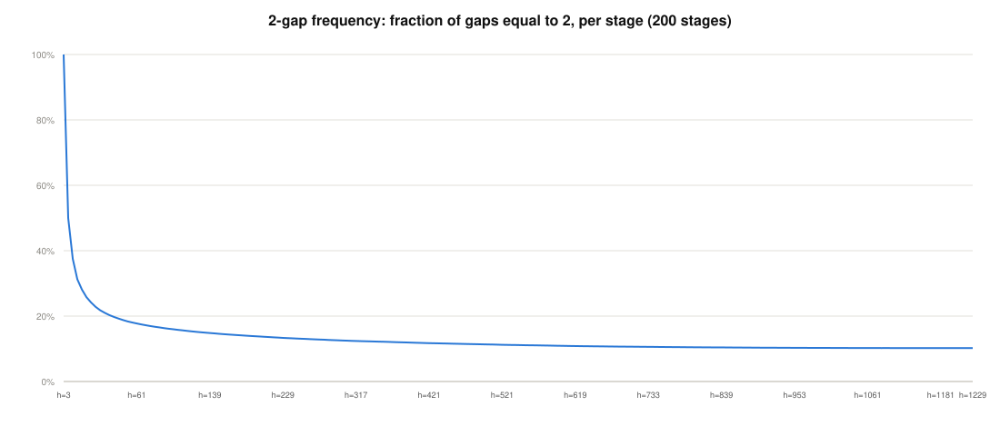
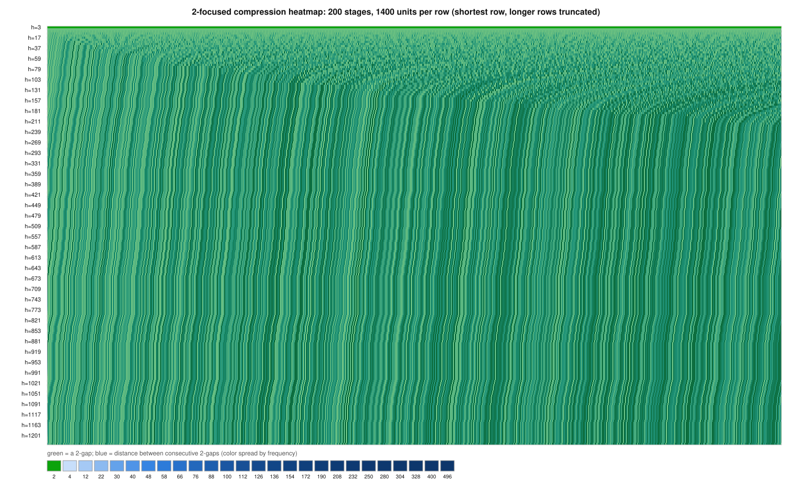
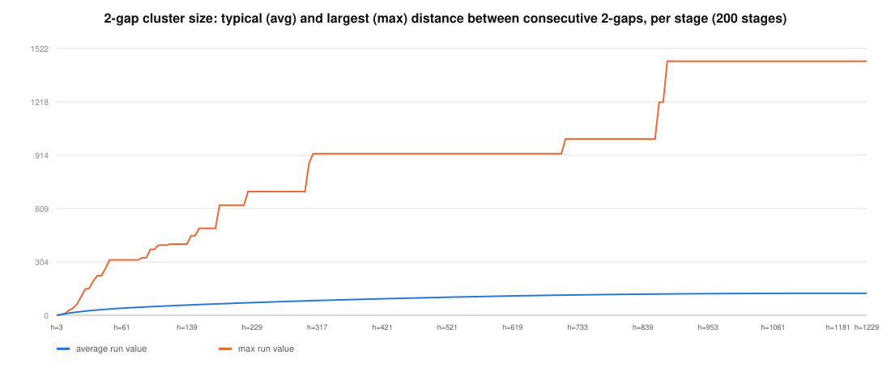

# Structural Properties and Signed Boundaries of 2-Gaps in Sieve Sequences

**Version:** 3 — figure comparison draft. Text is identical to
[`gap-dynamics-v2.md`](gap-dynamics-v2.md) except for two empirical figures
added below, generated from this project's own data pipeline
(`presentations/sieve-sequence-visualization/figures/`). Each figure is placed
directly against the theorem it empirically illustrates, not added for
decoration; no other content changes.
**Proof status:** The sequence foundation is Stainless-verified in the
companion Sieve Sequence article. The signed-localization theorems introduced
here are mathematically proved but not yet Stainless-verified.
**Author:** Mata, T. H.
Independent Researcher
**Email:** [thiago.henrique.mata@gmail.com](mailto:thiago.henrique.mata@gmail.com)
**GitHub:** [@thiagomata](https://github.com/thiagomata)

## Abstract

<div align="justify">
<p style="text-align: justify">

This article studies how 2-gaps evolve under successive prime filters and
sharpens the boundary between complete-period survival and square-window
placement. Complete-period CRT arguments prove that 2-gaps persist globally:
an incoming odd prime removes exactly two copy classes of each old 2-gap.
Those counts do not force a survivor into a particular interval
$[Q,Q^2)$.

The full argument reduces survival to a single signed quantity. A weighted conservation law and its
Cauchy--Schwarz corollary give a sharp terminal threshold on the harmful-excess
energy. A closed exhaustion argument—capacity envelopes, native-period Bessel,
fixed and moving cuts, and the stability-gap repair—shows that no
unsigned-capacity route can clear that threshold. The new contribution is
consequently signed and local. At filter $7$, exact residue order gives the
sharp interval bound $|b_7|\le18/7$, replacing a capacity estimate that grows
quadratically with the window scale. More generally, when an old period is
copied through an incoming prime $r$, the centered harmful excess in copy
block $j$ is exactly $B_j=d_t+d_{t-2}$ for two entries of the centered
old-start histogram modulo $r$. Consequently,
```math
\sum_{j=0}^{r-1}B_j^2
=2V_r+2\sum_{t\bmod r}d_td_{t-2}
\le4V_r.
```

This composes residue energy with the weighted harmful-excess survival
criterion over complete old-period blocks. It does not control the two partial
boundary fragments of an arbitrary interval, nor does it prove a relative
residue-energy estimate across an unbounded filter chain. Those are now the
precise remaining arithmetic obligations, framed by a scale conflict that
limits fixed-seed averaging and a Type-II barrier that any prime-producing
sieve must overcome.

</p>
</div>

## 1. Introduction

The Sieve Sequence represents an infinite accepted-value stream using one
finite cyclic gap list. That representation makes complete-period identities
exact, but the twin-prime application asks for a surviving 2-gap start in the
eligible square-safe window of one future head. The distinction between those
scopes is the organizing principle of this article.

Version 1 established the copy-or-merge and complete-period/local-window
boundary. This version retains that theorem spine and adds the signed
localization results that emerged from the later quadratic investigation. The
article develops the following properties in dependency order:

1. exact complete-period 2-gap count — §3.1;
2. exact copy-index filter frequency — §3.2;
3. exact batched survival — §3.3;
4. exact complete-period `(2,4,2)` cluster count — §3.4;
5. rotation invariance of cyclic counts — §3.5;
6. stable global absence of 2-gaps — §3.6;
7. square-safe certification — §4.1;
8. post-filter-3 isolation — §4.2;
9. exact accepted strikes and the sharp one-transition threshold —
   §§4.3--4.4;
10. why the capacity envelope is exhausted — §5.3;
11. exact weighted deletion conservation and its terminal quadratic corollary
    — §§5.1--5.2;
12. the exact filter-$7$ interval saving — §6;
13. the live frontier (accepted-boundary discrepancy and residue-collision
    energy) — §6.5;
14. the copy-block residue-energy bridge — §7;
15. the classified routes and the live program — §8; and
16. the fixed-seed scale conflict (§8.5) and the Type-II barrier (§9.5).

The final sections separate the proved complete-block control from the open
partial-boundary and cross-layer estimates. No complete-period theorem is used
as a short-window lower bound.

## 2. Preliminaries And Evidence Boundary

For a prime stage head $p$, let
```math
M_p=\prod_{q\lt p}q
```

and retain the integers coprime to $M_p$. Their accepted residues repeat
modulo $M_p$; adjacent differences in one complete period form a cyclic gap
list. The verified companion article establishes accepted-value completeness,
strict increase, period shift, exact survivor count, and the copy-or-merge
transition rule.

This review draft takes those verified construction facts as inputs. It then
studies mathematical properties of 2-gap populations and signed interval
discrepancies.

### 2.1 Roles, Populations, And Scopes

The notation follows the shared research vocabulary:

- $Q$ is a fixed **future head** used for square-safe certification;
- $r$ is one **incoming prime**, and $r_i$ is filter $i$ in a complete
  conditioned chain to $Q$;
- a **complete period** contains one full cyclic sieve pattern;
- a **local window** is an explicitly stated bounded integer interval;
- a **2-gap-start population** counts starts $x$, not all accepted values; and
- a **square-safe certificate** requires both $x$ and $x+2$ to lie strictly
  below $Q^2$ after every missing prime below $Q$ has been installed.

For a conditioned chain, $S_i$ denotes the local 2-gap starts immediately
before filter $r_i$, and $N_i=|S_i|$. The final survivor population is $S_m$
with size $N_m$. Complete-period populations are named separately and are
never substituted for $N_i$ without an explicit localization theorem.

### 2.2 Evidence Status

The following status convention is used:

- **Verified foundation:** supported by maintained Stainless source through
  the companion article.
- **Mathematically proved:** a complete mathematical proof is included here,
  but no corresponding `.holds` theorem currently exists.
- **Open:** the required estimate is stated but not proved.

No theorem in this article claims infinitely many twin primes.

Each property section states its population, scope, and quantifier, then
proves the result. Verified construction inputs link to maintained Scala
contracts. Mathematical properties without a corresponding `.holds` theorem
link to their canonical property note and are marked not yet
Stainless-verified. A mathematical proof is not called Stainless-verified
merely because its finite instances can be computed.

## 3. Complete-Period 2-Gap Properties

The first property group concerns cyclic 2-gap starts in complete periods.
These identities are exact because every installed prime contributes a full
residue system. They are not statements about a local square window.

### 3.1 Exact Global 2-Gap Count

After filter $2$ is installed, every accepted value is odd, so accepted
endpoints $x$ and $x+2$ are consecutive survivors: the intermediate value is
even. For every prime stage after filter $2$, this property counts all such
cyclic 2-gap starts in one complete period of that stage, without
constructing the gap list.

Let $p$ be the stage head and
```math
M_p=\prod_{q\lt p}q,
```

where $q$ ranges over installed primes. A residue $x$ represents a cyclic
2-gap exactly when
```math
\gcd(x(x+2),M_p)=1.
```

The exact count is
```math
G_2(p)
=
\prod_{\substack{3\le q\lt p\\q\text{ prime}}}(q-2).
```

For the filter $2$, the start must be odd, leaving one allowed residue. For
each installed odd prime $q$, the two endpoints fail precisely in the two
classes
```math
x\equiv0\pmod q,
\qquad
x\equiv-2\pmod q.
```

They are distinct because $q$ is odd, so exactly $q-2$ residues remain
allowed at each installed odd prime $q$.

The installed primes are pairwise coprime, so CRT gives a bijection between
one allowed choice at every installed prime and one residue modulo $M_p$.
Consequently,
```math
\begin{aligned}
G_2(p)
&=1\cdot
\prod_{\substack{3\le q\lt p\\q\text{ prime}}}
(q-2)
&&[\text{Chinese Remainder Theorem}]\\
&=\prod_{\substack{3\le q\lt p\\q\text{ prime}}}(q-2).
&&[\text{Q.E.D.}]
\end{aligned}
```

The empty odd-prime product is $1$, so the statement includes the first odd
stage. The result proves complete-period global presence, not placement in any
specified local window.

The mathematical proof is maintained in [Exact Global 2-Gap Count](
../../properties/sieve-sequence/exact-global-two-gap-count.md). No `.holds`
theorem currently encodes this exact product count, so this result is not yet
Stainless-verified.

### 3.2 Exact Filter Frequency Across Repeated Copies

Expansion distributes every old 2-gap through equally spaced copies before
filtering, and one incoming prime cannot choose arbitrary copies: the two
endpoint strikes occur at two exact copy-index phases. This holds for lifted
copies of one fixed old cyclic 2-gap, across every complete or finite run of
copy indices satisfying the stated coprimality precondition.

Let $M$ be the old period, let $(a,a+2)$ be one old cyclic 2-gap, and let
$r>2$ be an incoming prime with $\gcd(M,r)=1$. Copy $j$ has endpoints
```math
a+jM,
\qquad
a+2+jM.
```

Let $M^{-1}$ denote the inverse of $M$ modulo $r$. The left endpoint is
deleted exactly when
```math
\begin{aligned}
a+jM&\equiv0\pmod r
&&[\text{Left Endpoint Strike}]\\
j&\equiv-aM^{-1}\pmod r.
&&[\text{Multiply By }M^{-1}]
\end{aligned}
```

Likewise, the right endpoint is deleted exactly when
```math
\begin{aligned}
a+2+jM&\equiv0\pmod r
&&[\text{Right Endpoint Strike}]\\
j&\equiv-(a+2)M^{-1}\pmod r.
&&[\text{Multiply By }M^{-1}]
\end{aligned}
```

If the two copy-index classes were equal, subtracting would give
$2M^{-1}\equiv0\pmod r$, hence $2\equiv0\pmod r$, impossible for $r>2$.
Therefore the classes are distinct.

Every residue class modulo $r$ occurs at most $\lceil L/r\rceil$ times in a
run of $L$ consecutive copy indices. Thus
```math
K_r(J)\le2\left\lceil\frac{L}{r}\right\rceil.
```

For one complete run of $r$ consecutive copy indices, each forbidden class
occurs exactly once. Hence
```math
K_r=2,
\qquad
G_{\mathrm{survive}}=r-2.

\qquad[\text{Q.E.D.}]
```

This is exact distribution across copies before and under one filter. It does
not say that the $r-2$ survivors are evenly distributed after filtering or
that one lies in a chosen numerical window.

The mathematical proof is maintained in [Exact Filter Frequency Across
Repeated Copies](../../properties/sieve-sequence/copy-index-filter-frequency.md).
The repeated-stream foundation is verified in the companion Sieve Sequence
article, but no `.holds` theorem currently packages these two exact copy-index
classes and the finite-slice bound. This result is not yet Stainless-verified.

### 3.3 Exact Batched 2-Gap Survival

The one-filter copy law composes exactly. Applying several future filters as
one batch counts intersections through CRT, so no survivor is subtracted twice
and no intermediate floor or density approximation is needed. This holds for
every finite set of distinct incoming odd primes coprime to the old period,
over one complete period after the whole batch, for lifted copies of every
old cyclic 2-gap in one complete combined period.

Let $M$ be the old period and let $(a,a+2)$ be one old cyclic 2-gap. Choose a
finite set of distinct odd primes
```math
\mathcal R=\{r_1,r_2,\ldots,r_k\},
\qquad
\gcd\!\left(M,\prod_{r\in\mathcal R}r\right)=1,
```

and define
```math
R=\prod_{r\in\mathcal R}r.
```

The complete combined period modulo $MR$ contains $R$ lifted copies of the
old pair. Exactly
```math
\prod_{r\in\mathcal R}(r-2)
```

survive every filter in the batch. Therefore, if the old complete period has
$G$ cyclic 2-gaps, the new complete period has
```math
G_{\mathrm{after}}
=G\prod_{r\in\mathcal R}(r-2).
```

For each $r\in\mathcal R$, the filter-frequency theorem (§3.2) identifies two distinct forbidden
copy-index classes: one where $r$ divides the left endpoint and one where it
divides the right endpoint. Hence there are exactly $r-2$ allowed choices
modulo $r$. Because the primes in $\mathcal R$ are pairwise coprime, CRT makes
these choices independent. Thus, for one old 2-gap,
```math
\begin{aligned}
G_{\mathrm{one\ old\ gap}}
&=\prod_{r\in\mathcal R}(r-2).
&&[\text{Chinese Remainder Theorem; Copy-Index Filter Frequency}]
\end{aligned}
```

The lifted copy sets belonging to distinct old cyclic starts are counted as
distinct starts in the new complete period. Summing the same exact count over
the $G$ old starts gives
```math
\begin{aligned}
G_{\mathrm{after}}
&=\sum_{g=1}^{G}
  \prod_{r\in\mathcal R}(r-2)
&&[\text{Sum Over Old 2-Gap Starts}]\\
&=G\prod_{r\in\mathcal R}(r-2).
&&[\text{Simplification; Q.E.D.}]
\end{aligned}
```

The formula is independent of the conceptual order of the filters and counts
overlapping strikes correctly. Its scope is nevertheless the full combined
period $MR$. A shorter interval can omit all allowed CRT classes, so this
theorem cannot place a survivor in an eligible square-safe window.

The mathematical theorem and its complete-period limitation are maintained in
[Exact Batched 2-Gap Survival](
../../properties/sieve-sequence/exact-batched-two-gap-survival.md). No
corresponding `.holds` theorem currently packages the finite-batch product;
this result is not yet Stainless-verified.

### 3.4 Exact Global `(2,4,2)` Cluster Count

The label $(2,4,2)$ names the sequence of consecutive gaps inside a
four-term cluster
```math
a,\qquad a+2,\qquad a+6,\qquad a+8:
```
gap $2$ from $a$ to $a+2$, gap $4$ from $a+2$ to $a+6$, gap $2$ again from
$a+6$ to $a+8$. This is the classic prime-quadruplet shape, realized for
example by $11,13,17,19$ or $101,103,107,109$: two twin-prime pairs sharing
their two middle values four apart. Counting how often this exact pattern
survives is the natural next question once single 2-gaps (§3.1) are
understood, since it asks whether 2-gaps keep arriving in tight pairs rather
than only individually. It is also where the pattern comes from in the first
place: at the earliest stage, right after filters $2$ and $3$ are installed,
the entire accepted sequence already repeats as $\ldots,2,4,2,4,2,\ldots$
forever, so $(2,4,2)$ starts out as the universal shape of the sequence, not
a rare event — this section tracks how much of that shape survives as larger
primes filter it down.

The cluster's two 2-gaps are endpoint-disjoint and lie in a total span of
$8$. Expansion
creates $r$ copies of every old cluster; the incoming filter strikes exactly
four copies and preserves the other $r-4$ intact.

Let $C_M$ be the cyclic cluster count at modulus $M$. Copy $j$ of a cluster
has endpoints
```math
a+jM+\{0,2,6,8\},
\qquad
0\le j\lt r.
```

For each offset $h\in\{0,2,6,8\}$, the endpoint $a+jM+h$ is removed exactly
in the copy-index class
```math
j\equiv-(a+h)M^{-1}\pmod r.
```

If two offsets produced the same class, their difference would be divisible
by $r$. The nonzero pairwise differences are $2,4,6,8$. Neither $5$ nor $7$
divides any applicable difference, and every prime $r\ge11$ exceeds all four.
Thus the four classes are distinct. Out of the $r$ total copies created by
expansion, let $N_{\text{struck}}$ be the number of copies struck by the
incoming filter (one per distinct endpoint class) and $N_{\text{intact}}$
the number left intact. Then
```math
\begin{aligned}
N_{\text{struck}}&=4
&&[\text{Four Distinct Endpoint Classes}]\\
N_{\text{intact}}&=r-N_{\text{struck}}=r-4.
&&[\text{Subtraction}]
\end{aligned}
```

It remains to exclude newly created clusters. After filter $2$, all old gaps
are positive and even. A merged gap is a sum of at least two old gaps, so it
cannot equal $2$. It can equal $4$ only as $2+2$. But two consecutive 2-gaps
would require all three values $x,x+2,x+4$ to be accepted, whereas one of
them is divisible by $3$. Since filter $3$ is installed, that is impossible.
Therefore every new gap of size $2$ or $4$ is a copied old gap, and every new
$(2,4,2)$ occurrence is one of the intact copies counted above. Hence
```math
C_{rM}=(r-4)C_M.

\qquad[\text{No New Occurrences; Q.E.D.}]
```

This recurrence holds for every complete-period stage with modulus $M$
divisible by $6$ and every incoming prime $r\ge5$ with $r\nmid M$, counting
cyclic occurrences of the gap word $(2,4,2)$ in one complete period after
filters $2$ and $3$ are installed.

The wheel modulo $6$ has cyclic gap word $(4,2)$: accepted residues
$1,5\pmod6$ repeat forever as $\ldots,4,2,4,2,4,2,\ldots$ before any prime
beyond $3$ is installed. At this base stage the sequence is *nothing but*
copies of $(2,4,2)$ back to back, so there is exactly one cyclic $(2,4,2)$
occurrence per period, $C_6=1$ — the recurrence below tracks how that
initially-universal pattern gets diluted, but never destroyed, as larger
primes are installed. Iterating the recurrence over a finite
installed-prime set $\mathcal P$ containing $2$ and $3$ gives
```math
C(\mathcal P)
=
\prod_{\substack{p\in\mathcal P\\p\ge5}}(p-4).
```

The absolute cluster population is positive at every stage and grows whenever
an incoming prime exceeds $5$. Its proportion among accepted positions is
multiplied by $(r-4)/(r-1)\lt1$, so global growth does not imply that a chosen
short window contains a cluster.

The exact recurrence, no-creation proof, closed product, and localization
boundary are maintained in [Exact Global Count Of `(2,4,2)` Two-Gap
Clusters](
../../properties/sieve-sequence/exact-global-two-gap-cluster-count.md). No
`.holds` theorem currently packages the cyclic cluster count; this result is
not yet Stainless-verified.

### 3.5 Rotation Preserves Cyclic Gap Counts

Rotation chooses a new origin for the same cyclic list. It neither filters an
accepted value nor merges adjacent gaps, so it preserves the number of entries
having every gap value, including $2$, for every nonempty finite cyclic gap
list, every nonnegative rotation offset, and every gap value $d$. The
rotation invariance itself is proved; the exact multiplicity claim is not yet
Stainless-verified.

Let
```math
G=(g_0,g_1,\ldots,g_{T-1}),
\qquad T\ge1,
```

and define rotation by offset $j$ through
```math
\operatorname{rot}_j(G)_i
=g_{(i+j)\bmod T}.
```

For every value $d$,
```math
\#\{i: \operatorname{rot}_j(G)_i=d\}
=\#\{i:g_i=d\}.
```

Define the index map $\varphi_j(i)=(i+j)\bmod T$. Addition by $j$ modulo
$T$ is invertible, with inverse $\varphi_{-j}(i)=(i-j)\bmod T$. Hence
$\varphi_j$ is a bijection of
$\{0,1,\ldots,T-1\}$. Therefore
```math
\begin{aligned}
\#\{i:\operatorname{rot}_j(G)_i=d\}
&=\#\{i:g_{\varphi_j(i)}=d\}
&&[\text{By Definition Of Rotation}]\\
&=\#\{k:g_k=d\}
&&[\text{Reindex By The Bijection }k=\varphi_j(i)]\\
&=\#\{i:g_i=d\}.
&&[\text{Rename The Bound Index; Q.E.D.}]
\end{aligned}
```

Taking $d=2$ proves exact invariance of the complete cyclic 2-gap count.
Rotation may change which gap follows the displayed head and whether one gap
crosses the end-to-start boundary of a linear rendering. It cannot imply that
an absolute coordinate window such as $[Q,Q^2)$ contains the same number of
2-gaps, because that window is not defined only by cyclic indices.

#### Scala Verification Foundation And Pending Multiplicity Theorem

The maintained list implementation defines rotation as `back ++ front`. Its
verified properties preserve membership in both directions and preserve list
size:
```scala
def assertRotateContainsForward(
  list: List[BigInt], index: BigInt, x: BigInt
): Boolean = {
  require(index >= 0)
  require(list.contains(x))
  // ... verified proof ...
  ListUtils.rotateAt(list, index).contains(x)
}.holds

def assertRotateContainsBackward(
  list: List[BigInt], index: BigInt, x: BigInt
): Boolean = {
  require(index >= 0)
  require(ListUtils.rotateAt(list, index).contains(x))
  // ... verified proof ...
  list.contains(x)
}.holds

def assertRotateSameSize(
  list: List[BigInt], index: BigInt
): Boolean = {
  require(index >= 0)
  // ... verified proof ...
  ListUtils.rotateAt(list, index).size == list.size
}.holds
```

These foundations are verified in [
`RotationProperties::assertRotateContainsForward`,
`assertRotateContainsBackward`, and `assertRotateSameSize`](
../../src/main/scala/v1/chapter3/list/properties/RotationProperties.scala).
They establish the rotation operation and its same-elements/size behavior, but
membership alone does not count duplicate entries. The exact multiplicity
theorem above is maintained mathematically in [Rotation Preserves Cyclic Gap
Counts](../../properties/sieve-sequence/rotation-preserves-cyclic-gap-counts.md);
it is not yet Stainless-verified.

### 3.6 Absence Of 2-Gaps Is Stable

Later filtering can copy an old gap or merge consecutive old gaps, but it
cannot create a smaller positive gap. Thus, once the complete cyclic
population contains no 2-gap, no later filter can recreate one — a fact that
holds for every later filter transition, and therefore every finite chain of
later transitions, over every gap in one complete cyclic post-filter-2 gap
list.

Let the old cyclic gaps be $g_0,\ldots,g_{T-1}$. Because filter $2$ is already
installed, every $g_i$ is positive and even. Under the no-2 hypothesis,
```math
\forall i,\qquad g_i\ne2
\quad\Longrightarrow\quad
g_i\ge4.
```

For two values that remain consecutive after the next filter, their new gap
$h$ has one of two forms. If no intermediate accepted value was removed, it
copies one old gap. If one or more intermediate accepted values were removed,
it is the sum of at least two consecutive old gaps. Therefore
```math
\begin{aligned}
h=g_i
&\Longrightarrow h\ge4
&&[\text{Copied Gap}]\\
h=\sum_{j=u}^{v}g_j,\quad v\ge u+1
&\Longrightarrow h\ge4+4=8.
&&[\text{Merged Gaps}]
\end{aligned}
```

In either case $h\ne2$, so
```math
\left(\forall i,\ g_i\ne2\right)
\Longrightarrow
\left(\forall j,\ h_j\ne2\right).

\qquad[\text{Copy-Or-Merge Exhaustion; Q.E.D.}]
```

Applying the same implication inductively yields
```math
G_s(2)=0
\Longrightarrow
G_t(2)=0
\qquad\text{for every later stage }t\ge s,
```

where $G_s(2)$ is the complete-period 2-gap count at stage $s$. This is a
one-way extinction theorem. A positive global count does not force a 2-gap
into a chosen short window, so it must not be used as a localization result.

The copy-or-merge proof, inductive consequence, and global/local boundary are
maintained in [Absence Of 2-Gaps Is Stable Under Later Filtering](
../../properties/sieve-sequence/absence-of-two-gaps-is-stable.md). No
dedicated `.holds` theorem currently quantifies over the complete cyclic gap
transition, so this result is not yet Stainless-verified.

These are complete-period statements. They explain global growth but do not
locate any surviving copy in a prescribed short interval.

The verified Scala representation of the underlying repetition, filtering,
and next-stage reconstruction is documented in [Formal Verification of Sieve
Sequence Stages and Their Transitions](sieve-sequence.md). This article does
not duplicate those maintained source proofs.

§§3.1–3.6 above are exact complete-period identities; none of them measure a
short local window, and Section 3.6 explicitly warns against reading a
positive global count as a local guarantee. The figure below shows the
quantity those theorems deliberately do not bound: the fraction of one
stage's own gaps that equal $2$, per stage, over a real generated dataset (200
stages, the first $100{,}000$ gaps of each). It falls sharply from $100\%$
(stage 1, where every odd-only gap is $2$) toward roughly $10\%$ by
head $\approx1200$ — consistent with $G_2(p)$'s product formula thinning the
*complete-period* count, but shown here at the *local, per-stage* scale that
Section 3's theorems are careful not to claim.



The figure above summarizes each stage to one number; the figure below shows
the same underlying data at full per-row detail, over the same 200-stage
dataset. Every 2-gap renders in a fixed green; everything between one 2-gap
and the next is collapsed into a single colored unit representing that
distance. A row that is mostly green is a stage whose 2-gaps are still nearly
back to back; a row with long colored runs is a stage where 2-gaps have
spread apart. This is the row-by-row texture behind the declining-frequency
curve above, not a new claim.



## 4. Local Certification And One-Transition Survival

Complete-period growth becomes relevant to twin primes only after a theorem
places a surviving 2-gap inside an eligible square-safe window. This section
first proves what such a survivor certifies, then isolates the exact local
attrition conditions needed to retain one.

### 4.1 Safe-Window 2-Gaps Certify Twin Primes

The square bound turns acceptance into primality. Any composite below $Q^2$
has a prime divisor below $Q$, but every such divisor has already been
installed as a filter. Therefore, for every prime future head $Q$ and every
accepted integer $n$ with $Q\le n\lt Q^2$ after all primes below $Q$ are
installed, a surviving accepted pair at distance $2$ is not merely a
candidate pair; it is a twin-prime pair.

Let
```math
P_Q=\prod_{r\lt Q}r,
```

where $r$ ranges over primes. If
```math
Q\le n\lt Q^2,
\qquad
\gcd(n,P_Q)=1,
```

then $n$ is prime. Indeed, suppose that $n$ were composite. It has a prime
divisor $r\le\sqrt n$. The strict square bound gives
$r\le\sqrt n\lt Q$, so $r$ is one of the factors of $P_Q$. Consequently
$r\mid n$ and $r\mid P_Q$, contradicting $\gcd(n,P_Q)=1$:
```math
\begin{aligned}
n\text{ composite}
&\Longrightarrow
\exists r\text{ prime}:r\mid n\ \land\ r\le\sqrt n
&&[\text{Small Prime Divisor}]\\
&\Longrightarrow r\lt Q
&&[\text{Strict Bound }n\lt Q^2]\\
&\Longrightarrow r\mid P_Q
&&[\text{By Definition}]\\
&\Longrightarrow \gcd(n,P_Q)>1
&&[\text{Since }r\mid n]\\
&\Longrightarrow \bot.
&&[\text{Contradiction}]
\end{aligned}
```

Hence $n$ is prime. Applying this result independently to both endpoints gives
```math
Q\le x,
\qquad
x+2\lt Q^2,
\qquad
\gcd(x(x+2),P_Q)=1
\Longrightarrow
x\text{ and }x+2\text{ are prime}.

\qquad[\text{Q.E.D.}]
```

The right-endpoint inequality must be strict: $Q^2$ is composite but has no
prime divisor below $Q$. The theorem certifies one eligible survivor; it does
not prove that any such survivor exists.

The mathematical theorem and endpoint discipline are maintained in
[Safe-Window 2-Gaps Certify Twin Primes](
../../properties/sieve-sequence/safe-window-two-gaps-certify-twin-primes.md).
No `.holds` theorem currently encodes the least-prime-divisor argument, so
this result is not yet Stainless-verified.

### 4.2 Isolation Of 2-Gaps After Filter 3

After filter $3$, two 2-gaps cannot share an endpoint, for every sieve stage
whose modulus $M$ is divisible by $6$. This improves the sharp destruction
capacity of one later filter strike: for every later deletion of an accepted
value, removing one accepted value can destroy at most one existing 2-gap.

Suppose both $(x,x+2)$ and $(x+2,x+4)$ were accepted 2-gaps. The three values
$x,x+2,x+4$ occupy all three residue classes modulo $3$, so exactly one is
divisible by $3$. Because $3\mid M$, that value cannot be accepted. Thus
```math
\begin{aligned}
(x,x+2)\text{ and }(x+2,x+4)\text{ both accepted}
&\Longrightarrow
3\nmid x,\ 3\nmid(x+2),\ 3\nmid(x+4)
&&[\text{Acceptance}]\\
&\Longrightarrow \bot
&&[\text{Complete Residue System Modulo }3].
\end{aligned}
```

Equivalently, parity and filter $3$ force every 2-gap start into one residue:
```math
\begin{aligned}
x,x+2\text{ accepted}
&\Longrightarrow x\equiv1\pmod2
&&[\text{Filter }2]\\
&\Longrightarrow x\equiv5\pmod6.
&&[\text{Filter }3;\ \text{CRT}]
\end{aligned}
```

Any destroyed 2-gap must contain a removed accepted value as an endpoint. A
value could belong to two 2-gaps only in the forbidden overlapping
configuration above. Let $N_{\text{destroyed}}$ be the number of destroyed
2-gaps and $N_{\text{removed}}$ the number of removed accepted values.
Therefore
```math
N_{\text{destroyed}}
\le
N_{\text{removed}}.

\qquad[\text{Q.E.D.}]
```

Isolation limits destruction efficiency. It does not imply that a chosen
window contains a 2-gap before or after the filter.

The isolation argument above forces $x\equiv5\pmod6$: the smallest gap that
can separate two consecutive 2-gaps is therefore the classic prime-quadruplet
pattern $[2,4,2]$, a distance of exactly $4$, never less. The figure below
measures this directly on the same 200-stage generated dataset used in
Section 3: the average and maximum distance between consecutive 2-gaps
(summed runs, not individual raw gaps), per stage. The average grows steadily
($4\to{\sim}125$) while the maximum grows much faster (${\sim}1450$ by the
last stage), diverging further as the head grows — but the average's floor
sits at exactly $4$ across every stage, never lower, matching the isolation
bound proved above rather than merely approximating it.



The overlap proof and its filtering consequence are maintained in [Isolation
Of 2-Gaps After Filtering By 3](
../../properties/sieve-sequence/two-gap-isolation-after-filter-three.md). No
dedicated `.holds` theorem currently counts incident 2-gaps per accepted
endpoint, so this result is not yet Stainless-verified.

### 4.3 Exact Accepted Local Filter Strikes

Counting every multiple of $r$ overstates local destruction because most
multiples have already been removed by smaller filters. For every incoming
prime $r\ge5$ and its next prime future head $Q$, the remaining multiples in
that square-safe window admit an exact prime-multiplier description, proved
here using Bertrand's postulate as an external dependency.

Let
```math
M_r=\prod_{s\lt r}s,
\qquad
K=\left\lfloor\frac{Q^2-1}{r}\right\rfloor,
```

where $s$ ranges over primes and $Q$ is the next prime after $r$. Before
filter $r$ is applied, the accepted multiples of $r$ in $[Q,Q^2)$ are exactly
```math
r\ell
\qquad\text{with }\ell\text{ prime and }r\le\ell\le K.
```

Consequently their number is
```math
A(r,Q)=\pi(K)-\pi(r-1).
```

Every multiple of $r$ in the window has the form $r\ell$ with
$2\le\ell\le K$, because Bertrand's postulate gives $r\lt Q\lt2r$. Since
$\gcd(r,M_r)=1$, this value survived the earlier filters exactly when
$\gcd(\ell,M_r)=1$.

Bertrand's bound also gives
```math
\begin{aligned}
K
&\lt\frac{Q^2}{r}
&&[\text{By Definition Of }K]\\
&\lt4r
&&[\text{Bertrand: }Q\lt2r]\\
&\le r^2.
&&[\text{Since }r\ge5]
\end{aligned}
```

If an accepted multiplier $\ell\lt K+1\le r^2$ were composite, its least prime
divisor would be at most $\sqrt\ell\lt r$ and would divide $M_r$, contradicting
$\gcd(\ell,M_r)=1$. Thus every accepted multiplier is prime and at least $r$.
Conversely, every prime $\ell\ge r$ is coprime to $M_r$. Therefore
```math
\begin{aligned}
\#\{n\in[Q,Q^2):r\mid n,\ \gcd(n,M_r)=1\}
&=\#\{\ell:r\le\ell\le K,\ \ell\text{ prime}\}
&&[\text{Accepted Multiplier Characterization}]\\
&=\pi(K)-\pi(r-1)
&&[\text{Prime-Counting Definition}]\\
&=A(r,Q).
&&[\text{Q.E.D.}]
\end{aligned}
```

This is the exact count of accepted values struck by filter $r$ in the stated
window. A struck value need not be a 2-gap endpoint, so $A(r,Q)$ is only an
upper bound on the number of destroyed local 2-gaps.

The exact characterization, including its Bertrand dependency, is maintained
in [Exact Accepted Local Filter Strikes](
../../properties/sieve-sequence/exact-accepted-local-filter-strikes.md). No
`.holds` theorem currently contains the prime-counting argument; this result
is not yet Stainless-verified.

### 4.4 Sharp Local 2-Gap Survival Threshold

The proved theorem is the conditional implication below; its local-abundance
antecedent remains open. It holds for every incoming prime $r\ge5$, its next
prime future head $Q$, and the single transition that installs filter $r$,
over pre-filter and post-filter 2-gap starts whose two endpoints remain
inside one eligible square-safe window.

The exact accepted-strike count becomes a sharp deterministic survival test.
If the eligible window initially contains more 2-gaps than filter $r$ has
accepted values to remove, endpoint isolation forces at least one gap to
survive.

Let $G_{\mathrm{local}}(r,Q)$ count the pre-filter 2-gaps $(x,x+2)$ satisfying
```math
Q\le x,
\qquad
x+2\lt Q^2,
```

and let $G_{\mathrm{surviving}}(r,Q)$ count those still present after filter
$r$. With
```math
K=\left\lfloor\frac{Q^2-1}{r}\right\rfloor,
\qquad
A(r,Q)=\pi(K)-\pi(r-1),
```

Let $G_{\mathrm{destroyed}}(r,Q)$ count the destroyed eligible 2-gaps. The
2-gap isolation and accepted local strikes properties give
```math
\begin{aligned}
G_{\mathrm{destroyed}}(r,Q)
&\le\#\{\text{accepted values struck in }[Q,Q^2)\}
&&[\text{2-Gap Isolation}]\\
&=A(r,Q).
&&[\text{Accepted Local Strikes}]
\end{aligned}
```

Therefore
```math
\begin{aligned}
G_{\mathrm{surviving}}(r,Q)
&=G_{\mathrm{local}}(r,Q)
  -G_{\mathrm{destroyed}}(r,Q)
&&[\text{Population Accounting}]\\
&\ge G_{\mathrm{local}}(r,Q)-A(r,Q).
&&[\text{Substitution}]
\end{aligned}
```

Both counts are integers, so
```math
G_{\mathrm{local}}(r,Q)>A(r,Q)
\Longrightarrow
G_{\mathrm{surviving}}(r,Q)>0.

\qquad[\text{Integer Positivity; Q.E.D.}]
```

Equivalently, $A(r,Q)+1$ eligible pre-filter gaps suffice. The theorem does
not prove this local-abundance antecedent. Iterating it through later filters
would require a fresh eligible population bound at every transition.

The conditional theorem and its exact boundary are maintained in [Sharp Local
2-Gap Survival Threshold](
../../properties/sieve-sequence/sharp-local-two-gap-survival-threshold.md). No
`.holds` theorem currently encodes the local populations or the prime-counting
threshold; this result is not yet Stainless-verified.

### Local Harmful-Excess Notation

Let $Q$ be a future prime head and define the eligible start window
```math
W_Q=\{x\in\mathbb Z:Q\le x\ \land\ x+2\lt Q^2\}.
```

For a fixed filter $r$, let $K_r(I)$ count the incoming 2-gap starts in an
interval $I$ destroyed because $r$ divides one endpoint. If $N_r(I)$ is the
incoming population, define its centered harmful excess by
```math
b_r(I)=K_r(I)-\frac{2N_r(I)}r.
```

The density term $2N_r(I)/r$ is not itself an upper bound. The sign and size
of $b_r(I)$ encode the interval-order information discarded by separate
capacity estimates.

## 5. Weighted Harmful-Excess Survival

### 5.1 Weighted Deletion Conservation

The shooting-versus-cluster question becomes an exact signed conservation
law. Each layer has a multiplicative main term and a harmful excess. For one
fixed eligible 2-gap-start population followed through every filter in one
complete conditioned chain $5\le r_0\lt r_1\lt\cdots\lt r_{m-1}\lt Q$ to a
future head $Q$, with exact layer populations $N_i$, the weighted sum of
those excesses is not an approximation: it is exactly the predicted final
population minus the realized final population.

Let $N_i$ be the number of eligible 2-gap starts immediately before filter
$r_i$, and let $N_m$ be the number surviving the entire conditioned chain.
Define
```math
a_i=1-\frac2{r_i},
\qquad
A_{u,v}=\prod_{j=u}^{v-1}a_j,
\qquad
w_i=A_{i+1,m},
\qquad
w_{-1}=A_{0,m}.
```

Let
```math
T=N_0A_{0,m},
\qquad
b_i=a_iN_i-N_{i+1},
```

Moreover, $a_iw_i=A_{i,m}=w_{i-1}$ and $w_{m-1}=1$. Multiplying the
definition of $b_i$ by $w_i$ therefore gives
```math
\begin{aligned}
\sum_{i=0}^{m-1}w_ib_i
&=\sum_{i=0}^{m-1}
  \left(w_ia_iN_i-w_iN_{i+1}\right)
&&[\text{By Definition Of }b_i]\\
&=\sum_{i=0}^{m-1}
  \left(w_{i-1}N_i-w_iN_{i+1}\right)
&&[\text{Identity }a_iw_i=w_{i-1}]\\
&=w_{-1}N_0-w_{m-1}N_m
&&[\text{Telescoping}]\\
&=N_0A_{0,m}-N_m
&&[\text{Boundary Weights}]\\
&=T-N_m.
&&[\text{By Definition Of }T]
\end{aligned}
```

This is an identity, not an independent upper bound: the condition
$\sum_iw_ib_i<T$ is exactly equivalent to $N_m>0$.

The exact recurrence, telescoping identity, and per-gap interpretation are
maintained in [Weighted Deletion Conservation Law](
../../properties/sieve-sequence/weighted-deletion-conservation-law.md). No
`.holds` theorem currently encodes the weighted conditioned chain, so
this result is not yet Stainless-verified.

### 5.2 Terminal Harmful-Excess Energy

The strict energy inequality is sufficient for survival, for every nonempty
chain $5\le r_0\lt\cdots\lt r_{m-1}\lt Q$, using its exact realized
populations, over the same fixed eligible 2-gap-start population and
conditioned filter chain as the conservation law of §5.1. Proving that it
holds for infinitely many future heads remains open (the terminal survival
candidate).

Define
```math
E_b=
\sum_{i=0}^{m-1}
w_i\frac{r_i}{2(r_i-2)}b_i^2,
\qquad
W_-=\sum_{i=0}^{m-1}w_{i-1}.
```

Every $a_i$, $w_i$, and $w_{i-1}$ is positive, so $W_->0$.

Put $c_i=r_i/[2(r_i-2)]$. Weighted Cauchy--Schwarz yields
```math
\begin{aligned}
(T-N_m)^2
&=\left(\sum_iw_ib_i\right)^2
&&[\text{Exact Conservation}]\\
&=\left(
  \sum_i\sqrt{w_ic_i}\,b_i
  \sqrt{\frac{w_i}{c_i}}
  \right)^2
&&[\text{Factorization}]\\
&\le
  \left(\sum_iw_ic_ib_i^2\right)
  \left(\sum_i\frac{w_i}{c_i}\right)
&&[\text{Cauchy--Schwarz}]\\
&=E_b
  \left(\sum_i2w_i\frac{r_i-2}{r_i}\right)
&&[\text{By Definition Of }c_i]\\
&=E_b\left(2\sum_iw_ia_i\right)
&&[\text{Substitution}]\\
&=2W_-E_b.
&&[\text{Identity }a_iw_i=w_{i-1}]
\end{aligned}
```

Hence the actual chain always satisfies
```math
E_b\ge\frac{(T-N_m)^2}{2W_-}.
```

If the final population were extinct, $N_m=0$, this lower bound would become
$E_b\ge T^2/(2W_-)$. Therefore
```math
E_b\lt\frac{T^2}{2W_-}
\Longrightarrow
N_m>0.

\qquad[\text{Contradiction At Extinction; Q.E.D.}]
```

Safe-window certification (§4.1) then certifies the surviving eligible start as a twin-prime pair.
The implication is a theorem for every complete conditioned chain. The open
candidate is the new arithmetic statement that the strict energy inequality
holds for infinitely many future heads $Q$. Complete-period density and
separate one-layer capacity bounds do not establish that inequality.

The sharp lower bound and terminal classification are maintained in [Weighted
Harmful-Excess Energy Is Already Terminal](
../../properties/sieve-sequence/weighted-harmful-excess-energy-is-terminal.md).
The candidate's exact hypothesis and proof boundary are maintained in
[Weighted Harmful-Excess Quadratic Survival](
../../candidates/weighted-harmful-excess-quadratic-survival.md). No `.holds`
theorem currently encodes the weighted chain, so this result is not yet
Stainless-verified.

### 5.3 Why The Capacity Envelope Is Exhausted

This section presents a closed exhaustion argument rather than a single new
theorem: it shows why every unsigned-capacity route to the terminal survival
threshold $E_b\lt T^2/(2W_-)$ fails, leaving signed residue information as
the only remaining ingredient. It holds for every nonempty conditioned chain
$5\le r_0\lt\cdots\lt r_{m-1}\lt Q$, over the same fixed eligible 2-gap-start
population and conditioned filter chain as the weighted deletion conservation
and terminal harmful-excess energy properties above. The narrated properties
from integral profile attainment through capacity stability gap are each
mathematically proved in their canonical notes; full self-contained proofs of
the load-bearing steps appear in Appendix C.

The terminal-energy theorem of §5.2 reduces survival to a single inequality
on the weighted harmful-excess energy $E_b$. The most natural way to
upper-bound $E_b$ is to maximize each layer's contribution $b_i^2$ separately,
using only the arithmetic every residue histogram must satisfy. This produces
a *capacity envelope*. The next six paragraphs walk through the results that
build, refine, and ultimately exhaust that envelope.

#### 5.3.1 The separate capacity envelope

Each harmful residue class can hold at most $B_i$ incoming 2-gap starts, and
the two harmful classes together can hold at most $2B_i$. The sharp
capacity-envelope theorem (Appendix C.1) proves that maximizing $b_i^2$ over
every histogram compatible with these class capacities gives the sharp
separate-layer envelope
```math
E_b\le\mathcal U_{\mathrm{cap}}
=\sum_i\alpha_iX_i,
\qquad
X_i=\max\bigl((\ell_i-\mu_i)^2,(u_i-\mu_i)^2\bigr),
```

with $\mu_i=2N_i/r_i$ and $\ell_i,u_i$ the feasible harmful-count endpoints.
The capacity-stability enlargement adds the repair
$\Gamma_{\mathrm{cap}}$, enlarging the certificate threshold to
$T^2/(2W_-)+\Gamma_{\mathrm{cap}}$. The capacity envelope is correct and
sharp *for the information it retains*; the question is whether that
information is enough.

#### 5.3.2 Why capacity alone gives no positive floor

The width-floor theorem (Appendix C.2) proves the explicit per-layer floor
```math
X_i\ge\frac14\min(N_i,2B_i,r_iB_i-N_i)^2.
```

The same property proves the obstruction: this floor vanishes at both
$N_i=0$ and $N_i=r_iB_i$. Consequently no theorem using only $r_i$ and $B_i$
can force a positive envelope, because the fully occupied profile $N_i=r_iB_i$
is positive and has zero capacity envelope. Progress requires either keeping
realized populations away from both extremes, or replacing the capacity
interval by localized residue information.

#### 5.3.3 Native-period Bessel refines but does not finish

The native-period hybrid envelope intersects Bessel's inequality over the
native prefix with the coordinate capacities via an exact greedy linear
program. This gives the hybrid envelope
$\mathcal U_{\mathrm{hyb}}\le\mathcal U_{\mathrm{cap}}$, with strict gain
exactly when a normalized prefix-capacity box exceeds an interval remainder.
The overflow quantification (Appendix C.2) measures the gain at cut $k$ by
the normalized overflow $e_k$, which the width-floor theorem lower-bounds by
population slack. The envelope improves, but the next three subsections show
that no cut in the chain can clear the original survival threshold.

#### 5.3.4 Fixed cuts fail

The fixed-seven-cut theorem (Appendix C.3) proves that the fixed cut
immediately after filter $7$ fails: under the seven-layer density floor at
the next untouched layer (filter $11$), the hybrid envelope satisfies
```math
\mathcal U_2^{\mathrm{hyb}}>\frac{T^2}{2W_-}
\qquad\text{whenever }m\ge37.
```

The constant $37$ comes from the exact integer check
$29403\cdot275^2=2{,}223{,}601{,}875<37\cdot847\cdot269^2=2{,}267{,}721{,}379$.
The arbitrary-cut theorem (Appendix C.4) generalizes this to every fixed
cut $k$:
```math
m>P_k(r_k-2)^2\left(1+\frac6D\right)^2
\quad\Longrightarrow\quad
\mathcal U_k^{\mathrm{hyb}}>\frac{T^2}{2W_-}.
```

For any fixed $k$ the right side is bounded as $Q$ grows, while $m$ tends to
infinity along any unbounded family of heads. Therefore no fixed cut can
certify survival on unbounded chains.

#### 5.3.5 Moving cuts lose their complete native blocks

A cut that moves outward with the head can in principle avoid the fixed-cut
obstruction. The moving-cut theorem (Appendix C.5) proves the opposite
pressure: a threshold-clearing cut with at least one complete native block
forces
```math
m<\frac37\left(1+\frac6D\right)^2
\left(\frac{2\log H}{c}-2\right)^2,
```

where $H$ is the window length and $c$ is a Chebyshev-type lower-bound
constant for $\vartheta$. This bound is $O(\log^2 H)$. But the prime number
theorem gives $m=\pi(Q)-3\sim Q/\log Q$, so $m/\log^2H\sim Q/(4\log^3Q)\to\infty$.

The prime number theorem is an explicit external dependency here; the exact
logarithmic-squared inequality holds without it under five stated finite
hypotheses. The asymptotic conclusion requires PNT.

Therefore, for all sufficiently large $Q$, any threshold-clearing cut has
$M_k>H$: no complete native block remains. The incomplete-block theorem
(Appendix C.6) then proves that the single incomplete block left at that
moving-prime scale contributes $e_k=0$—the native-capacity route gives back
exactly $\mathcal U_{\mathrm{cap}}$.

#### 5.3.6 The stability-gap repair is negligible

The capacity-stability enlargement had enlarged the certificate threshold by
$\Gamma_{\mathrm{cap}}$. The stability-gap theorem closes that escape: under
the seven-layer density floor at filter $7$,
```math
\Gamma_{\mathrm{cap}}\le\frac{25P_m}{18}\left(\frac25+\frac{3N_0}{5S}\right)^2,
\qquad
\mathcal U_{\mathrm{cap}}\ge\frac{P_mD^2}{1080}.
```

Prime Mertens and PNT make the stability gap eventually positive but
negligible relative to the $P_mD^2/1080$ floor. The capacity-relaxed
threshold therefore cannot rescue the separate capacity envelope on an
unbounded family.

#### 5.3.7 Verdict: signed information is required

The capacity-plus-native-Bessel envelope cannot certify the terminal
survival threshold under the full seven-layer density floor on unbounded
chains. Every route that discards residue *signs and order*—maximizing each
layer over sign-compatible histograms—has been exhausted. The shared reason
is that unsigned capacity forgets exactly the interval-order information that
controls actual harmful excess.

This sets up the next two sections. §6 computes the first genuine localized
saving at filter $7$ by restoring exact residue order. §7 then bridges that
saving to the residue-collision energy of §6.5.2 across complete old-period
copy blocks. The full self-contained
proofs of the exhaustion steps summarized in $\S\S$5.3.1--5.3.6 appear in
Appendix C, so the reader can verify each constant without leaving the
article.

## 6. Exact Filter-Seven Localization

At the first nontrivial conditioned layer, exact residue order replaces the
quadratic capacity envelope by a constant boundary discrepancy, for every
finite integer interval $I$, after filters $2$, $3$, and $5$ have been
installed and immediately before filter $7$, over actual pre-filter-$7$
2-gap starts in an arbitrary integer interval. This is an arithmetic
localization theorem, not a density estimate.

The incoming starts occupy exactly three classes modulo $30$. Define
```math
F_7(x)=\mathbf1_{\{11,17,29\}\bmod30}(x),
\qquad
h_7(x)=\mathbf1_{\{0,5\}\bmod7}(x),
```

where $h_7$ marks the two endpoint-strike classes. The centered observable and
its interval sum are
```math
g_7(x)=F_7(x)\left(h_7(x)-\frac27\right),
\qquad
b_7(I)=\sum_{x\in I}g_7(x).
```

Because $30$ and $7$ are coprime, $g_7$ has period $210$. Its 21 admissible
start residues in increasing order are
```math
\begin{aligned}
&11,17,29,41,47,59,71,77,89,101,107,\\
&119,131,137,149,161,167,179,191,197,209.
\end{aligned}
```

Clearing the denominator gives weight $5$ at a harmful residue and $-2$ at a
harmless residue. In the order above the exact sequence is
```math
-2,-2,-2,-2,5,-2,-2,5,5,-2,-2,5,5,-2,-2,5,-2,-2,-2,-2,-2.
```

It contains six harmful and fifteen harmless terms, so
```math
6\cdot5+15\cdot(-2)=0.
\qquad[\text{Complete-Period Cancellation}]
```

Starting from zero, its cumulative sums are
```math
\begin{aligned}
0,&-2,-4,-6,-8,-3,-5,-7,-2,3,1,-1,\\
&4,9,7,5,10,8,6,4,2,0.
\end{aligned}
```

Their minimum is $-8$ and maximum is $10$. Every non-wrapping consecutive
subsum is the difference of two cumulative sums. Every wrapping subsum is the
negative of its non-wrapping complement because the full sum is zero. Hence
every cyclic subsum $C$ satisfies
```math
\begin{aligned}
|C|
&\le10-(-8)
&&[\text{Cumulative-Sum Range}]\\
&=18.
&&[\text{Simplification}]
\end{aligned}
```

Now partition any integer interval $I$ into consecutive complete blocks of
length $210$ and one remainder of length less than $210$. The complete blocks
contribute zero, and the remainder selects one cyclic subsum. Therefore
```math
\begin{aligned}
|7b_7(I)|&\le18
&&[\text{Complete Blocks Cancel}]\\
|b_7(I)|&\le\frac{18}{7}.
&&[\text{Divide By }7;\ \text{Q.E.D.}]
\end{aligned}
```

The interval from residue $47$ through residue $161$ attains $18/7$, so the
constant is sharp. For the complete conditioned chain with
$r_0=5$ and $r_1=7$, write $P_m=A_{0,m}$. Then
```math
\begin{aligned}
w_1
&=A_{2,m}
&&[\text{By Definition}]\\
&=\frac{P_m}{a_0a_1}
&&[\text{Factor }A_{0,m}]\\
&=\frac{P_m}{(3/5)(5/7)}
&&[\text{Substitute }r_0=5,\ r_1=7]\\
&=\frac{7P_m}{3},
&&[\text{Simplification}]\\
\alpha_1
&=w_1\frac{r_1}{2(r_1-2)}
&&[\text{Energy Coefficient}]\\
&=\frac{49P_m}{30}.
&&[\text{Substitution}]
\end{aligned}
```

Therefore
```math
\begin{aligned}
\alpha_1b_7^2
&\le\frac{49P_m}{30}\left(\frac{18}{7}\right)^2
&&[\text{Sharp Interval Bound}]\\
&=\frac{54}{5}P_m.
&&[\text{Simplification}]
\end{aligned}
```

The saving comes from the exact ordered residue pattern. It controls one
fixed early layer and does not give a uniform bound for the growing family of
later coefficients.

The exact certificate and arbitrary-interval proof are maintained in
[Filter-Seven Harmful Excess Is Boundary-Sized](
../../properties/sieve-sequence/filter-seven-harmful-excess-is-boundary-sized.md).
The 21 weights, their zero sum, and all cyclic subsums are not yet encoded
as a `.holds` theorem.

## 6.5 The Live Frontier: Two Candidates The Conclusion Names

The filter-seven excess bound and copy-block excess control properties are the last two steps of a longer argument, and the
article's conclusion ($\S$8, $\S$10) names two candidates as the live
twin-prime frontier. This section introduces them so that conclusion is
readable without external files. It states each candidate's core identity,
open estimate, and relationship to what the article has already proved. The
full algebraic reductions (activation shells, CRT lift indices, Gram matrices)
are developed in their canonical notes; this section carries only what a
reader needs to follow the article's own arc.

### 6.5.1 The Accepted-Boundary Discrepancy

The reduction below is proved for every nonempty conditioned chain
$5\le r_0<\cdots<r_{m-1}<Q$, over accepted anchor values in one interval,
followed through the conditioned filter chain; the terminal
signed-mean-square estimate is open.

Recall from $\S$5.1 that the harmful excess at layer $i$ is
$b_i=a_iN_i-N_{i+1}$. Candidate #23 isolates the *strike-density error*
$\varepsilon_i=H_i/A_i-1/r_i$, where $H_i$ is the count of accepted anchors
struck by filter $r_i$ and $A_i$ is the accepted-anchor population. Its
central result is an exact bridge: the expected bulk density $1/r_i$ is
already exact, and the harmful excess reduces to a difference of signed
Möbius boundary sums. Specifically, with
$E_i=A_i-\ell\varphi(P_i)/P_i$ the centered inclusion–exclusion discrepancy
at layer $i$,
```math
H_i-\frac{A_i}{r_i}
=
\left(1-\frac1{r_i}\right)E_i-E_{i+1},
\qquad
\varepsilon_i
=
\frac{(1-1/r_i)E_i-E_{i+1}}{A_i}.
```

The signed discrepancies telescope under one-anchor survival weights, but
candidate's weighted-energy budget requires a *weighted sum of their squares*:
```math
\sum_i
w_i\frac{r_i}{2(r_i-2)}
\left(\left(1-\frac1{r_i}\right)E_i-E_{i+1}\right)^2.
```

Bounding the divisor summands independently gives only
$|E_P|<2^{\omega(P)}-1$, exponentially too large. Success requires signed
cancellation, correlation between consecutive layers' boundary sums, or
cross-layer averaging — a genuinely new arithmetic input. The properties from Strike Divisor-Activation Kernel through First-Deletion Reindexing
catalog the activation-shell, CRT-lift, summatory, Gram, and first-deletion
reductions; each returns the original energy after exact algebra, so the
remaining input is signed arithmetic, not another coordinate rewrite.

**Why this is the article's general coefficient.** The filter-7 calculation
of §6 is the one-layer, one-prime instance of this same discrepancy:
$|b_7|\le18/7$ came from exact residue *order*, and the general layer
coefficient $b_i$ is exactly the two-residue boundary discrepancy studied
here. The canonical note is
[Accepted-Anchor Strike Density](../../candidates/accepted-anchor-strike-density.md).

### 6.5.2 The Residue-Collision Energy

For every incoming prime $r\ge5$ and its actual conditioned layer population,
over 2-gap-start residues modulo one incoming prime in one conditioned layer,
the reduction below is proved; the relative four-point correlation estimate
is open.

The residue-collision energy is the input that the copy-block bridge ($\S$7)
consumes. Let
$c_t$ count the incoming 2-gap starts in residue class $t\bmod r$, so
$N_r=\sum c_t$. The centered deviation is $d_t=c_t-N_r/r$, and the
residue-collision energy is
```math
V_r=\sum_{t\bmod r}d_t^2.
```

The two harmful classes contain $c_0+c_{-2}$ starts. Their centered excess
reduces exactly to the histogram second moment and its autocorrelation:
```math
C_r
=
\sum_{t\bmod r}c_t^2
=
N_r+2\sum_{h\ge1}A_r(6rh),
```

where $A_r(\cdot)$ is the four-point autocorrelation of the start indicator
at the given shift. The candidate's target is the *relative* bound
```math
C_r\le N_r+\frac{N_r^2}{r},
\qquad\text{equivalently}\qquad
V_r\le\frac{N_r^2}{r}.
```

An absolute upper-bound-sieve estimate is insufficient until its
normalization by the actual $N_r$ is justified independently. Minimal
falsifying histograms exist at small scale ($3+2+1$ at $(r,N)=(5,6)$;
$2+2$ at $(7,4)$), but exact conditioned-layer search through $Q\le251$
found none. The canonical note is
[Conditioned Residue-Collision Energy](../../candidates/conditioned-residue-collision-energy.md).

**How the two compose.** The copy-block bridge of §7 proves that the
complete-block harmful excess $B_j=d_{t_j}+d_{t_j-2}$ satisfies
$\sum_jB_j^2\le4V_r$. Therefore a relative bound for the residue-collision
energy $V_r$ immediately controls the complete-block portion of the terminal
harmful excess. The frontier is consequently a single composition: a relative
residue-energy estimate feeding the signed boundary discrepancy through the
copy-block bridge, with the two partial old-period boundary fragments still
open. This is exactly what the article's conclusion ($\S$8) names.

## 7. Copy-Block Harmful Excess And Residue Energy

The harmful excess of a copy block is not an arbitrary scalar. It is exactly
the sum of two centered entries of the old start histogram modulo $r$, for
every old period $M\ge1$, every incoming prime $r\ge5$ coprime to $M$, every
run of complete copy blocks, and every finite integer interval in the copied
stream, over lifted copies of one complete old-period 2-gap-start set,
grouped into old-period copy blocks. This turns residue-collision energy into
a quantitative bound for the complete block portion of a local interval.

Let $S\subset[0,M)$ be the old 2-gap starts and put $N=|S|$. For
$t\bmod r$, define
```math
c_t=\#\{a\in S:a\equiv t\pmod r\},
\qquad
d_t=c_t-\frac Nr,
\qquad
V_r=\sum_{t\bmod r}d_t^2.
```

Copy block $j$ is $[jM,(j+1)M)$. Let $K_j$ count starts $a+jM$ destroyed by
filter $r$ and define its centered harmful excess
```math
B_j=K_j-\frac{2N}{r}.
```

Set $t_j\equiv-jM\pmod r$. The two endpoint strikes are disjoint because
$r>2$, and they are equivalent to
```math
a\equiv t_j\pmod r,
\qquad
a\equiv t_j-2\pmod r.
```

Consequently,
```math
\begin{aligned}
K_j
&=c_{t_j}+c_{t_j-2}
&&[\text{Two Endpoint Classes}]\\
B_j
&=d_{t_j}+d_{t_j-2}.
&&[\text{Centering; Q.E.D.}]
\end{aligned}
```

Because $\gcd(M,r)=1$, the map $j\mapsto-jM\pmod r$ permutes all residues.
Also $\sum_td_t=\sum_tc_t-N=0$. Hence a complete run of $r$ blocks has
```math
\begin{aligned}
\sum_{j=0}^{r-1}B_j
&=\sum_{t\bmod r}(d_t+d_{t-2})
&&[\text{Residue Permutation}]\\
&=2\sum_{t\bmod r}d_t
&&[\text{Cyclic Reindexing}]\\
&=0.
&&[\text{Centered Histogram}]
\end{aligned}
```

The same permutation gives the exact energy identity
```math
\begin{aligned}
\sum_{j=0}^{r-1}B_j^2
&=\sum_{t\bmod r}(d_t+d_{t-2})^2
&&[\text{Residue Permutation}]\\
&=2V_r+2\sum_{t\bmod r}d_td_{t-2}.
&&[\text{Expansion}]
\end{aligned}
```

The autocorrelation may be negative. Discarding its sign with
$2xy\le x^2+y^2$ gives
```math
\begin{aligned}
2\sum_td_td_{t-2}
&\le\sum_td_t^2+\sum_td_{t-2}^2
&&[\text{Termwise Quadratic Bound}]\\
&=2V_r,
&&[\text{Cyclic Reindexing}]\\
\sum_{j=0}^{r-1}B_j^2
&\le4V_r.
&&[\text{Substitution; Q.E.D.}]
\end{aligned}
```

For any $k$ consecutive blocks with $0\le k\lt r$, Cauchy--Schwarz yields
```math
\begin{aligned}
\left|\sum_{j\in J}B_j\right|^2
&\le k\sum_{j\in J}B_j^2
&&[\text{Cauchy--Schwarz}]\\
&\le k\sum_{j=0}^{r-1}B_j^2
&&[\text{Nonnegative Terms}]\\
&\le4kV_r.
&&[\text{Complete-Block Energy}]
\end{aligned}
```

Thus $|\sum_{j\in J}B_j|\le2\sqrt{kV_r}$. For a longer run, remove complete
groups of $r$ blocks by the zero-sum identity and take $k$ to be the number of
remaining blocks.

An arbitrary integer interval $I$ has a left partial old-period block, a run
of complete blocks, and a right partial block. Each partial block contains at
most one copy of every start in $S$. Since $r\ge5$ and the strike indicator is
either $0$ or $1$,
```math
\left|
\mathbf1_{r\mid x(x+2)}-\frac2r
\right|
\le1-\frac2r.
```

Each partial contribution is therefore at most $N(1-2/r)$ in absolute value.
Combining both fragments with the complete-block bound gives
```math
|b_r(I)|
\le
2N\left(1-\frac2r\right)+2\sqrt{kV_r},
\qquad 0\le k\lt r.

\qquad[\text{Triangle Inequality; Q.E.D.}]
```

Finally, if $C_r=\sum_tc_t^2$ is the residue collision count, direct
expansion gives
```math
\begin{aligned}
V_r
&=\sum_t\left(c_t-\frac Nr\right)^2
&&[\text{By Definition}]\\
&=\sum_tc_t^2-\frac{2N}{r}\sum_tc_t+\frac{N^2}{r}
&&[\text{Expansion}]\\
&=C_r-\frac{N^2}{r}.
&&[\text{Since }\sum_tc_t=N]
\end{aligned}
```

Therefore a relative collision-energy theorem for the actual conditioned
starts would control the complete-block contribution to §5's harmful excess.
The reduction remains incomplete: no suitable relative bound for $V_r$ is
proved across the growing layers, two partial fragments remain, and the layer
bounds must still compose under the weights. When $M$ exceeds the whole
square-safe window there may be no complete block, and the boundary term
dominates.

The exact identities, energy bound, and arbitrary-interval boundary are
maintained in [Copy-Block Harmful Excess Is Controlled By Residue Energy](
../../properties/sieve-sequence/copy-block-harmful-excess-controlled-by-residue-energy.md).
The open relative collision input is formulated in [Conditioned
Residue-Collision Energy](
../../candidates/conditioned-residue-collision-energy.md). The centered
rational histogram and block observable are not yet modeled as a `.holds`
theorem.

## 8. Routes That Are Now Classified

Complete-period counting, native-period Bessel bounds, and separate capacity
envelopes do not resolve the late short-window problem. Accepted-anchor
recursion also returns the existing summatory coprime discrepancy after exact
CRT cancellation. These facts do not refute the quadratic survival condition;
they identify which additional information it must use.

The live twin-prime program is now narrow:
```math
\text{control }V_r\text{ relatively in the actual short window,}
\quad
\text{control partial blocks,}
\quad
\text{then compose the signed layers.}
```

More optimization of unsigned capacity or complete-period norms cannot supply
those missing facts.

## 8.5 The Fixed-Seed Scale Conflict

The exhaustion argument of §5.3 shows that no unsigned-capacity envelope can
certify survival. There is a deeper, structural reason complete-period
counting cannot place a survivor in a chosen window: the primorial modulus
outgrows the window itself.

Constrain the consecutive prime chain to end below the square horizon of its
seed prime $p$, so that the future head $Q$ satisfies $Q<p^2$. This keeps
the chain numerically short, but it conflicts with using many repeated
copies of one fixed seed residue inside the final safe window $[Q,Q^2)$.
The seed period is the primorial
```math
M_p=\prod_{r<p}r,
```

and by the prime number theorem in Chebyshev-theta form,
```math
\log M_p=\sum_{r<p}\log r\sim p.
```

Hence $M_p=\exp((1+o(1))p)$. Meanwhile $Q<p^2$ implies $Q^2<p^4$. Therefore
```math
\begin{aligned}
\frac{M_p}{Q^2}
&>\frac{\exp((1+o(1))p)}{p^4}
\longrightarrow\infty,
&& [\text{Asymptotic Limit}]\\
M_p&>Q^2
&& [\text{Eventually}].
\end{aligned}
```

For all sufficiently large scenarios satisfying $Q<p^2$, one fixed residue
class modulo $M_p$ occurs at most once in $[Q,Q^2)$. Its exact global
repetition frequency therefore cannot force local placement.

This is not a disproof of survival. It says that a proof cannot simultaneously
rely on a short chain under $p^2$ and on many local copies of one fixed seed.
A viable averaging argument must instead range over all seed residues at
once, use a much earlier seed with a longer filter chain, average over final
heads $Q$, or introduce an additional factorization or additive structure
that creates a bilinear variable. The prime number theorem is an explicit
external dependency in this argument.

This scale conflict is the geometric counterpart of the exhaustion verdict:
complete-period identities are exact globally but become locally uninformative
once the primorial exceeds the window. The signed local estimates of §§6--7
are precisely the response to this obstruction.

## 9. A Distinct Almost-Prime Program

Requiring both endpoints of a square-safe 2-gap to be prime reaches the
twin-prime boundary. A separate program relaxes the second endpoint to have at
most two prime factors. That program has different local factors and a
different Type-I/Type-II formulation; it is developed in [Relaxed Almost-Prime
Production in Sieve Sequences](../draft/draft-relaxed-almost-prime-sieve-sequence.md).

Its success would not prove a surviving 2-gap or infinitely many twin primes.

## 9.5 Why This Is Hard: The Type-II Barrier

The exhaustion argument and the fixed-seed scale conflict together explain
why this project's complete-period algebra cannot finish the twin-prime
program. The deeper reason the program is hard at all comes from the
contemporary theory of prime-producing sieves.

Ford and Maynard study nonnegative sequences whose difference from a
comparison model satisfies Type-I and Type-II estimates. Type-I controls
divisibility averages over many factor scales; Type-II controls bilinear
sums against arbitrary bounded coefficient sequences. Their framework proves
that a *substantial Type-II range is genuinely necessary* to guarantee a
nontrivial prime lower bound: very strong Type-I information alone can still
be consistent with a sequence containing no primes.

This project's exact residue and CRT formulas are algebraic input for a
possible Type-I analysis. They are not yet a Type-I theorem over the
required short intervals, because the accumulated discrepancy norm has not
been bounded—the fixed-seed scale conflict of §8.5 is one face of this.
No arbitrary-coefficient Type-II estimate is currently proved for the
sieve-sequence weights.

The relaxed almost-prime program of §9 makes the Type-II barrier concrete.
Its scalar-centered final weight retains a nonprincipal character mode
modulo $3$ on the complete reduced wheel: a bounded product coefficient can
correlate perfectly with the full relaxed survivor count. This refutes the
shortcut that scalar-density centering alone creates Type-II
orthogonality—the exact obstruction Ford–Maynard's framework predicts.

Green and Sawhney's work on prime values of $p^2+nq^2$ demonstrates a modern
successful Type-II strategy using extra algebraic variables, number-field
factorization, and Gowers-norm machinery. Those structural inputs do not
automatically exist for the affine pair $(x,x+2)$. Their result is therefore
a methodological guide, not a theorem that transfers.

The actionable consequence is that any route beyond the exhaustion boundary
of §5.3 must either prove a genuine short-window signed Type-I estimate for
the residue-energy / accepted-boundary quantities of §6.5, or introduce a
new bilinear variable that supplies the Type-II cancellation the affine pair
lacks. A full mapping of recent Type-I/Type-II results to these exact
obligations is developed in
[Recent Prime-Producing Sieves: A Deep-Dive](../../properties/sieve-sequence/research/recent-prime-producing-sieves-deep-dive.md).

## 10. Conclusion

Complete-period sieve algebra gives exact global 2-gap and `(2,4,2)` cluster
counts. One old 2-gap has $r-2$ surviving lifts under one incoming prime,
each old cluster has $r-4$ intact lifts, finite batches compose by CRT,
rotation preserves cyclic multiplicity, and global 2-gap extinction is stable.
Writing $C_M$ for the cyclic cluster count at modulus $M$:
```math
\begin{aligned}
G_2(p)
&=\prod_{3\le q\lt p}(q-2),
&&[\text{Exact Global Count}]\\
G_{\mathrm{after}}
&=G\prod_{r\in\mathcal R}(r-2),
&&[\text{Exact Batched Survival}]\\
C_{rM}&=(r-4)C_M,
&&[\text{Exact Cluster Recurrence}]\\
\#\{i:\operatorname{rot}_j(G)_i=2\}
&=\#\{i:g_i=2\}.
&&[\text{Rotation Bijection}]\\
G_s(2)=0&\Longrightarrow G_t(2)=0\quad(t\ge s).
&&[\text{Stable Global Absence}]
\end{aligned}
```

The local theorems identify both the certificate and the sharp
one-transition condition:
```math
\begin{aligned}
Q\le x,\ x+2\lt Q^2,\ \gcd(x(x+2),P_Q)=1
&\Longrightarrow x,x+2\text{ prime},
&&[\text{Square-Safe Certification}]\\
G_{\mathrm{surviving}}(r,Q)
&\ge G_{\mathrm{local}}(r,Q)-A(r,Q),
&&[\text{Exact Accepted Strikes}]\\
G_{\mathrm{local}}(r,Q)>A(r,Q)
&\Longrightarrow G_{\mathrm{surviving}}(r,Q)>0.
&&[\text{Sharp Local Threshold}]
\end{aligned}
```

For a complete conditioned chain, the signed conservation law (§5.1) and its
weighted Cauchy--Schwarz corollary (§5.2) prove
```math
\begin{aligned}
\sum_iw_ib_i&=T-N_m,
&&[\text{Exact Conservation}]\\
E_b&\ge\frac{(T-N_m)^2}{2W_-},
&&[\text{Weighted Cauchy--Schwarz}]\\
E_b\lt\frac{T^2}{2W_-}
&\Longrightarrow N_m>0.
&&[\text{Terminal Implication}]
\end{aligned}
```

The properties from Filter-Seven Excess Bound through Copy-Block Excess Control then add exact local arithmetic:
```math
\begin{aligned}
|b_7(I)|&\le\frac{18}{7},
&&[\text{Sharp Filter-7 Boundary}]\\
B_j&=d_{t_j}+d_{t_j-2},
&&[\text{Exact Copy-Block Formula}]\\
\sum_{j=0}^{r-1}B_j^2
&=2V_r+2\sum_td_td_{t-2}
\le4V_r.
&&[\text{Residue-Energy Bridge}]
\end{aligned}
```

The proved results therefore move the question beyond global density and
unsigned capacity. They do not complete the twin-prime program. The remaining
theorem must control relative residue energy for the actual conditioned
populations, control the two partial old-period boundary fragments, and make
those estimates beat the weighted terminal threshold through an unbounded
family of future heads.

## References

1. Mata, T. H. (2026). [Formal Verification of Sieve Sequence Stages and
   Their Transitions](sieve-sequence.md).
2. Mata, T. H. (2026). [Structural Properties and Open Boundaries of 2-Gaps
   in Sieve Sequences](gap-dynamics.md), version 1.
3. [Exact Global Count Of `(2,4,2)` Two-Gap Clusters](
   ../../properties/sieve-sequence/exact-global-two-gap-cluster-count.md).
4. [Absence Of 2-Gaps Is Stable Under Later Filtering](
   ../../properties/sieve-sequence/absence-of-two-gaps-is-stable.md).
5. [Weighted Deletion Conservation Law](
   ../../properties/sieve-sequence/weighted-deletion-conservation-law.md).
6. [Weighted Harmful-Excess Energy Is Already Terminal](
   ../../properties/sieve-sequence/weighted-harmful-excess-energy-is-terminal.md).
7. [Filter-Seven Harmful Excess Is Boundary-Sized](
   ../../properties/sieve-sequence/filter-seven-harmful-excess-is-boundary-sized.md).
8. [Copy-Block Harmful Excess Is Controlled By Residue Energy](
   ../../properties/sieve-sequence/copy-block-harmful-excess-controlled-by-residue-energy.md).
9. [Conditioned Residue-Collision Energy](
   ../../candidates/conditioned-residue-collision-energy.md).
10. [Weighted Harmful-Excess Quadratic Survival](
   ../../candidates/weighted-harmful-excess-quadratic-survival.md).

## Appendix A: Evidence And Verification Status

None of the mathematical properties in the table below has a corresponding
Stainless `.holds` theorem yet, with one partial exception: the rotation
invariance property's underlying membership and size behavior is verified,
though its exact multiplicity claim is not.

| Result | Mathematical status | Canonical evidence |
|--------|---------------------|--------------------|
| the Global 2-Gap Count property — exact global 2-gap count | Proved | [Global 2-Gap Count](../../properties/sieve-sequence/exact-global-two-gap-count.md) |
| the Copy-Index Filter Frequency property — exact copy-index filter frequency | Proved | [Copy-Index Filter Frequency](../../properties/sieve-sequence/copy-index-filter-frequency.md) |
| the Batched 2-Gap Survival property — exact batched survival | Proved | [Batched 2-Gap Survival](../../properties/sieve-sequence/exact-batched-two-gap-survival.md) |
| the Global 2-Gap Cluster Count property — exact global `(2,4,2)` cluster count | Proved | [Global 2-Gap Cluster Count](../../properties/sieve-sequence/exact-global-two-gap-cluster-count.md) |
| the Rotation Invariance property — rotation preserves cyclic multiplicity | Proved for nonempty finite lists | [Rotation Invariance](../../properties/sieve-sequence/rotation-preserves-cyclic-gap-counts.md), [rotation foundations](../../src/main/scala/v1/chapter3/list/properties/RotationProperties.scala) |
| the Absence Stability property — absence of 2-gaps is stable | Proved | [Absence Stability](../../properties/sieve-sequence/absence-of-two-gaps-is-stable.md) |
| the Safe-Window Certification property — square-safe certification | Proved | [Safe-Window Certification](../../properties/sieve-sequence/safe-window-two-gaps-certify-twin-primes.md) |
| the 2-Gap Isolation property — post-filter-3 isolation | Proved | [2-Gap Isolation](../../properties/sieve-sequence/two-gap-isolation-after-filter-three.md) |
| the Accepted Local Strikes property — exact accepted strikes | Proved using Bertrand's postulate | [Accepted Local Strikes](../../properties/sieve-sequence/exact-accepted-local-filter-strikes.md) |
| the Local Survival Threshold property — sharp one-transition threshold | Conditional implication proved; abundance antecedent open | [Local Survival Threshold](../../properties/sieve-sequence/sharp-local-two-gap-survival-threshold.md) |
| the Weighted Deletion Conservation property — weighted deletion conservation | Exact identity proved | [Weighted Deletion Conservation](../../properties/sieve-sequence/weighted-deletion-conservation-law.md) |
| the Terminal Harmful-Excess Energy property / candidate #24 — terminal harmful-excess energy | Conditional implication proved; strict inequality for infinitely many heads open | [Terminal Harmful-Excess Energy](../../properties/sieve-sequence/weighted-harmful-excess-energy-is-terminal.md), [candidate #24](../../candidates/weighted-harmful-excess-quadratic-survival.md) |
| the Filter-Seven Excess Bound property — filter-$7$ boundary | Proved and sharp | [Filter-Seven Excess Bound](../../properties/sieve-sequence/filter-seven-harmful-excess-is-boundary-sized.md) |
| the Copy-Block Excess Control property — copy-block residue-energy bridge | Proved; relative-energy and partial-boundary inputs open | [Copy-Block Excess Control](../../properties/sieve-sequence/copy-block-harmful-excess-controlled-by-residue-energy.md) |
| the Harmful-Capacity Excess Envelope property — sharp harmful-capacity envelope (Appendix C.1) | Proved; aggregate clearance open | [Harmful-Capacity Excess Envelope](../../properties/sieve-sequence/sharp-harmful-capacity-excess-envelope.md) |
| the Envelope Width Floor property — width floor needs population slack (Appendix C.2) | Proved; vanishes at $N\in\{0,rB\}$ | [Envelope Width Floor](../../properties/sieve-sequence/capacity-envelope-width-floor-needs-population-slack.md) |
| the Filter-Seven Cut Failure property — fixed-7 cut fails (Appendix C.3) | Proved ($m\ge37$) | [Filter-Seven Cut Failure](../../properties/sieve-sequence/fixed-seven-cut-cannot-clear-original-threshold.md) |
| the Fixed Native Cut Failure property — every fixed cut fails (Appendix C.4) | Proved | [Fixed Native Cut Failure](../../properties/sieve-sequence/every-fixed-native-cut-fails-original-threshold.md) |
| the Moving-Cut Block Loss property — moving cut loses blocks (Appendix C.5) | Exact theorem proved; asymptotic corollary uses PNT/Bertrand externally | [Moving-Cut Block Loss](../../properties/sieve-sequence/moving-cut-loses-complete-native-blocks.md) |
| the Incomplete-Block Bessel Bound property — incomplete-block Bessel (Appendix C.6) | Exact theorem proved; asymptotic scale uses PNT/Bertrand externally | [Incomplete-Block Bessel Bound](../../properties/sieve-sequence/incomplete-block-bessel-excludes-no-capacity.md) |
| Candidate #23 — accepted-boundary discrepancy (§6.5.1) | Exact reduction proved; signed mean-square estimate open | [Candidate #23](../../candidates/accepted-anchor-strike-density.md) |
| Candidate #20 — residue-collision energy (§6.5.2) | Exact reduction proved; relative four-point correlation open | [Candidate #20](../../candidates/conditioned-residue-collision-energy.md) |

The operational Sieve Sequence construction used by these mathematical
properties is Stainless-verified separately in [Formal Verification of Sieve
Sequence Stages and Their Transitions](sieve-sequence.md). This appendix does
not promote a mathematical property to verified status merely because its
construction inputs are verified.

## Appendix B: Complete Sieve-Sequence Property Coverage

This table records where each canonical property receives editorial treatment.
It does not change the mathematical or Stainless status stated by the linked
property note. “Collectively summarized” means the investigation chain is
classified there; it is not a substitute for the linked canonical proof.

| Property | Canonical note | Investigation chain | Article treatment |
|----------|----------------|---------------------|-------------------|
| [Global 2-Gap Count](../../properties/sieve-sequence/exact-global-two-gap-count.md) | Global transition | Full proof in this article |
| [Global 2-Gap Cluster Count](../../properties/sieve-sequence/exact-global-two-gap-cluster-count.md) | Global transition | Full proof in this article |
| [Batched 2-Gap Survival](../../properties/sieve-sequence/exact-batched-two-gap-survival.md) | Global transition | Full proof in this article |
| [Copy-Index Filter Frequency](../../properties/sieve-sequence/copy-index-filter-frequency.md) | Global transition | Full proof in this article |
| [2-Gap Isolation](../../properties/sieve-sequence/two-gap-isolation-after-filter-three.md) | Local survival | Full proof in this article |
| [Accepted Local Strikes](../../properties/sieve-sequence/exact-accepted-local-filter-strikes.md) | Local survival | Full proof in this article |
| [Local Survival Threshold](../../properties/sieve-sequence/sharp-local-two-gap-survival-threshold.md) | Local survival | Full proof in this article |
| [Safe-Window Certification](../../properties/sieve-sequence/safe-window-two-gaps-certify-twin-primes.md) | Local survival | Full proof in this article |
| [Reverse-Engineered Head Scenario](../../properties/sieve-sequence/reverse-engineered-eventual-head-scenario.md) | Scenario localization | Canonical note only; no full article section |
| [Perfect Scenario Infinitude](../../properties/sieve-sequence/infinite-perfect-scenario-property.md) | Scenario localization | Canonical note only; no full article section |
| [Count-Forces-Survival Threshold](../../properties/sieve-sequence/global-count-forcing-local-survival.md) | Scenario localization | Canonical note only; no full article section |
| [Rotation Invariance](../../properties/sieve-sequence/rotation-preserves-cyclic-gap-counts.md) | Scenario localization | Full proof in this article |
| [Absence Stability](../../properties/sieve-sequence/absence-of-two-gaps-is-stable.md) | Scenario localization | Full proof in this article |
| [Batched Discrepancy Boundary](../../properties/sieve-sequence/batched-short-window-discrepancy-boundary.md) | Scenario localization | Canonical note only; no full article section |
| [Fixed-k Shot Spacing](../../properties/sieve-sequence/stable-small-k-shot-spacing.md) | Scenario localization | Canonical note only; no full article section |
| [Pair Separation Premise](../../properties/sieve-sequence/interval-premise-from-pair-existence.md) | Scenario localization | Canonical note only; no full article section |
| [Local Count Shot-Capacity Premise](../../properties/sieve-sequence/local-count-forces-k2-shot-capacity.md) | Scenario localization | Canonical note only; no full article section |
| [Seven-Layer Capacity Floor](../../properties/sieve-sequence/exact-seven-layer-capacity-floor.md) | Capacity and conservation | Canonical note only; no full article section |
| [Close-Pair Matching Bound](../../properties/sieve-sequence/local-density-forces-close-pair-matching.md) | Capacity and conservation | Canonical note only; no full article section |
| [Raw Close-Pair Attrition](../../properties/sieve-sequence/filtering-attrition-bound-raw-close-pairs.md) | Capacity and conservation | Canonical note only; no full article section |
| [Matching Attrition Bound](../../properties/sieve-sequence/filtering-attrition-bound-close-pair-matching.md) | Capacity and conservation | Canonical note only; no full article section |
| [Post-Filter-3 Harmful Capacity](../../properties/sieve-sequence/harmful-residue-capacity-after-filter-three.md) | Capacity and conservation | Canonical note only; no full article section |
| [Two-Class Collision Survival](../../properties/sieve-sequence/two-class-survival-from-collision-energy.md) | Capacity and conservation | Canonical note only; no full article section |
| [Weighted Chain Survival](../../properties/sieve-sequence/weighted-collision-energy-chain-survival.md) | Capacity and conservation | Canonical note only; no full article section |
| [Weighted Deletion Conservation](../../properties/sieve-sequence/weighted-deletion-conservation-law.md) | Capacity and conservation | Full proof in this article |
| [Pair Local Factor](../../properties/sieve-sequence/two-gap-pair-local-factor-by-separation.md) | Pair correlation and energy | Canonical note only; no full article section |
| [Pair-Correlation Average](../../properties/sieve-sequence/complete-period-two-gap-pair-correlation-average.md) | Pair correlation and energy | Canonical note only; no full article section |
| [Fourier Correlation Bound](../../properties/sieve-sequence/fourier-two-gap-correlation-prefix-bound.md) | Pair correlation and energy | Canonical note only; no full article section |
| [Localized Fourier Boundary](../../properties/sieve-sequence/localized-two-gap-correlation-fourier-boundary.md) | Pair correlation and energy | Canonical note only; no full article section |
| [Conductor-Decay Destruction](../../properties/sieve-sequence/short-interval-localization-destroys-prime-conductor-decay.md) | Pair correlation and energy | Canonical note only; no full article section |
| [Large-Sieve Budget Mismatch](../../properties/sieve-sequence/black-box-large-sieve-does-not-fit-weighted-collision-budget.md) | Pair correlation and energy | Canonical note only; no full article section |
| [First-Deletion Terminal Energy](../../properties/sieve-sequence/first-deletion-pair-terminal-energy.md) | Pair correlation and energy | Canonical note only; no full article section |
| [Endpoint Excess-Imbalance Split](../../properties/sieve-sequence/two-endpoint-observables-separate-harmful-excess-and-imbalance.md) | Pair correlation and energy | Canonical note only; no full article section |
| [Orthogonal Residue-Energy Split](../../properties/sieve-sequence/orthogonal-residue-energy-decomposition-after-two-class-filter.md) | Pair correlation and energy | Canonical note only; no full article section |
| [Möbius Strike-Density Sum](../../properties/sieve-sequence/accepted-strike-density-boundary-decomposition.md) | Accepted-strike and spectral | Canonical note only; no full article section |
| [Endpoint Discrepancy Contraction](../../properties/sieve-sequence/endpoint-density-contracts-strike-discrepancy.md) | Accepted-strike and spectral | Canonical note only; no full article section |
| [Weighted Error Composition](../../properties/sieve-sequence/weighted-scalar-error-composition.md) | Accepted-strike and spectral | Canonical note only; no full article section |
| [Strike-Error Quadratic Variation](../../properties/sieve-sequence/accepted-strike-quadratic-variation.md) | Accepted-strike and spectral | Canonical note only; no full article section |
| [Prime-Square Boundary Formula](../../properties/sieve-sequence/prime-square-window-boundary-residue-formula.md) | Accepted-strike and spectral | Canonical note only; no full article section |
| [Harmless-Energy Pair Correlation](../../properties/sieve-sequence/harmless-energy-fixed-set-pair-form.md) | Accepted-strike and spectral | Canonical note only; no full article section |
| [Harmless-Class Uniformity](../../properties/sieve-sequence/complete-period-harmless-class-uniformity.md) | Accepted-strike and spectral | Canonical note only; no full article section |
| [Harmless Spectral Excess](../../properties/sieve-sequence/harmless-energy-spectral-excess.md) | Accepted-strike and spectral | Canonical note only; no full article section |
| [CRT Fiber Translation](../../properties/sieve-sequence/harmless-class-crt-translated-fibers.md) | Accepted-strike and spectral | Canonical note only; no full article section |
| [Inverse-Phase Gram Matrix](../../properties/sieve-sequence/centered-inverse-phase-gram-matrix.md) | Accepted-strike and spectral | Canonical note only; no full article section |
| [Phase-Operator Norm Bound](../../properties/sieve-sequence/centered-phase-operator-norm-boundary.md) | Accepted-strike and spectral | Canonical note only; no full article section |
| [Conductor Phase-Block Bound](../../properties/sieve-sequence/exact-conductor-phase-block-operator-bound.md) | Accepted-strike and spectral | Canonical note only; no full article section |
| [Ramanujan Cross-Conductor Geometry](../../properties/sieve-sequence/centered-ramanujan-cross-conductor-geometry.md) | Accepted-strike and spectral | Canonical note only; no full article section |
| [Strike Divisor-Activation Kernel](../../properties/sieve-sequence/accepted-strike-divisor-activation-kernel.md) | Accepted-strike and spectral | Canonical note only; no full article section |
| [Strike CRT Lift-Index](../../properties/sieve-sequence/accepted-strike-crt-lift-index-transform.md) | Accepted-strike and spectral | Canonical note only; no full article section |
| [Strike Summatory Remainder](../../properties/sieve-sequence/accepted-strike-summatory-coprime-remainder.md) | Accepted-strike and spectral | Canonical note only; no full article section |
| [Cross-Layer CRT Orthogonality](../../properties/sieve-sequence/accepted-strike-cross-layer-crt-orthogonality.md) | Accepted-strike and spectral | Canonical note only; no full article section |
| [Localized-Layer Gram Matrix](../../properties/sieve-sequence/accepted-strike-localized-layer-gram-matrix.md) | Accepted-strike and spectral | Canonical note only; no full article section |
| [First-Deletion Variance Identity](../../properties/sieve-sequence/accepted-strike-first-deletion-variance-identity.md) | Accepted-strike and spectral | Canonical note only; no full article section |
| [Active Two-Class Variance](../../properties/sieve-sequence/accepted-strike-active-two-class-variance-identity.md) | Accepted-strike and spectral | Canonical note only; no full article section |
| [First-Deletion Reindexing](../../properties/sieve-sequence/accepted-strike-first-deletion-coordinate-reindexing.md) | Accepted-strike and spectral | Canonical note only; no full article section |
| [Joint Capacity Envelope](../../properties/sieve-sequence/endpoint-observable-joint-capacity-envelope.md) | Capacity composition | Canonical note only; no full article section |
| [Endpoint Capacity Insufficiency](../../properties/sieve-sequence/endpoint-capacity-cannot-certify-collision-budget.md) | Capacity composition | Canonical note only; no full article section |
| [Sampling-Density Recombination](../../properties/sieve-sequence/endpoint-sampling-strike-density-harmful-residue-bridge.md) | Capacity composition | Canonical note only; no full article section |
| [Pointwise Margin Insufficiency](../../properties/sieve-sequence/pointwise-two-class-margin-does-not-imply-collision-budget.md) | Capacity composition | Canonical note only; no full article section |
| [Harmful-Residue Box Bound](../../properties/sieve-sequence/sharp-harmful-residue-box-inside-collision-ellipse.md) | Capacity composition | Canonical note only; no full article section |
| [Sixfold-Capacity Energy Envelope](../../properties/sieve-sequence/sharp-sixfold-capacity-harmful-energy-envelope.md) | Capacity composition | Canonical note only; no full article section |
| [Sixfold Population-Ratio Threshold](../../properties/sieve-sequence/sharp-sixfold-capacity-population-ratio-threshold.md) | Capacity composition | Canonical note only; no full article section |
| [Capacity Threshold Hierarchy](../../properties/sieve-sequence/capacity-population-threshold-hierarchy.md) | Capacity composition | Canonical note only; no full article section |
| [Late-Layer Sixfold Floor](../../properties/sieve-sequence/late-layer-sixfold-floor-controls-harmful-energy.md) | Capacity composition | Canonical note only; no full article section |
| [One-Layer Ellipse Non-Composition](../../properties/sieve-sequence/one-layer-harmful-ellipses-do-not-compose.md) | Capacity composition | Canonical note only; no full article section |
| [Terminal Harmful-Excess Energy](../../properties/sieve-sequence/weighted-harmful-excess-energy-is-terminal.md) | Terminal quadratic audit | Full proof in this article |
| [Integral Profile Attainment](../../properties/sieve-sequence/integral-population-profiles-attain-harmful-energy-threshold.md) | Terminal quadratic audit | Collectively summarized in [Capacity Learnings §22.2](../learnings/learnings-capacity-argument.md#222-separate-capacity-envelopes-are-exhausted); canonical note retains proof |
| [Harmful-Excess Stability Decomposition](../../properties/sieve-sequence/harmful-excess-energy-exact-stability-decomposition.md) | Terminal quadratic audit | Collectively summarized in [Capacity Learnings §22.2](../learnings/learnings-capacity-argument.md#222-separate-capacity-envelopes-are-exhausted); canonical note retains proof |
| [Capacity Minimizer Separation](../../properties/sieve-sequence/harmful-capacity-separates-energy-minimizer.md) | Terminal quadratic audit | Collectively summarized in [Capacity Learnings §22.2](../learnings/learnings-capacity-argument.md#222-separate-capacity-envelopes-are-exhausted); canonical note retains proof |
| [Harmful-Capacity Excess Envelope](../../properties/sieve-sequence/sharp-harmful-capacity-excess-envelope.md) | Terminal quadratic audit | Narrated in §5.3.1; full proof in Appendix C.1 |
| [Paired CRT Primorial Scale](../../properties/sieve-sequence/paired-harmful-excess-crt-orthogonality-has-primorial-scale.md) | Terminal quadratic audit | Collectively summarized in [Capacity Learnings §22.2](../learnings/learnings-capacity-argument.md#222-separate-capacity-envelopes-are-exhausted); canonical note retains proof |
| [Native-Period Hybrid Envelope](../../properties/sieve-sequence/native-period-bessel-capacity-hybrid-envelope.md) | Terminal quadratic audit | Collectively summarized in [Capacity Learnings §22.2](../learnings/learnings-capacity-argument.md#222-separate-capacity-envelopes-are-exhausted); canonical note retains proof |
| [Native-Period Capacity Overflow](../../properties/sieve-sequence/native-period-capacity-overflow-quantifies-hybrid-gain.md) | Terminal quadratic audit | Collectively summarized in [Capacity Learnings §22.2](../learnings/learnings-capacity-argument.md#222-separate-capacity-envelopes-are-exhausted); canonical note retains proof |
| [Envelope Width Floor](../../properties/sieve-sequence/capacity-envelope-width-floor-needs-population-slack.md) | Terminal quadratic audit | Narrated in §5.3.2; full proof in Appendix C.2 |
| [Seven-Layer Density Floor](../../properties/sieve-sequence/seven-layer-density-floor-maximizes-capacity-width.md) | Terminal quadratic audit | Collectively summarized in [Capacity Learnings §22.2](../learnings/learnings-capacity-argument.md#222-separate-capacity-envelopes-are-exhausted); canonical note retains proof |
| [Seven-Layer Overflow Forcing](../../properties/sieve-sequence/seven-layer-floor-forces-native-overflow.md) | Terminal quadratic audit | Collectively summarized in [Capacity Learnings §22.2](../learnings/learnings-capacity-argument.md#222-separate-capacity-envelopes-are-exhausted); canonical note retains proof |
| [Filter-Seven Cut Failure](../../properties/sieve-sequence/fixed-seven-cut-cannot-clear-original-threshold.md) | Terminal quadratic audit | Narrated in §5.3.4; full proof in Appendix C.3 |
| [Fixed Native Cut Failure](../../properties/sieve-sequence/every-fixed-native-cut-fails-original-threshold.md) | Terminal quadratic audit | Narrated in §5.3.4; full proof in Appendix C.4 |
| [Moving-Cut Block Loss](../../properties/sieve-sequence/moving-cut-loses-complete-native-blocks.md) | Terminal quadratic audit | Narrated in §5.3.5; full proof in Appendix C.5 |
| [Incomplete-Block Bessel Bound](../../properties/sieve-sequence/incomplete-block-bessel-excludes-no-capacity.md) | Terminal quadratic audit | Narrated in §5.3.5; full proof in Appendix C.6 |
| [Capacity Stability Gap](../../properties/sieve-sequence/capacity-stability-gap-cannot-rescue-capacity-envelope.md) | Terminal quadratic audit | Collectively summarized in [Capacity Learnings §22.2](../learnings/learnings-capacity-argument.md#222-separate-capacity-envelopes-are-exhausted); canonical note retains proof |
| [Filter-Seven Excess Bound](../../properties/sieve-sequence/filter-seven-harmful-excess-is-boundary-sized.md) | Terminal quadratic audit | Full proof in this article |
| [Copy-Block Excess Control](../../properties/sieve-sequence/copy-block-harmful-excess-controlled-by-residue-energy.md) | Terminal quadratic audit | Full proof in this article |
| [Divisor Local Factor](../../properties/sieve-sequence/relaxed-almost-prime-divisor-local-factor.md) | Relaxed almost-prime | Full proof in [the relaxed almost-prime draft](../draft/draft-relaxed-almost-prime-sieve-sequence.md) |
| [Bilinear Character Obstruction](../../properties/sieve-sequence/relaxed-almost-prime-bilinear-character-obstruction.md) | Relaxed almost-prime | Full proof in [the relaxed almost-prime draft](../draft/draft-relaxed-almost-prime-sieve-sequence.md) |
| [Cofactor Progression Discrepancy](../../properties/sieve-sequence/relaxed-cofactor-divisor-sum-is-prime-progression-discrepancy.md) | Relaxed almost-prime | Full proof in [the relaxed almost-prime draft](../draft/draft-relaxed-almost-prime-sieve-sequence.md) |

## Appendix C: Self-Contained Proofs For The Exhaustion Chain

This appendix gives the full proofs of the capacity-exhaustion steps
summarized in $\S$5.3, so the article is self-contained. Each entry states the
property's population, scope, the derivation, and the boundary. The canonical
notes remain the authoritative source; these proofs adapt them without
introducing new mathematics.

Notation shared across the entries: $D=Q^2-Q-3$, $a_i=1-2/r_i$,
$P_i=\prod_{j<i}a_j$, $P_m=\prod_{j<m}a_j$, $T=N_0P_m$, and
$W_-=\sum_{i<m}P_m/P_i$. The per-layer squared harmful-excess envelope is
written $X_i$ throughout (in the canonical notes the earlier capacity
theorem writes it $M_i$; the native-period hybrid theorem renamed it $X_i$
to avoid collision with the native modulus $M_k$, and this article follows
the later convention).

### C.1 Sharp Harmful-Capacity Excess Envelope

Fix one filter layer's residue histogram, restricted to the two harmful
classes: for every incoming prime $r>2$, every common residue-class capacity
$B\ge0$, and every population $0\le N\le rB$, let the residue counts $c_a$
($a\bmod r$) satisfy $0\le c_a\le B$ and $\sum c_a=N$. The two harmful
classes hold $N_{\text{harm}}=c_0+c_{-2}$ starts, and the signed harmful
excess is $b=N_{\text{harm}}-2N/r$.

The total $N_{\text{harm}}$ is constrained by two facts. First, each harmful
class holds at most $B$, so $N_{\text{harm}}\le 2B$. Also
$N_{\text{harm}}\le N$. Second, the other $r-2$ classes hold at most
$(r-2)B$ of the $N$ starts, forcing at least $N-(r-2)B$ into the harmful
pair. The sixfold-capacity envelope proves both endpoints are attainable,
giving the exact feasible interval
```math
\ell\le N_{\text{harm}}\le u,
\qquad
\ell=\max(0,N-(r-2)B),
\qquad
u=\min(N,2B).
```

Because $b^2=(N_{\text{harm}}-2N/r)^2$ is convex in $N_{\text{harm}}$, its
maximum over $[\ell,u]$ occurs
at an endpoint:
```math
b^2
\le
X_{r,N,B}
:=
\max\left\{
\left(\ell-\frac{2N}{r}\right)^2,
\left(u-\frac{2N}{r}\right)^2
\right\}.
```

Both endpoints are attainable, so this bound is sharp. The conditioned-chain
upper envelope follows by summing the per-layer sharp bounds with the energy
coefficients $\alpha_i=w_ir_i/[2(r_i-2)]$:
```math
E_b\le\mathcal U_{\mathrm{cap}}:=\sum_i\alpha_iX_i.

\qquad[\text{Q.E.D.}]
```

The bound is sharp one layer at a time but need not be sharp
over a chain, because the histograms attaining each $X_i$ separately may not
co-arise from one nested survivor sequence. A cross-layer CRT restriction
could lower the true aggregate energy below $\mathcal U_{\mathrm{cap}}$. The
property does not prove $\mathcal U_{\mathrm{cap}}<T^2/(2W_-)+\Gamma_{\mathrm{cap}}$;
it reduces the capacity-only route to that explicit inequality.

### C.2 Capacity-Envelope Width Floor Needs Population Slack

For every $r\ge5$, $B\ge0$, $0\le N\le rB$, over one filter layer's feasible
harmful-count interval, this property extracts the explicit lower bound on
$X_{r,N,B}$ supplied by
the *width* of the feasible interval $[\ell,u]$. Write
$c=(\ell+u)/2$, $h=(u-\ell)/2$. The farther endpoint from $2N/r$ has distance
```math
\max\left(\left|\frac{2N}{r}-(c-h)\right|,\left|\frac{2N}{r}-(c+h)\right|\right)
=h+\left|\frac{2N}{r}-c\right|\ge h.
```

Therefore
```math
X_{r,N,B}\ge\frac{(u-\ell)^2}{4}.
```

The width has the closed form
```math
u-\ell=\min(N,2B,rB-N).
```

This follows by splitting the feasible range into three parts. If
$0\le N\le 2B$, then $u=N$, $\ell=0$, and $u-\ell=N$. If
$2B\le N\le(r-2)B$, then $u=2B$, $\ell=0$, and $u-\ell=2B$. If
$(r-2)B\le N\le rB$, then $u=2B$, $\ell=N-(r-2)B$, and $u-\ell=rB-N$. The
formulas agree at the shared endpoints, proving the minimum formula.
Combining,
```math
X_{r,N,B}\ge\frac14\min(N,2B,rB-N)^2.

\qquad[\text{Q.E.D.}]
```

**Zero characterization.** Because $X_{r,N,B}$ is the maximum of two squares,
$X_{r,N,B}=0$ iff both endpoints equal $2N/r$, which requires $u=\ell$. By the
width formula this is equivalent to $\min(N,2B,rB-N)=0$. Since $2B>0$ and
$0\le N\le rB$, this occurs exactly at
```math
X_{r,N,B}=0\iff N\in\{0,rB\}.
```

This is the obstruction: the envelope vanishes at both the empty and the
fully-occupied populations. Theorem using only $r$ and $B$ cannot force a
positive floor, because the fully-occupied profile $N=rB$ is positive and has
zero capacity envelope.

### C.3 Fixed Seven Cut Cannot Clear The Original Threshold

Consider the cut immediately after filter $7$, so $k=2$, for every chain
$r_0=5,r_1=7,r_2=11,\ldots$ with $Q\ge17$ and $m\ge37$, examining the suffix
capacity term at the first untouched layer (filter $11$) of a conditioned
chain and assuming the seven-layer density floor's local-count threshold at
filter $11$. The native-period
hybrid envelope leaves every coordinate $i\ge2$ under its separate capacity
bound, giving
```math
\mathcal U_2^{\mathrm{hyb}}\ge\alpha_2X_2.
```

The first three multiplicative factors are $a_0=3/5$, $a_1=5/7$, $a_2=9/11$,
so $P_3=a_0a_1a_2=27/77$. Since $w_2=P_m/P_3$ and $\alpha_2=w_2/(2a_2)$,
```math
\alpha_2=\frac{P_m}{2a_2P_3}=\frac{P_m}{2\cdot(9/11)\cdot(27/77)}
=\frac{847}{486}P_m.
```

Candidate #17 at filter $11$ gives $X_2\ge B_{11}^2$ with
$B_{11}=\lfloor D/66\rfloor+1\ge D/66$. Therefore
```math
\mathcal U_2^{\mathrm{hyb}}\ge\frac{847}{486}P_m\left(\frac{D}{66}\right)^2.
```

For the threshold upper bound, $T=N_0P_m$ and $W_-=\sum_{i<m}P_m/P_i\ge mP_m$
(since $P_i\le1$). Before filter $5$ every 2-gap start is $5\bmod6$, so
$N_0\le\lfloor D/6\rfloor+1\le D/6+1$. Hence
```math
\frac{T^2}{2W_-}\le\frac{P_m}{2m}\left(\frac D6+1\right)^2.
```

The suffix exceeds the threshold whenever
```math
\frac{847}{486}\left(\frac{D}{66}\right)^2>\frac1{2m}\left(\frac D6+1\right)^2,
```

equivalently $m>\frac{29403}{847}(1+6/D)^2$. For $Q\ge17$, $D\ge269$, so the
right side is at most $\frac{29403}{847}(275/269)^2$. The integer comparison
```math
29403\cdot275^2=2{,}223{,}601{,}875<2{,}267{,}721{,}379=37\cdot847\cdot269^2
```

shows this is strictly below $37$. Therefore $m\ge37$ proves
```math
\mathcal U_2^{\mathrm{hyb}}>\frac{T^2}{2W_-}.

\qquad[\text{Q.E.D.}]
```

This proves the *envelope* cannot certify survival through this
fixed cut. It does not bound the actual energy $E_b$. It does not address
later optimized cuts ($k\ge3$), the capacity-relaxed threshold, or localized
residue information.

### C.4 Every Fixed Native Cut Fails The Original Threshold

Generalize C.3 to an arbitrary cut $k$, for every chain
$5\le r_0<\cdots<r_{m-1}<Q$ with $Q\ge17$ and $2\le k<m$, over the suffix
capacity term at the first untouched layer of an arbitrary native cut. The
seven-layer density floor at layer $r_k$ gives
$X_k\ge B_k^2$ with $B_k=\lfloor D/(6r_k)\rfloor+1\ge D/(6r_k)$, and
$\alpha_k=P_m/(2P_ka_k^2)$. Therefore
```math
\mathcal U_k^{\mathrm{hyb}}
\ge\frac{P_mD^2}{72P_ka_k^2r_k^2}.
```

The threshold upper bound is unchanged:
$T^2/(2W_-)\le(P_m/2m)(D/6+1)^2$. The suffix exceeds the threshold whenever
```math
\frac{P_mD^2}{72P_ka_k^2r_k^2}>\frac{P_m}{2m}\left(\frac D6+1\right)^2.
```

Canceling $P_m>0$ and rearranging gives $m>P_ka_k^2r_k^2(1+6/D)^2$. Since
$a_kr_k=r_k-2$,
```math
m>P_k(r_k-2)^2\left(1+\frac6D\right)^2
\quad\Longrightarrow\quad
\mathcal U_k^{\mathrm{hyb}}>\frac{T^2}{2W_-}.
```

Every fixed cut eventually fails: for fixed $k$, $P_k$ and $r_k$ are constants
while $(1+6/D)^2\to1$ as $Q$ grows. Along any family with $m\to\infty$, the
fixed cut violates the necessary condition. Thus a cut capable of clearing the
original threshold must move: $k=k(Q)\to\infty$.

A parameter-free lower bound on the cut prime follows from $k\ge2$, giving
$P_k\le P_2=(3/5)(5/7)=3/7$. Threshold clearance would require
```math
m\le\frac37(r_k-2)^2\left(1+\frac6D\right)^2,
```

equivalently
```math
\mathcal U_k^{\mathrm{hyb}}<\frac{T^2}{2W_-}
\quad\Longrightarrow\quad
r_k\ge2+\frac{\sqrt{7m/3}}{1+6/D}.

\qquad[\text{Q.E.D.}]
```

**Recovery of C.3.** For the cut after filter $7$, $k=2$, $r_2=11$,
$P_2=3/7$, and $P_2(r_2-2)^2=(3/7)\cdot81=243/7=29403/847$, recovering
C.3's constant exactly.

The bound $r_k\ge2+\sqrt{7m/3}/(1+6/D)$ uses no estimate for
the distribution of primes. It is a necessary condition on the cut prime, not
sufficient: it does not prove such an $r_k$ exists in the chain. Converting
the prime bound into a cut-index bound requires the prime number theorem
(Appendix C.5).

### C.5 Moving Cut Loses Complete Native Blocks

For every chain $5\le r_i<Q$, cut $2\le k<m$, over a native cut that moves
outward with the future head together with the prime-counting function, the
exact logarithmic-squared inequality below holds under five stated finite
hypotheses. The asymptotic corollary uses Bertrand's postulate and the prime
number theorem as explicit external dependencies; the exact theorem itself is
finite, and only the asymptotic corollary is external.

The native modulus at cut $k$ is $M_k=\prod_{p<r_k}p=2\cdot3\prod_{i<k}r_i$.
Since $r_{k-1}$ is the prime immediately before $r_k$,
```math
\log M_k=\vartheta(r_{k-1}).
```

Assume the following five hypotheses:

1. the seven-layer density floor holds at layer $r_k$;
2. the cut clears the original threshold, $\mathcal U_k^{\mathrm{hyb}}<T^2/(2W_-)$;
3. the native modulus fits the interval, $M_k\le H$ where $H=D+1=Q^2-Q-2$;
4. for some constant $c>0$, $\vartheta(r_{k-1})\ge cr_{k-1}$; and
5. Bertrand's inequality $r_k<2r_{k-1}$.

From C.4, hypothesis 2 forces
$r_k\ge2+\sqrt{7m/3}/(1+6/D)$. From hypotheses 3--5,
```math
\log H\ge\log M_k=\vartheta(r_{k-1})\ge cr_{k-1}>\frac c2 r_k.
```

Combining the lower and upper requirements on $r_k$ and rearranging,
```math
m<\frac37\left(1+\frac6D\right)^2\left(\frac{2\log H}{c}-2\right)^2.
```

This is the exact finite theorem: a threshold-clearing cut with at least one
complete native block forces the chain length to be at most $O(\log^2H)$.

**Prime-number-theorem corollary (external).** The asymptotics
$\vartheta(x)\sim x$ and $\pi(x)\sim x/\log x$ are external to the project's
verification. For the actual full chain, $m=\pi(Q)-3\sim Q/\log Q$, whereas
$\log^2H\sim4\log^2Q$. Therefore
```math
\frac{m}{\log^2H}\sim\frac{Q}{4\log^3Q}\longrightarrow\infty.
```

The exact logarithmic-squared necessary condition fails for all sufficiently
large $Q$. Hence, under the seven-layer density floor at the first suffix
layer,
```math
\mathcal U_k^{\mathrm{hyb}}<\frac{T^2}{2W_-}
\quad\Longrightarrow\quad
M_k>H
```

for every sufficiently large $Q$ and every cut $k$. There are no complete
native blocks to cancel.

When $M_k>H$, the native-period hybrid envelope still
constrains the single incomplete interval block. C.6 addresses whether that
constraint can supply the missing gain. The asymptotic conclusion depends
explicitly on PNT and Bertrand; the exact inequality remains valid without
them under the five stated hypotheses.

### C.6 Incomplete-Block Bessel Excludes No Capacity

Under the hypotheses of C.4–C.5, for every cut $2\le k<m$ with $M_k>H$, the
native-period hybrid envelope's interval remainder on the single incomplete
native block left is $s_k=H$: the whole window is one incomplete block (the
asymptotic scale uses Bertrand and PNT as external dependencies). This entry
proves the
normalized capacity box then fits inside that budget, so the overflow $e_k$
vanishes and the hybrid envelope collapses back to the all-capacity
envelope.

The native-period hybrid envelope's exact norm at coordinate $i<k$ is
```math
q_{i,k}=\frac{M_kP_i(r_i-2)}{3r_i^2}.
```

The capacity numerator obeys $X_i\le N_i^2$. Since conditioned populations
decrease, $N_i\le N_0$, and before filter $5$ every 2-gap start is $5\bmod6$,
so $N_0\le\lfloor D/6\rfloor+1\le D/5$ (using $D\ge269>30$). Therefore
```math
X_i\le\frac{D^2}{25}.
```

For the denominator, the function $x\mapsto(x-2)/x^2$ is decreasing for
$x\ge4$, so for $i<k$,
```math
\frac{r_i-2}{r_i^2}\ge\frac{r_k-2}{r_k^2},
\qquad
q_{i,k}\ge\frac{M_kP_k(r_k-2)}{3r_k^2}.
```

Summing the $k$ prefix coordinates,
```math
\sum_{i<k}\frac{X_i}{q_{i,k}}
\le\frac{3kD^2r_k^2}{25M_kP_k(r_k-2)}.
```

The overflow quantification defines
$e_k=(\sum_{i<k}X_i/q_{i,k}-s_k)_+$. When $M_k>H$, $s_k=H$. The normalized
sum is at most $H$—giving $e_k=0$—whenever
```math
M_kP_k\ge\frac{3kD^2r_k^2}{25H(r_k-2)}.
```

**Prime-number-theorem scale (external).** The prefix product satisfies
$M_kP_k=6\prod_{i<k}(r_i-2)\ge M_k/2^k$. Using PNT and Bertrand externally,
C.5 forces $r_k\gg\sqrt{Q/\log Q}$ for any potentially successful cut, hence
$\log(M_kP_k)\sim r_{k-1}\gg\sqrt{Q/\log Q}$. The logarithm of the right side
of the zero-overflow criterion is only $O(\log Q)$, since $k<Q$,
$D<H<Q^2$, and $r_k<Q$. The criterion therefore holds for every sufficiently
large $Q$, giving
```math
e_k=0,\qquad\mathcal U_k^{\mathrm{hyb}}=\mathcal U_{\mathrm{cap}}.
```

**Exhaustion of the original native hybrid.** Combining C.3--C.6: fixed cuts
are excluded by C.3--C.4; any potentially successful moving cut has
$M_k>H$ (C.5) and then $\mathcal U_k^{\mathrm{hyb}}=\mathcal U_{\mathrm{cap}}$
(C.6). Since C.3 gives $\mathcal U_{\mathrm{cap}}\ge\mathcal U_2^{\mathrm{hyb}}>T^2/(2W_-)$,
the capacity-plus-native-Bessel envelope satisfies
```math
\mathcal U_{\mathrm{hyb}}\ge\frac{T^2}{2W_-}
```

for every sufficiently large complete chain satisfying the seven-layer
density floor. The current capacity-plus-native-Bessel envelope cannot
certify the terminal survival threshold on an unbounded family.

This is a method obstruction, not a refutation of the
seven-layer density floor or the terminal survival candidate. It does not
address the capacity-relaxed threshold
$T^2/(2W_-)+\Gamma_{\mathrm{cap}}$ (handled by the stability-gap theorem,
summarized in §5.3.6) or a localized upper bound for the actual $E_b$.
