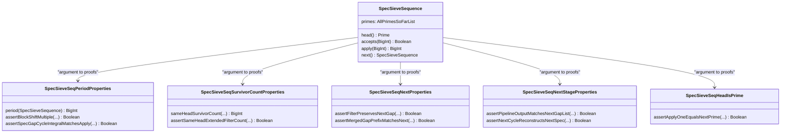

# Formal Verification of Sieve Sequence Stages and Their Transitions

**Author:** Mata, T. H.
Independent Researcher
**Email:** [thiago.henrique.mata@gmail.com](mailto:thiago.henrique.mata@gmail.com)
**GitHub:** [@thiagomata](https://github.com/thiagomata)

## Abstract

<div align="justify">
<p style="text-align: justify">

This article defines a sieve sequence stage as the increasing sequence of
integers accepted by a finite prefix of the prime filters. The accepted pattern
is periodic modulo the product of those filters, so one finite list of positive
gaps reconstructs the entire infinite stage. We formally verify the stage's
strict increase, completeness, block-period shift, gap-cycle reconstruction,
and exact transition count. If the current head is $h$, the current period has
$T$ accepted values, and the current modulus is $M$, then the expanded
window of length $hM$ contains $hT$ old survivors; exactly $T$ are
multiples of $h$, leaving $T(h-1)$ survivors. We also verify the local
copy-or-merge rule for the next gaps and prove, under explicit structural and
period preconditions, that the resulting gap prefix agrees with the next linear
specification.

The formal result has two explicit boundaries. First, next-head primality is
conditional on the square bound supplied mathematically by Bertrand's postulate.
Second, the article proves the semantic transition between stages, while the
direct construction of the next cycle from a repeated and filtered current cycle
is a separate open composition problem. Accordingly, the article establishes a
formally verified finite-stage sieve specification and transition semantics, not
a new prime-sieving algorithm or a theorem about the persistence of any
particular prime gap.

</p>
</div>

## 1. Introduction

The sieve of Eratosthenes repeatedly removes multiples of known primes
[[5]](#ref5). A standard implementation stores a bounded array and crosses out
composites. The Sieve Sequence studied here exposes a different mathematical
view: after a finite set of prime filters has been installed, the survivors
form an infinite periodic sequence. A finite cycle of adjacent gaps therefore
represents the whole stage.

This representation belongs to the broad family of cyclic or wheel-based sieve
descriptions. Pritchard's survey places wheel sieves among systematic families
of prime-number sieves [[6]](#ref6). The present contribution is not the wheel
idea itself. It is the explicit decomposition of the stage and transition into
contracts that can be checked by Stainless, a verifier for Scala programs
[[7]](#ref7), against a first-principles arithmetic and list library.

The proof is organized into these property groups:

- stage semantics and complete increasing enumeration - Section 3;
- canonical period and finite gap-cycle reconstruction - Section 4;
- repeated-cycle invariance, exact filtering, and copy-or-merge dynamics - Section 5;
- next-head primality and next-stage agreement - Section 6;
- conditional assumptions and open composition problems - Section 7.

The mathematical object is separate from its proof namespaces. `SpecSieveSequence`
is the data model and linear semantic specification. Independent property
objects establish the period, survivor count, transition, next-stage assembly,
and head-primality theorems.

## 2. Preliminaries

This section fixes the notation, relates the linear and cyclic views, and states
how to interpret a Stainless-verified contract.

- Section 2.1 defines one stage and its acceptance predicate.
- Section 2.2 defines the finite period and gap cycle.
- Section 2.3 maps the proof architecture.
- Section 2.4 explains the verification boundary.

### 2.1 Stage Definition

Let a stage $S$ be determined by a current head prime $h$ and the complete
list $\overline{P}$ of primes smaller than $h$. The list is stored in
descending order, but its order does not affect divisibility. Define

```math
\begin{aligned}
M &= \prod_{q \in \overline{P}} q,
  &&\text{[Tail primorial]} \\
A_S(v) &\Longleftrightarrow
  v \ge h \land
  \forall q \in \overline{P},\ v \not\equiv 0 \pmod q.
  &&\text{[Acceptance]}
\end{aligned}
```

The linear sequence $L=(\ell_k)_{k\ge 0}$ starts at $h$ and repeatedly
selects the least later accepted value:

```math
\begin{aligned}
\ell_0 &= h, \\
\ell_{k+1}
  &= \min\{v>\ell_k : A_S(v)\}.
\end{aligned}
```

A stage does **not** claim that every $\ell_k$ is prime. For example, the
stage with $h=5$ and filters $3,2$ emits
$5,7,11,13,17,19,23,25,\ldots$. The value $25$ survives because the
current head $5$ has not yet been added to the filter list. Prime generation
comes from the chain of stage heads, not from treating all values in one stage
as prime.

### 2.2 Period and Gap Cycle

Because every $q\in\overline{P}$ divides $M$, acceptance is unchanged by
adding $M$:

```math
\begin{aligned}
A_S(v+M)
&\Longleftrightarrow
\forall q\in\overline{P},\
(v+M)\not\equiv0\pmod q \\
&\Longleftrightarrow
\forall q\in\overline{P},\
v\not\equiv0\pmod q \\
&\Longleftrightarrow A_S(v).
\end{aligned}
```

Let $T>0$ be the unique index satisfying
$\ell_T=h+M$. Define one complete gap list

```math
\begin{aligned}
G &= (g_0,\ldots,g_{T-1}), \\
g_i &= \ell_{i+1}-\ell_i.
\end{aligned}
```

Every gap is positive and the gaps telescope across the period:

```math
\begin{aligned}
g_i &> 0, \\
\sum_{i=0}^{T-1} g_i
  &= \ell_T-\ell_0 \\
  &= (h+M)-h \\
  &= M.
\end{aligned}
```

The cycle integral repeatedly adds the entries of $G$. With the indexing used
by the Scala implementation, its position $k-1$ reconstructs $\ell_k$ for
every $k>0$.

### 2.3 Proof Architecture



The arrows are intentionally one-directional: property objects call into the
data model, while the data model does not depend on property objects. The
construction builds on the verified modulo [[1]](#ref1), list [[2]](#ref2),
cycle [[3]](#ref3), and cycle-integral [[4]](#ref4) foundations.

### 2.4 Meaning of Verification

Stainless verifies each function under its declared preconditions, so a
`require` clause is part of the theorem being cited, not a runtime detail that
can be ignored. An `.ensuring` clause records the postcondition, while a
Boolean proof function ending in `.holds` records the proposition established
by that source function. The official documentation describes this contract
and verification-condition model [[7]](#ref7); System FR provides formal
foundations for the verifier's higher-order functional reasoning [[8]](#ref8).

No repository-wide verification-condition total is used as evidence here.
Those totals change when unrelated functions are added. The stable evidence is
the exact source-linked contract shown for each theorem.

## 3. Linear Stage Semantics

The linear specification is an ordered enumeration of exactly the integers that
pass the installed filters at or after the head.

- `apply` returns accepted values and never moves backwards.
- `indexOfAccepted` proves completeness of the enumeration.
- strict increase makes indexes and adjacent gaps unambiguous.

### 3.1 Accepted Values and Completeness

The generator's `apply` contract proves soundness:
$A_S(\ell_k)$ for every $k\ge0$. Conversely, `indexOfAccepted` proves that
every accepted $v\ge h$ occurs at some index. Together they establish exact
enumeration rather than merely generation of a subset.

```math
\begin{aligned}
\forall k\ge0,\quad
A_S(\ell_k)
&\quad\text{[Soundness]} \\
\forall v\ge h,\quad
A_S(v)
&\Longrightarrow
\exists i\ge0,\ \ell_i=v
\quad\text{[Completeness]}.
\end{aligned}
```

For completeness, start at $\ell_0=h\le v$. If the current generated value
is smaller than $v$, the next generated accepted value cannot pass over $v$,
because $v$ itself is accepted. Repeating this finite descent on
$v-\ell_k$ reaches an index $i$ with $\ell_i=v$.

```scala
def indexOfAccepted(value: BigInt): BigInt = {
  require(accepts(value))

  assert(value >= head.value)
  assert(apply(BigInt(0)) == head.value)
  assert(apply(BigInt(0)) <= value)
  findIndexForAcceptedFrom(value, BigInt(0))
}.ensuring(res =>
  res >= BigInt(0) &&
  apply(res) == value &&
  (res > BigInt(0) ==> apply(res - BigInt(1)) < value)
)
```

This verified contract is implemented in [
  SpecSieveSequence::indexOfAccepted
](
  ../../src/main/scala/v1/chapter6/sieve/seq/spec/SpecSieveSequence.scala
).

### 3.2 Strict Increase

Each recursive step searches strictly after the previous result. Consequently,
the sequence is strictly increasing, indexes are injective, and every adjacent
gap is positive.

```math
\begin{aligned}
\ell_{k+1}
&\ge \ell_k+1
  &&\text{[Search begins after }\ell_k\text{]} \\
&> \ell_k
  &&\text{[Integer order]} \\
g_k
&=\ell_{k+1}-\ell_k>0
  &&\text{[Q.E.D.]}.
\end{aligned}
```

```scala
def applyStrictlyIncreases(k: BigInt): Boolean = {
  require(k >= BigInt(0))

  val previous = apply(k)
  val upper = searchBound(k + BigInt(1))
  val next = apply(k + BigInt(1))

  assert(previous <= searchBound(k))
  assert(tailPrimorial > BigInt(0))
  assert(searchBound(k) < upper)
  assert(previous + BigInt(1) <= upper)
  assert(searchBoundPassesFilter(k + BigInt(1)))
  assert(accepts(upper))
  assert(next == searchNext(previous + BigInt(1), upper))
  assert(next >= previous + BigInt(1))
  next > previous
}.holds
```

This property is verified in [
  SpecSieveSequence::applyStrictlyIncreases
](
  ../../src/main/scala/v1/chapter6/sieve/seq/spec/SpecSieveSequence.scala
).

## 4. Period and Cycle Reconstruction

The finite representation works because the filter predicate is periodic and
the scan preserves the order of the repeated accepted residues.

- one period shifts every generated value by $M$;
- every later block is a translated copy of the first block;
- integrating one finite positive gap cycle reconstructs the infinite scan.

### 4.1 Canonical Block Shift

The boundary $h+M$ passes exactly the same filters as $h$, so completeness
gives a positive index $T$ with $\ell_T=h+M$. Periodicity of acceptance and
strict order then identify the $k$-th accepted value in the following block:

```math
\begin{aligned}
A_S(v+M) &= A_S(v)
  &&\text{[Modulo-period invariance]} \\
\ell_T &= h+M
  &&\text{[Canonical boundary]} \\
\ell_{k+T} &= \ell_k+M
  &&\text{[Same ordered survivor]} \\
\ell_{k+nT} &= \ell_k+nM
  &&\text{[Induction on }n\text{; Q.E.D.]}.
\end{aligned}
```

```scala
def assertBlockShiftMultiple(
  seq: SpecSieveSequence,
  k: BigInt,
  n: BigInt,
  period: BigInt
): Boolean = {
  require(k >= BigInt(0))
  require(n >= BigInt(0))
  require(period > BigInt(0))
  require(seq.apply(period) == seq.head.value + seq.tailPrimorial)
  decreases(n)

  if (n == BigInt(0)) {
    seq.apply(k + n * period) ==
      seq.apply(k) + n * seq.tailPrimorial
  } else {
    val prev = n - BigInt(1)
    assert(assertBlockShiftMultiple(seq, k, prev, period))
    assert(assertBlockShift(seq, k + prev * period, period))
    seq.apply(k + n * period) ==
      seq.apply(k) + n * seq.tailPrimorial
  }
}.holds
```

This property is verified in [
  SpecSieveSeqPeriodProperties::assertBlockShiftMultiple
](
  ../../src/main/scala/v1/chapter6/sieve/seq/spec/properties/SpecSieveSeqPeriodProperties.scala
).

### 4.2 Gap-Cycle Reconstruction

Let `GapCycle(G)` store the first $T$ adjacent differences. The block-shift
theorem makes those differences periodic:

```math
\begin{aligned}
g_{k+T}
&=\ell_{k+T+1}-\ell_{k+T} \\
&=(\ell_{k+1}+M)-(\ell_k+M)
  &&\text{[Block shift]} \\
&=g_k.
\end{aligned}
```

The cycle integral starts at $h$ and adds these gaps. Induction on $k$
then reconstructs every scan value:

```math
\begin{aligned}
I_G(0)
&=h+g_0=\ell_1
  &&\text{[Base]} \\
I_G(k)
&=I_G(k-1)+g_k \\
&=\ell_k+(\ell_{k+1}-\ell_k)
  &&\text{[Induction hypothesis]} \\
&=\ell_{k+1}
  &&\text{[Q.E.D.]}.
\end{aligned}
```

```scala
def assertSpecGapCycleIntegralMatchesApply(
  seq: SpecSieveSequence,
  period: BigInt,
  k: BigInt
): Boolean = {
  require(period > BigInt(0))
  require(seq.apply(period) ==
    seq.head.value + seq.tailPrimorial)
  require(k > BigInt(0))
  decreases(k)

  val gapCycle = specGapCycle(seq, period)
  val mem = gapCycle.memCycle
  val integral = CycleIntegral(seq.head.value, mem)

  if (k == BigInt(1)) {
    assert(assertSpecGapCycleIntegralBase(seq, period))
    integral(BigInt(0)) == seq.apply(BigInt(1))
  } else {
    assert(CycleIntegralProperties.assertNextPosition(
      integral, k - BigInt(1)))
    assert(assertSpecGapCycleIntegralMatchesApply(
      seq, period, k - BigInt(1)))
    assert(assertMemCycleGapMatch(
      seq, k - BigInt(1), period))
    integral(k - BigInt(1)) == seq.apply(k)
  }
}.holds
```

This property is verified in [
  SpecSieveSeqPeriodProperties::assertSpecGapCycleIntegralMatchesApply
](
  ../../src/main/scala/v1/chapter6/sieve/seq/spec/properties/SpecSieveSeqPeriodProperties.scala
).

### 4.3 Repetition Does Not Change the Infinite Sequence

The transition prepares $h$ copies of the current period before installing
the head $h$ as a new filter. Repeating the stored gap list multiplies the
finite representation's period from $T$ to $hT$, but it does not change
the infinite periodic sequence represented by the cycle integral.

```math
\begin{aligned}
G^{\langle h\rangle}
  &=\underbrace{G\mathbin{\texttt{++}}\cdots\mathbin{\texttt{++}}G}_{h\text{ copies}}, \\
|G^{\langle h\rangle}|&=hT, \\
G^{\langle h\rangle}_{k\bmod hT}
  &=G_{k\bmod T}, \\
I_{G^{\langle h\rangle}}(k)
  &=I_G(k)
  \quad\text{[Equal increments and initial value; Q.E.D.]}.
\end{aligned}
```

```scala
def assertSpecRepeatedCycleIntegralMatchesBase(
  seq: SpecSieveSequence,
  period: BigInt,
  k: BigInt
): Boolean = {
  require(period > BigInt(0))
  require(seq.apply(period) ==
    seq.head.value + seq.tailPrimorial)
  require(k >= BigInt(0))

  val gapCycle =
    SpecSieveSeqPeriodProperties.specGapCycle(seq, period)
  val baseCI = CycleIntegral(seq.head.value, gapCycle.memCycle)
  val repeatedCI = specRepeatedCycleIntegral(seq, period)

  assert(GapCycle.assertMemCyclePeriodPositive(gapCycle))
  assert(seq.head.value > BigInt(0))
  assert(RepeatedGapIntegralProperties
    .assertRepeatedValuesIntegralMatches(
      baseCI, repeatedCI, seq.head.value, k
    ))

  repeatedCI(k) == baseCI(k)
}.holds
```

This property is verified in [
  SpecDerivedRepeatedCycleProperties::assertSpecRepeatedCycleIntegralMatchesBase
](
  ../../src/main/scala/v1/chapter6/sieve/seq/spec/properties/SpecDerivedRepeatedCycleProperties.scala
).

## 5. Installing the Current Head as a Filter

The next stage adds $h$ to the active filter list. Over one complete expanded
window, this operation has an exact count and a deterministic effect on gaps.

- the expanded old stage contains exactly $hT$ accepted values;
- exactly $T$ of those values are divisible by $h$;
- every next gap is either copied or is a sum of consecutive old gaps;
- filtering the base and repeated cycle views yields equal survivor-gap lists.

### 5.1 Exact Survivor Count

Consider the accepted values with indexes $r+iT$, where
$0\le r<T$ and $0\le i<h$. The block-shift theorem gives

```math
\begin{aligned}
\ell_{r+iT}=\ell_r+iM.
\end{aligned}
```

The head $h$ is a prime not present among the smaller-prime factors of $M$,
so $\gcd(M,h)=1$. Multiplication by $M$ permutes the residues modulo $h$.
For each fixed $r$, exactly one offset $i\in\{0,\ldots,h-1\}$ therefore
satisfies $\ell_r+iM\equiv0\pmod h$. There are $T$ choices of $r$, so
exactly $T$ old survivors are removed:

```math
\begin{aligned}
N_{\mathrm{old}} &= hT
  &&\text{[}\,h\text{ repeated blocks]} \\
N_{\mathrm{removed}} &= T
  &&\text{[One zero residue for each }r\text{]} \\
N_{\mathrm{survive}}
  &=hT-T \\
  &=T(h-1)
  &&\text{[Q.E.D.]}.
\end{aligned}
```

This is an exact full-period theorem, not a probabilistic density estimate.

```scala
def assertSameHeadExtendedFilterCount(
  seq: SpecSieveSequence,
  period: BigInt
): Boolean = {
  require(period > BigInt(0))
  require(seq.apply(period) ==
    seq.head.value + seq.tailPrimorial)
  require(Calc.mod(
    seq.tailPrimorial, seq.head.value) != BigInt(0))

  val expandedIndex = period * seq.head.value
  val expandedEnd =
    seq.head.value + seq.head.value * seq.tailPrimorial

  assert(seq.head.value > BigInt(1))
  assert(expandedIndex >= BigInt(0))
  assert(assertGeneratedHeadMultiplesPrefixExpandedCount(
    seq, period))
  assert(countGeneratedHeadMultiplesPrefix(
    seq, expandedIndex) == period)
  assert(assertExpandedHeadMultipleCountFromGeneratedCount(
    seq, period))
  assert(countAcceptedHeadMultiplesBetween(
    seq, seq.head.value, expandedEnd) == period)
  assert(assertSameHeadExtendedFilterCountFromRemovedCount(
    seq, period))
  countAcceptedHeadNonMultiplesBetween(
    seq, seq.head.value, expandedEnd) ==
      period * (seq.head.value - BigInt(1))
}.holds
```

This property is verified in [
  SpecSieveSeqSurvivorCountProperties::assertSameHeadExtendedFilterCount
](
  ../../src/main/scala/v1/chapter6/sieve/seq/spec/properties/SpecSieveSeqSurvivorCountProperties.scala
).

### 5.2 Copy-or-Merge Gap Dynamics

Let old consecutive values be $\ell_k<\ell_{k+1}$. If both survive the new
filter, no new accepted value can appear between them, so their difference is
copied unchanged. If one or more old values are removed, the next surviving
endpoints are $\ell_k$ and $\ell_j$ for some $j>k+1$; telescoping merges the
intermediate gaps:

```math
\begin{aligned}
\ell_{k+1}\text{ survives}
&\Longrightarrow
g'_m=\ell_{k+1}-\ell_k=g_k,
  &&\text{[Copy]} \\
\ell_{k+1},\ldots,\ell_{j-1}\text{ removed}
&\Longrightarrow
g'_m=\ell_j-\ell_k \\
&=\sum_{i=k}^{j-1}(\ell_{i+1}-\ell_i) \\
&=\sum_{i=k}^{j-1}g_i.
  &&\text{[Merge; Q.E.D.]}
\end{aligned}
```

The immediate-survivor branch is verified directly:

```scala
def assertFilterPreservesNextGap(
  seq: SpecSieveSequence,
  nextSeq: SpecSieveSequence,
  k: BigInt
): Boolean = {
  require(k >= BigInt(0))
  require(nextSeq.filterValues.nonEmpty)
  require(nextSeq.filterValues.tail == seq.filterValues)
  require(seq.head.value <= nextSeq.head.value)
  require(nextSeq.accepts(seq.apply(k)))
  require(Calc.mod(
    seq.apply(k + BigInt(1)),
    nextSeq.filterValues.head
  ) != BigInt(0))

  val v = seq.apply(k)
  val w = seq.apply(k + BigInt(1))
  val vIdx = nextSeq.indexOfAccepted(v)

  assert(nextSeq(vIdx) == v)
  assert(assertFilterPreservesNextPosition(seq, nextSeq, k))
  assert(nextSeq(vIdx + BigInt(1)) == w)

  nextSeq(vIdx + BigInt(1)) - nextSeq(vIdx) == w - v
}.holds
```

This property is verified in [
  SpecSieveSeqNextProperties::assertFilterPreservesNextGap
](
  ../../src/main/scala/v1/chapter6/sieve/seq/spec/properties/SpecSieveSeqNextProperties.scala
).

The skipped-successor branch is verified as a supporting theorem. When the
immediate old successor is removed, the next gap is the sum of the old gaps up
to the first later survivor:

```scala
private def assertMergeGapEqualsOldGapSum(
  seq: SpecSieveSequence,
  nextSeq: SpecSieveSequence,
  k: BigInt,
  period: BigInt
): Boolean = {
  require(k >= BigInt(0))
  require(period > BigInt(0))
  require(nextSeq.filterValues.nonEmpty)
  require(nextSeq.filterValues.tail == seq.filterValues)
  require(seq.head.value <= nextSeq.head.value)
  require(nextSeq.accepts(seq.apply(k)))
  require(Calc.mod(
    seq.apply(k + BigInt(1)),
    nextSeq.filterValues.head
  ) == BigInt(0))
  require(seq.apply(period) ==
    seq.head.value + seq.tailPrimorial)
  require(Calc.mod(
    seq.head.value + seq.tailPrimorial,
    nextSeq.filterValues.head
  ) != BigInt(0))

  val p = nextSeq.filterValues.head
  val vIdx = nextSeq.indexOfAccepted(seq.apply(k))
  val bound = k + p * period

  assert(assertPeriodBoundIsNonMultiple(
    seq, nextSeq, k, period))
  val m = findFirstNonMultipleAfter(seq, k, p, bound)
  assert(m >= k)
  assert(assertMergeLandsOnFirstSurvivor(
    seq, nextSeq, k, period))
  assert(nextSeq(vIdx) == seq.apply(k))
  assert(nextSeq(vIdx + BigInt(1)) == seq.apply(m))
  assert(SpecSieveSeqPeriodProperties
    .assertSumGapTelescopes(seq, k, m))

  nextSeq(vIdx + BigInt(1)) - nextSeq(vIdx) ==
    SpecSieveSeqPeriodProperties.sumGap(seq, k, m)
}.holds
```

This supporting property is verified in [
  SpecSieveSeqNextProperties::assertMergeGapEqualsOldGapSum
](
  ../../src/main/scala/v1/chapter6/sieve/seq/spec/properties/SpecSieveSeqNextProperties.scala
).

The general merged prefix is then verified against the next specification's
gap list:

```scala
def assertMergedGapPrefixMatchesNext(
  seq: SpecSieveSequence,
  nextSeq: SpecSieveSequence,
  k: BigInt,
  seqIndex: BigInt,
  remaining: BigInt,
  period: BigInt
): Boolean = {
  require(k >= BigInt(0))
  require(seqIndex >= BigInt(0))
  require(remaining >= BigInt(0))
  require(period > BigInt(0))
  require(nextSeq.filterValues.nonEmpty)
  require(nextSeq.filterValues.tail == seq.filterValues)
  require(seq.head.value <= nextSeq.head.value)
  require(nextSeq.accepts(seq.apply(k)))
  require(seq.apply(period) ==
    seq.head.value + seq.tailPrimorial)
  require(Calc.mod(
    seq.head.value + seq.tailPrimorial,
    nextSeq.filterValues.head
  ) != BigInt(0))
  decreases(remaining)

  val prefix = mergedGapPrefix(
    seq, nextSeq, k, remaining, period)

  if (remaining == BigInt(0)) {
    prefix == SpecSieveSeqPeriodProperties.gapList(
      nextSeq, seqIndex, BigInt(0))
  } else {
    val nextOldIndex = nextMergedGapOldIndex(
      seq, nextSeq, k, period)
    val computedSeqIndex =
      nextSeq.indexOfAccepted(seq.apply(k))

    assert(nextSeq.assertApplyInjective(
      seqIndex, computedSeqIndex))
    assert(assertMergedGapPrefixHeadMatchesNext(
      seq, nextSeq, k, period))
    assert(assertMergedGapPrefixMatchesNext(
      seq,
      nextSeq,
      nextOldIndex,
      seqIndex + BigInt(1),
      remaining - BigInt(1),
      period
    ))

    prefix == SpecSieveSeqPeriodProperties.gapList(
      nextSeq, seqIndex, remaining)
  }
}.holds
```

This property is verified in [
  SpecSieveSeqNextProperties::assertMergedGapPrefixMatchesNext
](
  ../../src/main/scala/v1/chapter6/sieve/seq/spec/properties/SpecSieveSeqNextProperties.scala
).

### 5.3 Filtering the Repeated Cycle Preserves the Semantic Result

Section 4.3 proved pointwise equality between the base and repeated cycle
integrals. Applying the same divisibility predicate at the same positions must
therefore select identical survivor values. Equal survivor lists have equal
adjacent-gap lists:

```math
\begin{aligned}
I_{G^{\langle h\rangle}}(k)&=I_G(k)
  &&\text{[Repeated-cycle equality]} \\
I_{G^{\langle h\rangle}}(k)\not\equiv0\pmod h
&\Longleftrightarrow I_G(k)\not\equiv0\pmod h
  &&\text{[Substitution]} \\
\operatorname{survivors}(I_{G^{\langle h\rangle}},h)
&=\operatorname{survivors}(I_G,h) \\
\operatorname{gaps}(\operatorname{survivors}(I_{G^{\langle h\rangle}},h))
&=\operatorname{gaps}(\operatorname{survivors}(I_G,h))
  &&\text{[Q.E.D.]}.
\end{aligned}
```

```scala
def assertSpecBaseAndRepeatedGapListMatch(
  seq: SpecSieveSequence,
  period: BigInt
): Boolean = {
  require(period > BigInt(0))
  require(seq.apply(period) ==
    seq.head.value + seq.tailPrimorial)

  val gapCycle =
    SpecSieveSeqPeriodProperties.specGapCycle(seq, period)
  val baseCI = CycleIntegral(seq.head.value, gapCycle.memCycle)
  val repeatedCI = specRepeatedCycleIntegral(seq, period)
  val count = period * seq.head.value

  assert(seq.head.value > BigInt(0))

  val baseSurvivors =
    CycleIntegralFilterProperties.survivorValues(
      baseCI, seq.head.value, BigInt(0), count)
  val repSurvivors =
    CycleIntegralFilterProperties.survivorValues(
      repeatedCI, seq.head.value, BigInt(0), count)

  assert(assertSpecBaseAndRepeatedSurvivorValuesMatch(
    seq, period, BigInt(0), count))
  assert(baseSurvivors == repSurvivors)

  if (baseSurvivors.isEmpty) {
    baseSurvivors == repSurvivors
  } else {
    assert(repSurvivors.nonEmpty)
    CycleIntegralFilterProperties.gapsFromValues(
      baseSurvivors) ==
    CycleIntegralFilterProperties.gapsFromValues(
      repSurvivors)
  }
}.holds
```

This property is verified in [
  SpecDerivedRepeatedCycleProperties::assertSpecBaseAndRepeatedGapListMatch
](
  ../../src/main/scala/v1/chapter6/sieve/seq/spec/properties/SpecDerivedRepeatedCycleProperties.scala
).

## 6. The Next Stage

The next stage installs the current head as a filter, starts at the following
prime, and represents its own accepted sequence by a new finite gap cycle.
Throughout this section, a prime marks the next stage's own version of each
object defined in Section 2: $S'$ is the next stage, $h'=\ell_1$ its head,
$M'$ its tail primorial, $\ell'$ its linear enumeration, and $G'$ its gap
cycle.

- the first old-stage successor is the next prime under the square bound;
- the semantic merged-gap prefix equals the next specification's gap prefix;
- a valid next-period boundary lets the next gap cycle reconstruct the next scan.

### 6.1 Square-Bound Successor Primality

The first old-stage successor is accepted by all filters smaller than $h$.
If that successor lies below $h^2$, then a composite successor would have a
prime divisor below $h$, contradicting acceptance. Therefore the successor is
prime under the square-bound precondition:

```math
\begin{aligned}
\ell_1&<h^2, \\
\ell_1\text{ composite}
&\Longrightarrow
\exists d<h,\ d\text{ prime and }d\mid \ell_1
  &&\text{[Smallest prime divisor]} \\
d<h
&\Longrightarrow d\in\overline{P}
  &&\text{[All smaller primes are filters]} \\
d\mid\ell_1
&\Longrightarrow \neg A_S(\ell_1)
  &&\text{[Filter contradiction]} \\
&\Longrightarrow \ell_1\text{ is prime}.
  &&\text{[Q.E.D.]}
\end{aligned}
```

```scala
def assertApplyOneIsPrimeIfBelowHeadSq(
  seq: SpecSieveSequence
): Boolean = {
  require(seq.apply(BigInt(1)) <
    seq.head.value * seq.head.value)

  val v1 = seq.apply(BigInt(1))
  assert(seq.applyStrictlyIncreases(0))

  if (Prime.isPrime(v1)) {
    Prime.isPrime(v1)
  } else {
    val d =
      PrimeProperties.assertCompositeSmallestPrimeDivisor(v1)
    assert(d < seq.head.value)
    assert(Calc.mod(v1, d) == BigInt(0))

    AllPrimesSoFarList.primeAtOrBelowHeadIsContained(
      d, seq.primes.list)
    assert(AllPrimesSoFarList.containsValue(
      d, seq.primes.list.tail))
    assert(assertFilterValuesContains(seq, d))
    assert(divisorInFilterValues(v1, d, seq.filterValues))
    assert(!SieveUtils.isCoprime(v1, seq.filterValues))
    assert(seq.passesFilter(v1))
    assert(false)
    Prime.isPrime(v1)
  }
}.holds
```

This property is verified in [
  SpecSieveSeqHeadIsPrime::assertApplyOneIsPrimeIfBelowHeadSq
](
  ../../src/main/scala/v1/chapter6/sieve/seq/spec/properties/SpecSieveSeqHeadIsPrime.scala
).

### 6.2 The First Successor Is the Next Prime

Suppose the next prime after $h$ is $p^+$ and $p^+<h^2$. The next prime
passes every smaller-prime filter, so $\ell_1\le p^+$. Conversely, if
$\ell_1<h^2$ were composite, it would have a prime divisor at most
$\sqrt{\ell_1}<h$. That divisor belongs to $\overline{P}$, contradicting
acceptance. Thus $\ell_1$ is prime. No prime lies strictly between $h$ and
$p^+$, so $\ell_1=p^+$.

```math
\begin{aligned}
A_S(p^+) &\quad\text{[Distinct larger prime passes old filters]} \\
\ell_1 &\le p^+
  &&\text{[Least accepted successor]} \\
\ell_1 < h^2
  &\Longrightarrow \ell_1\text{ is prime}
  &&\text{[Composite divisor would be }<h\text{]} \\
h<\ell_1\le p^+,
\quad \ell_1\text{ prime}
  &\Longrightarrow \ell_1=p^+
  &&\text{[No intervening prime; Q.E.D.]}.
\end{aligned}
```

```scala
def assertApplyOneEqualsNextPrime(
  seq: SpecSieveSequence
): Boolean = {
  require(seq.primes.nextPrime.value <
    seq.head.value * seq.head.value)

  val nextP = AllPrimesSoFarList.nextPrime(seq.primes.list)

  assert(nextP.value > seq.head.value)
  assert(Prime.isPrime(nextP.value))
  assert(AllPrimesSoFarList.noPrimesBetween(
    seq.head.value + BigInt(1), nextP.value))

  assert(assertApplyOneGtHead(seq))
  assert(assertApplyOneAtOrBeforeOwnNextPrime(seq))
  assert(assertApplyOnePrimeIfOwnNextPrimeBelowHeadSq(seq))

  assert(seq.apply(BigInt(1)) <= nextP.value)
  assert(Prime.isPrime(seq.apply(BigInt(1))))
  assert(seq.head.value + BigInt(1) <= seq.apply(BigInt(1)))

  if (seq.apply(BigInt(1)) < nextP.value) {
    assert(AllPrimesSoFarList.noPrimesBetweenExcludesValue(
      seq.head.value + BigInt(1),
      nextP.value,
      seq.apply(BigInt(1))
    ))
    assert(!Prime.isPrime(seq.apply(BigInt(1))))
    assert(false)
    seq.apply(BigInt(1)) == nextP.value
  } else {
    seq.apply(BigInt(1)) == nextP.value
  }
}.holds
```

This property is verified in [
  SpecSieveSeqHeadIsPrime::assertApplyOneEqualsNextPrime
](
  ../../src/main/scala/v1/chapter6/sieve/seq/spec/properties/SpecSieveSeqHeadIsPrime.scala
).

### 6.3 Semantic Pipeline Agreement

Let $T'=T(h-1)$. Under the stated stage-relationship invariants, the semantic
merge process starts at the first surviving old value and emits $T'$ merged
gaps. Section 5.2 proves recursively that this list equals the first $T'$
gaps of the next linear specification:

```math
\begin{aligned}
T'&=T(h-1), \\
\operatorname{mergedGaps}(S,S',1,T')
&=\operatorname{gapList}(S',0,T')
  \quad\text{[By copy-or-merge induction; Q.E.D.]}.
\end{aligned}
```

```scala
def assertPipelineOutputMatchesNextGapList(
  seq: SpecSieveSequence,
  nextSeq: SpecSieveSequence,
  period: BigInt,
  nextPeriod: BigInt
): Boolean = {
  require(period > BigInt(0))
  require(nextPeriod > BigInt(0))
  require(seq.apply(period) ==
    seq.head.value + seq.tailPrimorial)
  require(nextPeriod ==
    period * (seq.head.value - BigInt(1)))
  require(Calc.mod(
    seq.tailPrimorial, seq.head.value) != BigInt(0))
  require(seq.primes.nextPrime.value <
    seq.head.value * seq.head.value)
  require(nextSeq.filterValues.nonEmpty)
  require(nextSeq.filterValues.head == seq.head.value)
  require(nextSeq.filterValues.tail == seq.filterValues)
  require(nextSeq.head.value == seq.apply(BigInt(1)))
  require(seq.head.value < nextSeq.head.value)
  require(nextSeq.accepts(seq.apply(BigInt(1))))
  require(nextSeq(BigInt(0)) == seq.apply(BigInt(1)))
  require(Calc.mod(
    seq.head.value + seq.tailPrimorial,
    seq.head.value
  ) != BigInt(0))

  SpecSieveSeqNextProperties.assertMergedGapPrefixMatchesNext(
    seq, nextSeq, BigInt(1), BigInt(0), nextPeriod, period
  )
}.holds
```

This property is verified in [
  SpecSieveSeqNextStageProperties::assertPipelineOutputMatchesNextGapList
](
  ../../src/main/scala/v1/chapter6/sieve/seq/spec/properties/SpecSieveSeqNextStageProperties.scala
).

### 6.4 Conditional Next-Cycle Reconstruction

If $T'$ is known to be the canonical period of the next stage, the generic
cycle-reconstruction theorem from Section 4.2 applies directly to that stage:

```math
\begin{aligned}
\ell'_{T'} &= h'+M'
  &&\text{[Next-period boundary]} \\
G'&=\operatorname{gapList}(S',0,T') \\
I_{G'}(k-1)&=\ell'_k
  &&\text{[Cycle reconstruction; Q.E.D.]}.
\end{aligned}
```

```scala
def assertNextCycleReconstructsNextSpec(
  seq: SpecSieveSequence,
  period: BigInt,
  nextPeriod: BigInt,
  k: BigInt
): Boolean = {
  require(period > BigInt(0))
  require(nextPeriod > BigInt(0))
  require(seq.apply(period) ==
    seq.head.value + seq.tailPrimorial)
  require(seq.primes.nextPrime.value <
    seq.head.value * seq.head.value)
  require(seq.next.apply(nextPeriod) ==
    seq.next.head.value + seq.next.tailPrimorial)
  require(k > BigInt(0))

  val nextSeq = seq.next
  SpecSieveSeqPeriodProperties
    .assertSpecGapCycleIntegralMatchesApply(
      nextSeq, nextPeriod, k
    )
}.holds
```

This property is verified in [
  SpecSieveSeqNextStageProperties::assertNextCycleReconstructsNextSpec
](
  ../../src/main/scala/v1/chapter6/sieve/seq/spec/properties/SpecSieveSeqNextStageProperties.scala
).

## 7. Exact Proof Boundary

The verified results above do not form an unconditional operational theorem.
This section states the boundary as part of the theorem.

- **Square bound.** `SpecSieveSequence.next` and the next-head theorem require
  $p^+<h^2$. Bertrand's postulate supplies a prime between $h$ and $2h$;
  for prime $h\ge2$, this implies the required square bound (with $h=2$
  checked directly). Ramanujan gives a direct proof of the required postulate
  [[9]](#ref9), but
  Bertrand's postulate is an external mathematical dependency here, not a
  Stainless theorem in this development.

- **Count-to-period bridge.** Section 5.1 verifies that filtering the complete
  expanded current-stage window leaves exactly $T(h-1)$ values. Section 6.3
  separately reconstructs the next stage when
  $\ell'_{T'}=h'+M'$ is supplied. The derivation of that next canonical-period
  equation from the same-head count is a distinct open composition theorem.

- **Direct cycle-to-cycle construction.** Repetition preserves the represented
  values; filtering the base and repeated views gives equal survivor lists and
  gaps; the first survivor is the next head; and the semantic merged-gap prefix
  agrees with the next specification. The open composition theorem is the
  equality between the repeated cycle's filtered survivor-gap list and that
  semantic merged-gap prefix, followed by packaging those gaps into a new
  integral cycle.

- **No local gap-persistence theorem.** Exact full-period counts do not imply that
  a chosen gap occurs in a shorter interval such as $[h,h^2)$. This article
  proves the sieve-stage foundation only; it makes no claim about infinitely many
  twin primes or the survival of 2-gaps in every local window.

- **No efficiency theorem.** The period grows from $T$ to $T(h-1)$. The finite
  cycle is analytically useful, but materializing it need not outperform a
  conventional segmented sieve. No time or space complexity advantage is claimed.

These qualifications are part of the result: they separate the verified
finite-stage theorem from adjacent mathematical questions.

## 8. Future Work

The next proof obligation is to connect the filtered repeated-cycle survivor
gaps with the semantic merged-gap prefix. That equality is the missing bridge
between the local delete-and-merge description and the concrete gap list of
the next sieve level. Once that bridge is verified, the next `CycleIntegral`
can be constructed directly from the current repeated and filtered cycle
rather than being related through a separate semantic transition.

A second direction is to derive the next canonical-period boundary from the
exact survivor count. The article already proves the complete-period counting
law, but the canonical boundary requires turning that count into the precise
finite prefix used by the next stage. The square-bound dependency currently
supplied by Bertrand's postulate is another natural verification target:
either a Stainless proof of the needed bound or a clearly stated formal
substitute would make the dependency explicit inside the project.

Finally, local gap-distribution theorems should be developed separately from
the full-period construction results proven here. The full-period facts explain
how the sieve stage is represented and transformed; they do not by themselves
settle which gaps appear in a particular finite window.

## 9. Conclusion

The Sieve Sequence is a finite representation of an infinite accepted-value
stream. The formalization verifies the following core facts:

```math
\begin{aligned}
A_S(v)
&\Longrightarrow \exists i\ge0,\ \ell_i=v,
  &&\text{[Complete enumeration]} \\
\ell_{k+1}&>\ell_k,
  &&\text{[Strict increase]} \\
\ell_{k+nT}&=\ell_k+nM,
  &&\text{[Block shift]} \\
I_G(k-1)&=\ell_k,
  &&\text{[Cycle reconstruction]} \\
I_{G^{\langle h\rangle}}(k)&=I_G(k),
  &&\text{[Repetition invariance]} \\
N_{\mathrm{survive}}&=T(h-1),
  &&\text{[Exact expanded filtering]} \\
g'_m&=g_k
  \quad\text{or}\quad
  g'_m=\sum_{i=k}^{j-1}g_i,
  &&\text{[Copy or merge]} \\
p^+<h^2&\Longrightarrow \ell_1=p^+,
  &&\text{[Next head]} \\
\operatorname{mergedGaps}(S,S',1,T')
&=\operatorname{gapList}(S',0,T'),
  &&\text{[Semantic transition]} \\
\ell'_{T'}=h'+M'
&\Longrightarrow I_{G'}(k-1)=\ell'_k.
  &&\text{[Conditional next reconstruction]}
\end{aligned}
```

The formalization therefore gives a precise finite-stage account of the sieve:
the old filter pattern repeats, the new head removes exactly one lift per old
residue over a complete expanded period, and deletion changes gaps only by
copying or merging them. The theorem does not infer prime-gap persistence or
algorithmic efficiency from the full-period facts alone.

## References

<a name="ref1" id="ref1" href="#ref1">[1]</a>
Mata, T. H. (2026). *Proving Properties of Division and Modulo using Formal
Verification*. [Local article](../chapter2/modulo.md).

<a name="ref2" id="ref2" href="#ref2">[2]</a>
Mata, T. H. (2026). *Using Formal Verification to Prove Properties of Lists
Recursively Defined*. [Local article](../chapter3/list.md).

<a name="ref3" id="ref3" href="#ref3">[3]</a>
Mata, T. H. (2026). *Formal Verification of Cyclic Lists*.
[Local article](../chapter4/cycle.md).

<a name="ref4" id="ref4" href="#ref4">[4]</a>
Mata, T. H. (2026). *Formal Verification of Cycle Integral Properties from
First Principles*. [Local article](../chapter4/integral-cycle.md).

<a name="ref5" id="ref5" href="#ref5">[5]</a>
Hardy, G. H. and Wright, E. M. (1979). *An Introduction to the Theory of
Numbers* (5th ed.). Clarendon Press, Oxford. See Section 5.4 for the Chinese
Remainder Theorem and Section 15.1 for the sieve of Eratosthenes.
[Bibliographic record](https://books.google.com/books?id=FlUj0Rk_rF4C).

<a name="ref6" id="ref6" href="#ref6">[6]</a>
Pritchard, P. (1987). "Linear prime-number sieves: a family tree."
*Science of Computer Programming*, 9(1), 17-35.
[doi:10.1016/0167-6423(87)90024-4](https://doi.org/10.1016/0167-6423(87)90024-4).

<a name="ref7" id="ref7" href="#ref7">[7]</a>
EPFL-LARA. *Stainless documentation: Verification Conditions*.
[Official documentation](https://epfl-lara.github.io/stainless/verification.html).

<a name="ref8" id="ref8" href="#ref8">[8]</a>
Hamza, J., Voirol, N., and Kuncak, V. (2019). "System FR: Formalized
Foundations for the Stainless Verifier." *Proceedings of the ACM on Programming
Languages*, 3(OOPSLA), Article 166.
[doi:10.1145/3360592](https://doi.org/10.1145/3360592).

<a name="ref9" id="ref9" href="#ref9">[9]</a>
Ramanujan, S. (1919). "A proof of Bertrand's postulate." *Journal of the
Indian Mathematical Society*, 11, 181-182.
[Original paper](https://ramanujan.sirinudi.org/Volumes/published/ram24.pdf).
