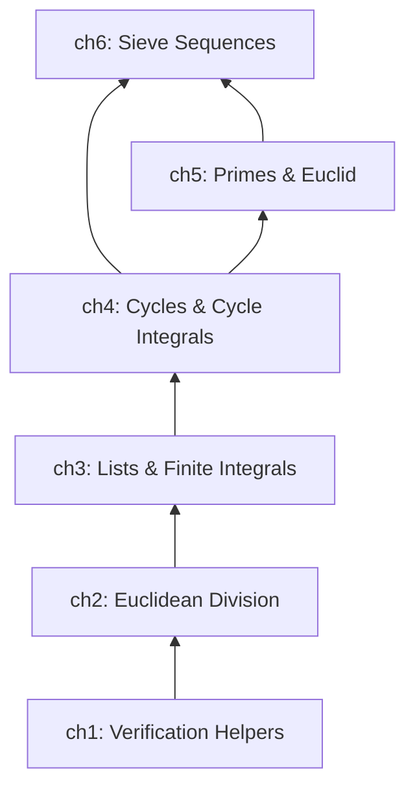
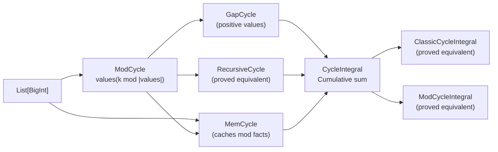
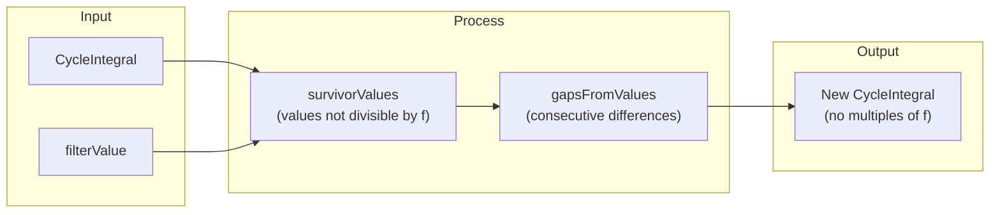
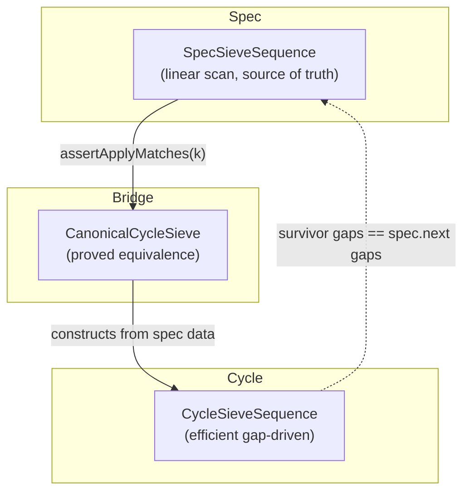
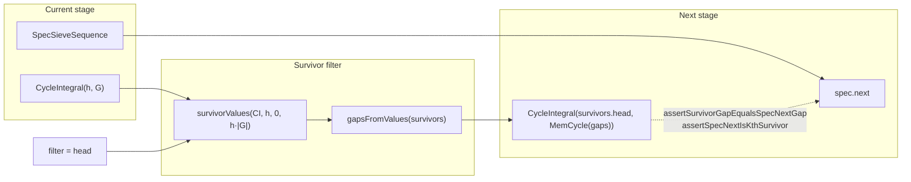

# Project Architecture

## Overview

The project is a zero-prior-knowledge formal verification of the Sieve of Eratosthenes, built in **6 layers**. Each layer defines its own data structures and proves their key properties, which the next layer uses as primitives.

---

## Layer 1: Verification Helpers

**File:** `src/main/scala/v1/chapter1/verification/Helper.scala`

Generic assertion infrastructure (`assert`, `equals` up to 9-ary). All higher layers use these to write `.holds` lemmas.

**Key contribution to the stack:** The `.holds` pattern — every verified property in the project is a Boolean function ending with `.holds`, proved by Stainless.

---

## Layer 2: Euclidean Division

**Files:** `src/main/scala/v1/chapter2/div/{DivMod, Calc, ModIdempotence, ...}`

### Core objects

| Object | Purpose |
|--------|---------|
| `DivMod` | Euclidean division case class (a = b·q + r, 0 ≤ r < b) |
| `Calc` | Wrapper: `Calc.div(a, b)`, `Calc.mod(a, b)` — only approved way to compute div/mod (the `%` operator is blocked) |

### Key properties verified

- **Mod idempotence**: `Calc.mod(Calc.mod(a, b), b) == Calc.mod(a, b)`
- **Mod addition**: `Calc.mod(a + c, b) == Calc.mod(Calc.mod(a, b) + Calc.mod(c, b), b)`
- **Mod multiplication**: `Calc.mod(a * c, b) == Calc.mod(Calc.mod(a, b) * Calc.mod(c, b), b)`
- **Mod zero**: `Calc.mod(a, b) == 0` iff `b` divides `a`
- **Small dividend**: If `a < b`, then `Calc.mod(a, b) == a` and `Calc.div(a, b) == 0`

### What the next layer needs

All list operations (chapter 3) depend on modular arithmetic for index computations, modulo indexing, and list product divisibility.

---

## Layer 3: Lists and Finite Integrals

**Files:** `src/main/scala/v1/chapter3/list/{ListUtils, Integral, ListBoundUtils, ListRepeatProperties, ...}`

### Core objects

| Object | Purpose |
|--------|---------|
| `ListUtils` | `sum`, `slice`, `splitAt`, small-big reordering |
| `Integral` | Finite prefix-sum over a list: `Integral(L)(k) = sum(L[0..k])` |
| `ListBoundUtils` | Predicates: `allGreaterThan`, `allPositive`, `allNonNegative` |

### Key properties verified

- **Sum distribution**: `sum(A ++ B) == sum(A) + sum(B)`, `sum(A.tail) + A.head == sum(A)`
- **Tail shift**: Accessing `A.tail(i)` equals `A(i+1)`
- **Integral head match**: `Integral(L).head == L.head`
- **Integral delta match**: `Integral(L)(k) - Integral(L)(k-1) == L(k)` (for `k > 0`)
- **List repeat foundation**:
  - `repeat(L, n) == L ++ repeat(L, n-1)` (structural recursion)
  - `sum(repeat(L, n)) == sum(L) * n` (sum under repetition)
  - `repeat(L, n)(k) == L(Calc.mod(k, |L|))` (index access)

### What the next layer needs

Cycle definitions (chapter 4) use lists as their value store, list bounds for gap cycles, and the sum/access lemmas for the integral-cycle connection.

---

## Layer 4: Cycles and Cycle Integrals

**Files:** `src/main/scala/v1/chapter4/cycle/{mod, memory, recursive, gap, integral/*}`

### Core objects

| Object | Purpose |
|--------|---------|
| `ModCycle` | `values(k mod |values|)` — modulo-indexed cycle |
| `MemCycle` | Wraps ModCycle with caching (private constructor via `MemCycle.apply`) |
| `RecursiveCycle` | Recursively defined cycle, proved equivalent to ModCycle |
| `GapCycle` | Cycle of positive gaps (wraps MinBoundList), provides `memCycle` and `integral` |
| `CycleIntegral` | Recursive prefix-sum: `CI(k) = CI(k-1) + cycle(k)` |
| `ModCycleIntegral` | Closed-form: `CI(k) = (k div n)·sum + integral(k mod n) + init` |

### Key properties verified

- **Cycle access**: `cycle(k) == cycle.values(Calc.mod(k, cycle.size))` (`findValueInCycle`)
- **Cycle after loop**: `cycle(k + n) == cycle(k)` where `n = cycle.size` (`valueMatchAfterManyLoops`)
- **ModCycle ≡ RecursiveCycle**: Both produce identical values (`propagateModFromValueToCycle`)
- **CycleIntegral recurrence**:
  - `CI(k+1) - CI(k) == cycle(k+1)` (`assertDiffEqualsCycleValue`)
  - `CI(k + n) - CI(k) == CI(k') - CI(k)` for same modulo position (`assertSameDiffAfterCycle`)
- **CycleIntegral increasing**: If all cycle values are positive, CI is strictly increasing
- **Three integral equivalence**: Recursive ≡ Classic ≡ ModCycleIntegral (`assertModCycleEqualsCycleIntegral`)
- **Bridge**: `ModCycle(k) == MemCycle(k)` when both wrap the same values (`assertModCycleEqualsMemCycle`)

### CycleIntegralFilterProperties (survivor layer)

This file adds the survivor-based gap derivation that powers the sieve progression:

| Property | Statement |
|----------|-----------|
| `assertSurvivorAtNotMultiple` | Every value in `survivorValues` is NOT divisible by `f` |
| `assertGapsFromValuesAtIndex` | `gapsFromValues(L)[i] == L[i+1] - L[i]` |
| `assertGapsFromValuesSize` | `|gapsFromValues(L)| == |L| - 1` |
| `assertFirstSurvivorHead` | `survivorValues(ci, f, start, 1).head == ci(start)` when `ci(start) mod f != 0` |
| `assertNewCIMatchesSurvivors` | `newCI(k) == survivors(k+1)` when gaps match |
| `assertFilterMergeComposition` | `newCI(k) mod f != 0` for all `k` — the full composition theorem |

### What the next layer needs

Cycle integrals are the engine of the sieve: `CycleSieveSequence` stores a `CycleIntegral` that generates the candidate stream. The survivor filter properties (above) are what prove the next-stage correctness — they show that filtering and re-gapping produces a valid new cycle.

---

## Layer 5: Primes and Euclid

**Files:** `src/main/scala/v1/chapter5/prime/{Prime, PrimeUtils, AllPrimesSoFarList, PrimeProperties, ...}`

### Core objects

| Object | Purpose |
|--------|---------|
| `Prime` | Wrapper requiring `isPrime(value)`, provides `noDivisorInRange` |
| `SortedPrimeList` | Descending-sorted prime list with verified insert/remove |
| `AllPrimesSoFarList` | Complete-prime-prefix: contains every prime up to its head |
| `PrimeUtils` | `primorial`, `biggerPrime`, `isMultiple`, `primeValues` |

### Key properties verified

- **Euclid's theorem**: `primorial(P) + 1` is coprime to all primes in `P` — proves infinite primes
- **Next prime from Euclid**: `AllPrimesSoFarList.nextPrime` constructs a larger prime
- **Smallest divisor**: If `n` is composite, it has a prime divisor ≤ sqrt(n)
- **Distinct primes coprime**: `p ≠ q ∧ isPrime(p) ∧ isPrime(q) ⇒ q mod p ≠ 0`
- **Filter preserves primes**: Filtering by prime `p` does not remove any other prime `q`

### What the next layer needs

The `SpecSieveSequence` (chapter 6) uses `AllPrimesSoFarList` as its prime source. The filter-preserves-primes property ensures that the sieve never incorrectly removes a candidate.

---

## Layer 6: Sieve Sequences

**Files:** `src/main/scala/v1/chapter6/seq/sieve/{SpecSieveSequence, CycleSieveSequence, CanonicalCycleSieve, SieveSequenceNextLevel, ...}`

### Three-sequence architecture

### `SpecSieveSequence` — the mathematical spec

- **Apply**: `apply(0) = head`, `apply(k) = next accepted value after apply(k-1)`
- **Gaps**: `gapList(from, count)` = differences between consecutive apply values
- **Spec gap cycle**: `specGapCycle(period)` returns a `GapCycle` certified to produce the correct gap list
- **Next**: `next` constructs the next stage (new head + old primes as filters)
- **Key theorem**: `assertSpecGapCycleIntegralMatchesApply` — the gap cycle integral reconstructs the spec's apply values

### `CycleSieveSequence` — the efficient implementation

- **State**: `primes: List[BigInt]` + `gapCycle: GapCycle`
- **Integral**: `CycleIntegral(head, gapCycle.memCycle)` generates the candidate stream
- **Apply**: `apply(0) = head`, `apply(k) = integral(k-1)` for `k > 0`
- **Next**: two approaches:
  - `next()` — the **walk** (scans positions, collects survivors, derives gaps). Hard to verify.
  - `nextWithGapCycle(newGapCycle)` — takes a pre-computed gap cycle, used by the constructive path
- **No reference to `SpecSieveSequence`** — fully independent data structure

### `CanonicalCycleSieve` — the bridge

**Construction:** Takes a `SpecSieveSequence` + `period`, builds a `CycleSieveSequence` from the spec's own data.

| Lemma | What it proves |
|-------|----------------|
| `assertApplyMatches(k)` | `cycle(k) == spec(k)` — same-stage equivalence |
| `assertNextHeadMatches()` | `cycle(1) == spec.next.head.value` — next head matches |
| `assertNextCycleGapsMatchSpecNext` | Constructive next gaps == spec.next gap list |
| `assertNextCycleApplyMatchesSpecNext` | Constructive next cycle matches spec.next in apply |
| `assertSurvivorGapEqualsSpecNextGap` | Survivor gap(i) == spec.next gap(i) |
| `assertSpecNextIsKthSurvivor` | `spec.next(k) == cycle(pos)` — per-position survivor equivalence |
| `assertFilterMergeComposition` | New CI from survivors has no multiples of the filter prime |

### Survivor-based next-stage derivation

The key verified fact: the survivor-based gaps equal `spec.next`'s gaps at every index, and the first survivor head equals `spec.next(0)`. This proves the survivor derivation produces the correct next stage — no walk unfolding needed.

---

## Summary: What each layer contributes to the next

| Layer | Gives the next layer |
|-------|---------------------|
| **ch2: Div/Mod** | Modular arithmetic — index operations, list product divisibility, cycle indexing |
| **ch3: Lists** | Sum/append/access properties, finite integrals, list repeat — the building blocks for cycle definitions |
| **ch4: Cycles** | Unbounded sequences, cycle integrals (prefix sums), gap cycles, survivor filtering — the sieve's computational engine |
| **ch5: Primes** | Prime definitions, Euclid's theorem, filter preservation — the mathematical guarantee that the sieve works |
| **ch6: Sieve** | The full pipeline — spec as source of truth, cycle as efficient representation, canonical bridge proving they match, survivor-based next-stage derivation |
