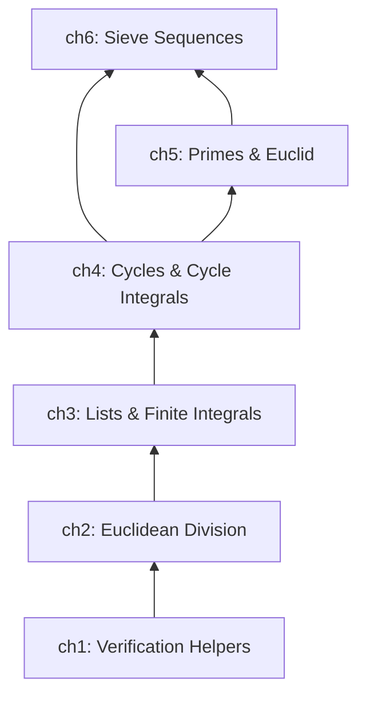
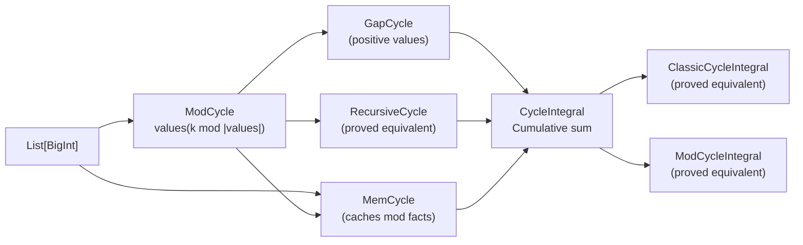
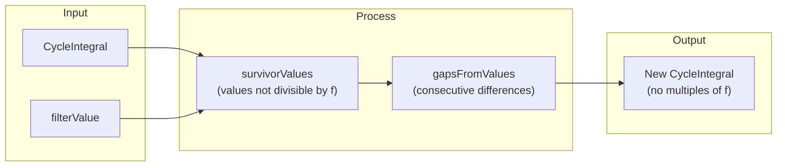
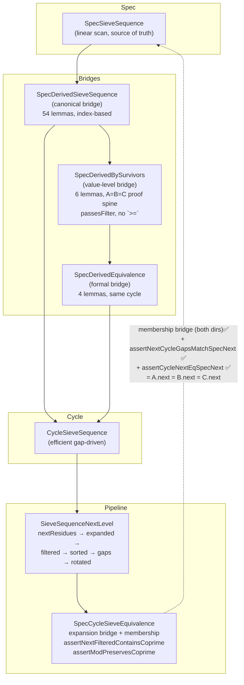
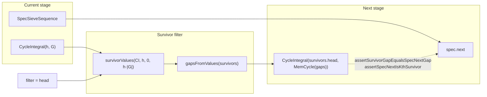

# Project Architecture

## Overview

The project is a zero-prior-knowledge formal verification of the Sieve of Eratosthenes, built in **6 layers**. Each layer defines its own data structures and proves their key properties, which the next layer uses as primitives.



---

## Layer 1: Verification Helpers

**File:** `src/main/scala/v1/chapter1/verification/Helper.scala`

Generic assertion infrastructure (`assert`, `equals` up to 9-ary). All higher layers use these to write `.holds` lemmas.

**Key contribution to the stack:** The `.holds` pattern — every verified property in the project is a Boolean function ending with `.holds`, proved by Stainless.

---

## Layer 2: Euclidean Division

**Files:** `src/main/scala/v1/chapter2/div/{DivMod, Calc, ModIdempotence, ...}`

### Core objects

| Object | Purpose |
|--------|---------|
| `DivMod` | Euclidean division case class (a = b·q + r, 0 ≤ r < b) |
| `Calc` | Wrapper: `Calc.div(a, b)`, `Calc.mod(a, b)` — only approved way to compute div/mod (the `%` operator is blocked) |

### Key properties verified

- **Mod idempotence**: `Calc.mod(Calc.mod(a, b), b) == Calc.mod(a, b)`
- **Mod addition**: `Calc.mod(a + c, b) == Calc.mod(Calc.mod(a, b) + Calc.mod(c, b), b)`
- **Mod multiplication**: `Calc.mod(a * c, b) == Calc.mod(Calc.mod(a, b) * Calc.mod(c, b), b)`
- **Mod zero**: `Calc.mod(a, b) == 0` iff `b` divides `a`
- **Small dividend**: If `a < b`, then `Calc.mod(a, b) == a` and `Calc.div(a, b) == 0`

### What the next layer needs

Cycle definitions (chapter 4) use lists as their value store, list bounds for gap cycles, and the sum/access lemmas for the integral-cycle connection. The sieve pipeline (chapter 6) uses `repeat(L, n)` for the expansion step: expanding residues `head` times with modulus shift.

### ListRepeatProperties

Three verified properties of `repeat(L, n)`:

- **Structural recursion**: `repeat(L, n) == L ++ repeat(L, n-1)` — building block for induction proofs
- **Sum preservation**: `sum(repeat(L, n)) == sum(L) * n`
- **Index access**: `repeat(L, n)(k) == L(Calc.mod(k, |L|))` — used by `assertRepeatedIndex` for cycle replication proofs
- **Positivity preservation**: If `L` has all-positive values, `repeat(L, n)` also does

These properties underpin the **repeat** step of the pipeline's filter→repeat→rotate process: `nextExpanded` repeats the residue list `head` times, and `ListRepeatProperties` provides the structural lemmas for reasoning about the expanded list.

### What the next layer needs

Cycle definitions (chapter 4) use lists as their value store, list bounds for gap cycles, and the sum/access lemmas for the integral-cycle connection.

---

## Layer 4: Cycles and Cycle Integrals

**Files:** `src/main/scala/v1/chapter4/cycle/{mod, memory, recursive, gap, integral/*}`

### Core objects



| Object | Purpose |
|--------|---------|
| `ModCycle` | `values(k mod |values|)` — modulo-indexed cycle |
| `MemCycle` | Wraps ModCycle with caching (private constructor via `MemCycle.apply`) |
| `RecursiveCycle` | Recursively defined cycle, proved equivalent to ModCycle |
| `GapCycle` | Cycle of positive gaps (wraps MinBoundList), provides `memCycle` and `integral` |
| `CycleIntegral` | Recursive prefix-sum: `CI(k) = CI(k-1) + cycle(k)` |
| `ModCycleIntegral` | Closed-form: `CI(k) = (k div n)·sum + integral(k mod n) + init` |

### Key properties verified

- **Cycle access**: `cycle(k) == cycle.values(Calc.mod(k, cycle.size))` (`findValueInCycle`)
- **Cycle after loop**: `cycle(k + n) == cycle(k)` where `n = cycle.size` (`valueMatchAfterManyLoops`)
- **ModCycle ≡ RecursiveCycle**: Both produce identical values (`propagateModFromValueToCycle`)
- **CycleIntegral recurrence**:
  - `CI(k+1) - CI(k) == cycle(k+1)` (`assertDiffEqualsCycleValue`)
  - `CI(k + n) - CI(k) == CI(k') - CI(k)` for same modulo position (`assertSameDiffAfterCycle`)
- **CycleIntegral increasing**: If all cycle values are positive, CI is strictly increasing
- **Three integral equivalence**: Recursive ≡ Classic ≡ ModCycleIntegral (`assertModCycleEqualsCycleIntegral`)
- **Bridge**: `ModCycle(k) == MemCycle(k)` when both wrap the same values (`assertModCycleEqualsMemCycle`)

### CycleIntegralFilterProperties (survivor layer)

This file adds the survivor-based gap derivation that powers the sieve progression:



| Property | Statement |
|----------|-----------|
| `assertSurvivorAtNotMultiple` | Every value in `survivorValues` is NOT divisible by `f` |
| `assertGapsFromValuesAtIndex` | `gapsFromValues(L)[i] == L[i+1] - L[i]` |
| `assertGapsFromValuesSize` | `|gapsFromValues(L)| == |L| - 1` |
| `assertFirstSurvivorHead` | `survivorValues(ci, f, start, 1).head == ci(start)` when `ci(start) mod f != 0` |
| `assertNewCIMatchesSurvivors` | `newCI(k) == survivors(k+1)` when gaps match |
| `assertFilterMergeComposition` | `newCI(k) mod f != 0` for all `k` — the full composition theorem |

### What the next layer needs

Cycle integrals are the engine of the sieve: `CycleSieveSequence` stores a `CycleIntegral` that generates the candidate stream. The survivor filter properties (above) are what prove the next-stage correctness — they show that filtering and re-gapping produces a valid new cycle.

**Replicated cycles** (`assertReplicatedCycleValueEqual`): If a replicated integral has factor× more gaps (same head, repeated gap pattern), every position matches the original integral's modulo-wrapped cycle value. This is the bridge between the pipeline's **repeat** step (expanding residues `head` times) and the cycle integral representation: the expanded list is the residue list repeated `head` times, and the replicated cycle integral matches the original's local properties.

---

## Layer 5: Primes and Euclid

**Files:** `src/main/scala/v1/chapter5/prime/{Prime, PrimeUtils, AllPrimesSoFarList, PrimeProperties, ...}`

### Core objects

| Object | Purpose |
|--------|---------|
| `Prime` | Wrapper requiring `isPrime(value)`, provides `noDivisorInRange` |
| `SortedPrimeList` | Descending-sorted prime list with verified insert/remove |
| `AllPrimesSoFarList` | Complete-prime-prefix: contains every prime up to its head |
| `PrimeUtils` | `primorial`, `biggerPrime`, `isMultiple`, `primeValues` |

### Key properties verified

- **Euclid's theorem**: `primorial(P) + 1` is coprime to all primes in `P` — proves infinite primes
- **Next prime from Euclid**: `AllPrimesSoFarList.nextPrime` constructs a larger prime
- **Smallest divisor**: If `n` is composite, it has a prime divisor ≤ sqrt(n)
- **Distinct primes coprime**: `p ≠ q ∧ isPrime(p) ∧ isPrime(q) ⇒ q mod p ≠ 0`
- **Filter preserves primes**: Filtering by prime `p` does not remove any other prime `q`

### What the next layer needs

The `SpecSieveSequence` (chapter 6) uses `AllPrimesSoFarList` as its prime source. The filter-preserves-primes property ensures that the sieve never incorrectly removes a candidate.

---

## Layer 6: Sieve Sequences

**Files:** `src/main/scala/v1/chapter6/seq/sieve/{SpecSieveSequence, CycleSieveSequence, SpecDerivedSieveSequence, SpecDerivedBySurvivors, SpecDerivedEquivalence, SieveSequenceNextLevel, SpecCycleSieveEquivalence, ...}`

### Six-object architecture



### `SpecSieveSequence` — the mathematical spec

- **Apply**: `apply(0) = head`, `apply(k) = next accepted value after apply(k-1)`
- **Gaps**: `gapList(from, count)` = differences between consecutive apply values
- **Spec gap cycle**: `specGapCycle(period)` returns a `GapCycle` certified to produce the correct gap list
- **Next**: `next` constructs the next stage (new head + old primes as filters)
- **Key theorem**: `assertSpecGapCycleIntegralMatchesApply` — the gap cycle integral reconstructs the spec's apply values

### `CycleSieveSequence` — the efficient implementation

- **State**: `primes: List[BigInt]` + `gapCycle: GapCycle`
- **Integral**: `CycleIntegral(head, gapCycle.memCycle)` generates the candidate stream
- **Apply**: `apply(0) = head`, `apply(k) = integral(k-1)` for `k > 0`
- **Next**: two approaches:
  - `next()` — the **walk** (scans positions, collects survivors, derives gaps). Hard to verify.
  - `nextWithGapCycle(newGapCycle)` — takes a pre-computed gap cycle, used by the constructive path
- **No reference to `SpecSieveSequence`** — fully independent data structure

### `SpecDerivedSieveSequence` — the canonical bridge

**Construction:** Takes a `SpecSieveSequence` + `period`, builds a `CycleSieveSequence` from the spec's own data.

| Lemma | What it proves |
|-------|----------------|
| `assertApplyMatches(k)` | `cycle(k) == spec(k)` — same-stage equivalence |
| `assertNextHeadMatches()` | `cycle(1) == spec.next.head.value` — next head matches |
| `assertNextCycleGapsMatchSpecNext` | Constructive next gaps == spec.next gap list |
| `assertNextCycleApplyMatchesSpecNext` | Constructive next cycle matches spec.next in apply |
| `assertSurvivorGapEqualsSpecNextGap` | Survivor gap(i) == spec.next gap(i) — P2 |
| `assertSpecNextIsKthSurvivor` | `spec.next(k) == cycle(pos)` — per-position survivor equivalence |
| `assertFilterMergeComposition` | New CI from survivors has no multiples of the filter prime |
| `currentWindow(steps)` | Transparent `List[BigInt]` of `cycle.integral(0..steps-1)` |
| `survivorWindow(steps)` | Filtered window (non-multiples of head) |
| `assertFullEquivalence` | Top-level: same-stage + next-stage head (13/13) |

### Survivor-based next-stage derivation



The key verified fact: the survivor-based gaps equal `spec.next`'s gaps at every index, and the first survivor head equals `spec.next(0)`. This proves the survivor derivation produces the correct next stage — no walk unfolding needed.

### `SpecDerivedBySurvivors` — the value-level bridge

**Construction:** Wraps a `SpecDerivedSieveSequence`, proves A = B = C for the next stage through 6 lemmas.

Key contributions:

- **Filter-passing without `>=` precondition**: `assertSpecNextFilterEqCyclePrimes()` — `spec.next.filterValues == cyclePrimes`, the base identity for filter bridging.
- **Rotation anchor**: `assertNextHeadResidueIsSpecNextHead()` — rotation points to `spec.next.head.value`.
- **Modulus identity**: `assertHeadModulusEqualsSpecNextFilterModulus()` — `head*modulus == spec.next.filterModulus`.
- **A = B (gap level)**: `assertCanonicalGapsEqSpecNextGapList(nextPeriod)` — canonical gaps = spec.next gapList + rotation + modulus.
- **B = C**: `assertCycleNextEqSpecNext(nextPeriod)` — cycle built from canonical gap cycle = spec.next.
- **A = B = C**: `assertSpecCanonicalCycleNextMatch(nextPeriod)` — composes all three.

Previously contained 17 expansion bridge methods (survivor coprimality chain, integral monotonicity, pipeline membership). These were removed in 2026-07-05 cleanup — they were not called from the spine proof and supported a different proof strategy.

### `SpecDerivedEquivalence` — the formal bridge

**Construction:** Takes a `SpecDerivedSieveSequence`, wraps it AND a `SpecDerivedBySurvivors` from the same data. 4 lemmas proving both classes share the same `cycle`, `apply(k)`, `gapCycle`, and head/modulus. Certifies that proofs from either class transfer to the other.

### Pipeline objects

Two objects implement the pipeline that computes the next stage from a `CycleSieveSequence`:

| Object | Role |
|--------|------|
| `SieveSequenceNextLevel` | Pipeline steps: `nextResidues → nextExpanded → nextFiltered → nextSorted → nextGaps → nextHeadResidueIndex → nextRotatedGaps` |
| `SpecCycleSieveEquivalence` | Equivalence lemmas between pipeline and Spec: `assertExpandedResiduesRepresentPeriod`, `assertNextFilteredContainsCoprime`, `assertModPreservesCoprime` (3 lemmas, made public 2026-07-05) |

The expansion bridge is fully proven: every cycle-integral survivor appears in `nextFiltered(cycle)`, and every `spec.next` value appears in `nextSorted(cycle).list`.

### M3 status — A.next = B.next = C.next (fully verified)

**Goal:** `spec.next(k) == canonical.next(k) == cycle.next(k)` for all k.

**Proven by direct construction:**

| Component | Status | Lemma |
|-----------|--------|-------|
| Canonical next gaps = spec.next gapList | ✅ | `assertNextCycleGapsMatchSpecNext(nextPeriod)` |
| Canonical next apply = spec.next apply | ✅ | `assertNextCycleApplyMatchesSpecNext(nextPeriod, k)` |
| Canonical gaps = spec.next gapList + rotation + modulus | ✅ | `assertCanonicalGapsEqSpecNextGapList(nextPeriod)` |
| Cycle from canonical gap cycle = spec.next | ✅ | `assertCycleNextEqSpecNext(nextPeriod)` |
| **Spec = Canonical = Cycle for next stage** | ✅ | **`assertSpecCanonicalCycleNextMatch(nextPeriod)`** |

All three representations produce identical next-stage streams — same head, same gaps, same `apply(k)` for every k. The cycle uses the canonical next's gap cycle directly (same `primes.next`, same `GapCycle` → same `integral` → same `apply`).

### Dead code

| File | Reason |
|------|--------|
| `SieveCycleAfterProof.scala` | Entirely commented out. Bad agent's unfinished attempt at the value-level chain. All 5 lemmas now correctly verified in `SpecDerivedBySurvivors`. Preserved per the `never-destroy` rule.

---

## Summary: What each layer contributes to the next

| Layer | Gives the next layer |
|-------|---------------------|
| **ch2: Div/Mod** | Modular arithmetic — index operations, list product divisibility, cycle indexing |
| **ch3: Lists** | Sum/append/access properties, finite integrals, list repeat — the building blocks for cycle definitions |
| **ch4: Cycles** | Unbounded sequences, cycle integrals (prefix sums), gap cycles, survivor filtering — the sieve's computational engine |
| **ch5: Primes** | Prime definitions, Euclid's theorem, filter preservation — the mathematical guarantee that the sieve works |
| **ch6: Sieve** | Spec + Cycle + pipelines — source-of-truth spec, efficient gap-driven cycle, canonical bridge (index-based), value-level bridge (coprimality chains), formal equivalence between bridges, pipeline computation of next stage. **A.next = B.next = C.next fully verified.** |

---

## Dependency Map

### Cross-chapter import graph

```
ch1(Verification) → ch2(Div/Mod) → ch3(Lists) → ch4(Cycles) → ch5(Primes) → ch6(Sieve)
                                                              ↑              |
                                                              |  (SieveUtils) |
                                                              +--------------+
```

The dependency graph is a strict DAG with **one backward edge**: `ch5` imports `SieveUtils` (a `filterList`/`isCoprime` utility) from `ch6`. This is used by 4 files in `ch5`:

| Chapter 5 file | Imports from chapter 6 |
|---|---|
| `PrimeUtils.scala` | `v1.chapter6.seq.sieve.SieveUtils` |
| `PrimeProperties.scala` | `v1.chapter6.seq.sieve.SieveUtils` |
| `FilterPreservesPrimesProperties.scala` | `v1.chapter6.seq.sieve.SieveUtils` |
| `PrimeSieveBridge.scala` | `v1.chapter6.seq.sieve.SieveUtils` |

### File counts per chapter

| Chapter | Production files | Property files | Total |
|---------|:-:|:-:|:-:|
| ch1: Verification | 1 | 0 | 1 |
| ch2: Div/Mod | 3 | 9 | 12 |
| ch3: Lists | 8 | 6 | 15 (1 excluded: `old/RepeatedList`) |
| ch4: Cycles | 7 | 9 | 16 |
| ch5: Primes | 4 | 3 | 7 |
| ch6: Sieve | 14 | 0 | 14 |

### Isolated files (zero internal `v1.*` imports)

These files import only from `stainless.lang`, `stainless.collection`, or standard library — they form the bottom of the dependency stack:

| File | Package |
|---|---|
| `Helper.scala` | `v1.chapter1.verification` |
| `DivMain.scala` | `v1.chapter2.div` |
| `ListBuilder.scala` | `v1.chapter3.list` |
| `SortedList.scala` | `v1.chapter3.list` |
| `Integral.scala` | `v1.chapter3.list.integral` |
| `SortedPrimeList.scala` | `v1.chapter5.prime` |
| `CycleUtils.scala` | `v1.chapter6.seq.sieve` |
| `CsvWriter.scala` | `v1.chapter6.seq.sieve.empirical` |
| `EmpiricalRunner.scala` | `v1.chapter6.seq.sieve.empirical` |
| `GapAnalyzer.scala` | `v1.chapter6.seq.sieve.empirical` |
| `SegmentedSieve.scala` | `v1.chapter6.seq.sieve.empirical` |
| `Types.scala` | `v1.chapter6.seq.sieve.empirical` |

Note: the `empirical/` files are `@extern` — not verified by Stainless.

### Heaviest importers (by count of distinct internal packages imported)

| File | Imports from |
|---|---|
| `SpecSieveSequence.scala` (ch6) | ch2(Calc, +3 properties), ch3(2 files), ch4(4 files), ch5(4 files) |
| `CycleSieveSequence.scala` (ch6) | ch2(Calc), ch3(3 files), ch4(4 files), ch5(4 files) |
| `CycleIntegralFilterProperties.scala` (ch4) | ch1(Helper), ch2(Calc, +2 properties), ch3(4 files), ch4(3 files) |
| `CycleIntegralProperties.scala` (ch4) | ch1(Helper), ch2(Calc), ch3(3 files), ch4(3 files) |
| `SpecCycleSieveEquivalence.scala` (ch6) | ch2(Calc,DivMod,+2 properties), ch3(3 files), ch4(2 files), ch5(2 files) |

### Key structural notes

- **`SieveUtils`** (ch6) is the single most imported module across the project — used by 4 ch5 files and 2 ch6 files
- **`Helper.assert`** (ch1) is imported by every property file across all chapters
- **`Calc`** (ch2) is the cross-cutting dependency — imported by every chapter from ch2 through ch6
- The old `Seq` case class (`v1.chapter6.seq.Seq`) and its `SeqProperties` were removed — they had zero production dependents
