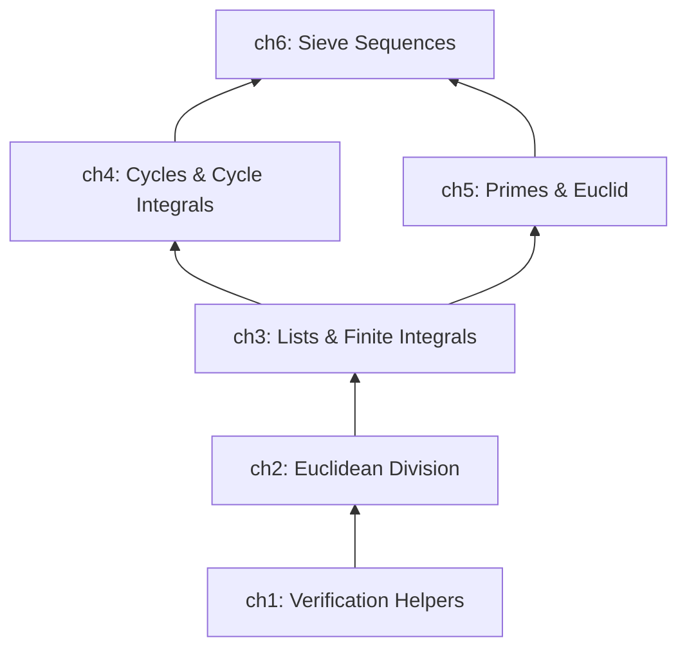
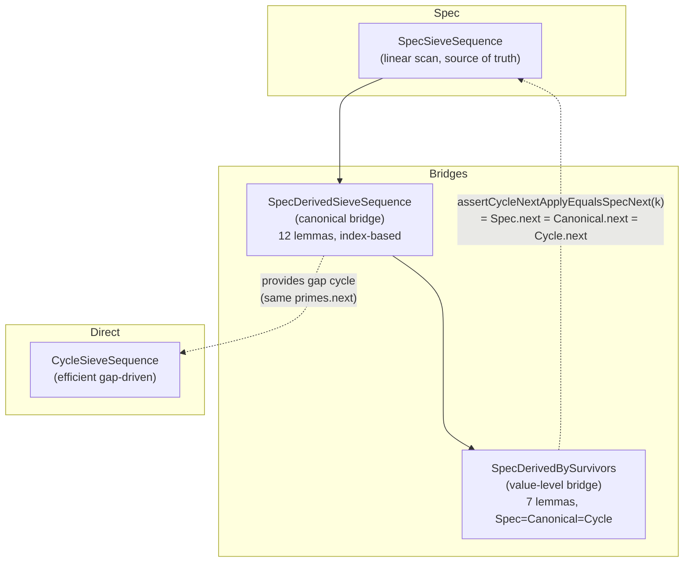

# Project Architecture

## Overview

The project formally verifies that three representations of a sieve stage produce
identical streams: the **Spec** (`SpecSieveSequence`, linear scan, source of truth),
the **Canonical bridge** (`SpecDerivedSieveSequence`, constructed from the Spec),
and the **Cycle** (`CycleSieveSequence`, efficient gap-driven, no reference to the Spec).

**Theorems proved:**

```math
\begin{aligned}
&\text{Current stage:} \quad \text{Spec}(k) = \text{Canonical}(k) = \text{Cycle}(k) \quad \forall k && \text{[assertApplyMatches]} \\
&\text{Next stage:} \quad \text{Spec.next}(k) = \text{Canonical.next}(k) = \text{Cycle.next}(k) \quad \forall k && \text{[assertCycleNextApplyEqualsSpecNext]}
\end{aligned}
```

The proof stack is built in **6 layers**. Each layer defines its own data structures
and verifies key properties, which the next layer uses as primitives.



---

## Layer 1: Verification Helpers

**File:** `src/main/scala/v1/chapter1/verification/Helper.scala`

Generic assertion infrastructure (`assert`, `equals` up to 9-ary). Provides the
`.holds` pattern — every verified property in the project is a Boolean function
ending with `.holds`, proved by Stainless.

---

## Layer 2: Euclidean Division

**Files:** `src/main/scala/v1/chapter2/div/`

### Core objects

| Object   | Purpose                                                                        |
|----------|--------------------------------------------------------------------------------|
| `DivMod` | Euclidean division: $a = b \cdot q + r$, $0 \le r < b$                         |
| `Calc`   | Wrappers `Calc.div(a,b)`, `Calc.mod(a,b)` — only approved way (`%` is blocked) |

### Key properties verified

- **Mod idempotence**: `Calc.mod(Calc.mod(a, b), b) == Calc.mod(a, b)`
- **Mod addition**: `Calc.mod(a + c, b) == Calc.mod(Calc.mod(a, b) + Calc.mod(c, b), b)`
- **Mod multiplication**: `Calc.mod(a \* c, b) == Calc.mod(Calc.mod(a, b) \* Calc.mod(c, b), b)`
- **Small dividend**: If $a < b$, then `Calc.mod(a, b) == a` and `Calc.div(a, b) == 0`
- **Bounded modulo**: If $m \le v < 2m$, then `Calc.mod(v, m) == v - m`

All subsequent layers depend on these modular arithmetic facts for index
operations, list positioning, and cycle indexing.

---

## Layer 3: Lists and Finite Integrals

**Files:** `src/main/scala/v1/chapter3/list/`

### Core objects

| Object                 | Purpose                                                    |
|------------------------|------------------------------------------------------------|
| `ListUtils`            | Sum, append, slice, split, rotate                          |
| `SortedList`           | Sorted list (ascending), `fromUnsorted` via insertion sort |
| `Integral`             | Finite prefix-sum of a list                                |
| `ListRepeatProperties` | `repeat(L, n) = L ++ ... ++ L` (n times)                   |

### Key properties verified

- **Sum over append**: `sum(A ++ B) == sum(A) + sum(B)`
- **Split + recombine**: `splitAt(list, i)._1 ++ splitAt(list, i)._2 == list`
- **Rotate preserves size**: `rotateAt(list, i).size == list.size`
- **Sortedness**: `SortedList.isAscending` implies every element ≤ next
- **Filter preserves order**: `filterList(list, d)` keeps relative order
- **ListRepeatProperties**:
    - `repeat(L, n) == L ++ repeat(L, n-1)` — structural induction
    - `repeat(L, n)(k) == L(Calc.mod(k, |L|))` — index access
    - `sum(repeat(L, n)) == sum(L) \* n` — sum under repetition
    - Positivity preserved: if `allGreaterThan(L, v)`, then `allGreaterThan(repeat(L, n), v)`

### Role in the stack

Lists are the universal store for cycles (gap values), integrals (cumulative sums),
and the pipeline (expanded residues, survivors, gaps). The `repeat` foundation
underpins the pipeline's expansion step: `nextExpanded` repeats the residue list
`head` times.

---

## Layer 4: Cycles and Cycle Integrals

**Files:** `src/main/scala/v1/chapter4/cycle/`

### Core objects

| Object             | Purpose                                                              |
|--------------------|----------------------------------------------------------------------|
| `ModCycle`         | `values(k mod                                                        |values|)` — modulo-indexed cycle |
| `MemCycle`         | Wraps ModCycle with built-in caching                                 |
| `GapCycle`         | Cycle of strictly positive gaps — provides `memCycle` and `integral` |
| `CycleIntegral`    | Recursive prefix-sum: $CI(k) = CI(k-1) + cycle(k)$                   |
| `ModCycleIntegral` | Closed-form: $CI(k) = (k \text{ div } n) \cdot sum + \text{prefix}$  |

### Key properties verified

- **Cycle access**: `cycle(k) == cycle.values(Calc.mod(k, cycle.size))`
- **Cycle periodicity**: `cycle(k + n) == cycle(k)` where $n =$ `cycle.size`
- **Recurrence**: $CI(k+1) - CI(k) = cycle(k+1)$
- **Integral equivalence**: recursive `CycleIntegral` ≡ closed-form `ModCycleIntegral`
- **Replicated cycles**: `assertReplicatedCycleValueEqual` — repeating gaps $t$ times preserves cycle values at each
  position

### CycleIntegralFilterProperties (survivor layer)

Extends cycles with the survivor-based gap derivation:

| Lemma                          | Statement                                                        |
|--------------------------------|------------------------------------------------------------------|
| `assertSurvivorAtNotMultiple`  | Every survivor is NOT divisible by filter value $f$              |
| `assertGapsFromValuesAtIndex`  | $gaps(L)[i] = L[i+1] - L[i]$                                     |
| `assertFilterMergeComposition` | New CI from survivors has no multiples of $f$ (full composition) |

---

## Layer 5: Primes and Euclid

**Files:** `src/main/scala/v1/chapter5/prime/`

### Core objects

| Object               | Purpose                                                         |
|----------------------|-----------------------------------------------------------------|
| `Prime`              | Wrapper requiring `isPrime(value)`, provides `noDivisorInRange` |
| `SortedPrimeList`    | Descending-sorted prime list with verified insert/remove        |
| `AllPrimesSoFarList` | Complete-prime-prefix: contains every prime up to its head      |
| `PrimeUtils`         | `primorial`, `biggerPrime`, `primeValues`                       |

### Key properties verified

- **Euclid's theorem**: $primorial(P) + 1$ is coprime to all primes in $P$ — primes are infinite
- **Distinct primes coprime**: $p \neq q \land isPrime(p) \land isPrime(q) \implies q \bmod p \neq 0$
- **Filter preserves primes**: Filtering by $p$ does not remove any other prime $q$
- **Primorial-product bridge**: `primorial(L) == product(primeValues(L))` for non-empty $L$

---

## Layer 6: Sieve Sequences

**Files:** `src/main/scala/v1/chapter6/seq/sieve/`

### Goal

Prove that all three representations of a sieve stage produce identical streams
at both the current and next stages:

```math
\text{Spec}(k) = \text{Canonical}(k) = \text{Cycle}(k) \quad \forall k, \qquad
\text{Spec.next}(k) = \text{Canonical.next}(k) = \text{Cycle.next}(k) \quad \forall k
```

### The three representations



#### `SpecSieveSequence`

The mathematically transparent reference model. A linear scan starting from
`head`, emitting every value that passes the active tail filters.

- **Apply**: $apply(0) = head$, $apply(k+1) > apply(k)$ (strictly increasing)
- **Gaps**: $gapList(from, count)$ = adjacent differences of apply
- **Gap cycle**: $specGapCycle(period)$ certifies a GapCycle matching the gap list

#### `SpecDerivedSieveSequence` (12 methods)

The canonical bridge. Constructs a `CycleSieveSequence` from the Spec's own data and
proves the cycle matches the Spec element-for-element.

| Lemma                                       | Statement                                         |
|---------------------------------------------|---------------------------------------------------|
| `assertApplyMatches(k)`                     | `cycle(k) == spec(k)` — same-stage equivalence    |
| `assertNextHeadMatches()`                   | `cycle(1) == spec.next.head.value`                |
| `assertNextCycleGapsMatchSpecNext(nP)`      | Canonical next gaps == `spec.next.gapList`        |
| `assertSurvivorGapEqualsSpecNextGap(nP, k)` | Survivor gap$_k$ == spec.next gap$_k$             |
| `repeatedCycle(times)`                      | Repeating gap period preserves apply              |
| `assertRepeatedCycleApplyMatches(times, k)` | `repeatedCycle(times).apply(k) == cycle.apply(k)` |

All 12 methods listed in `OBJECTS.md` §6.6.

#### `SpecDerivedBySurvivors` (7 methods)

Value-level companion to the canonical bridge. Wraps `SpecDerivedSieveSequence` and adds
the rotation anchor, modulus identity, and the merged composition lemma.

| Lemma                                            | Statement                                                                                           |
|--------------------------------------------------|-----------------------------------------------------------------------------------------------------|
| `assertSpecNextFilterEqCyclePrimes()`            | `spec.next.filterValues == cyclePrimes`                                                             |
| `assertNextHeadResidueIsSpecNextHead()`          | `mod(cycle(1), head * modulus) == spec.next.head.value`                                             |
| `assertHeadModulusEqualsSpecNextFilterModulus()` | `head * modulus == spec.next.tailPrimorial`                                                         |
| `assertCanonicalCycleNextMatchSpecNext(nP)`      | Merged: canonical gaps = gapList + rotation + modulus + head+gap identity                           |
| `assertSpecCanonicalCycleNextMatch(nP)`          | Composes the above — Spec = Canonical = Cycle for next stage                                        |
| `assertCycleNextApplyEqualsSpecNext(nP, k)`      | **Returns** `cNext.apply(k) == spec.next(k)` for any $k$                                            |
| `assertBNextApplyEqualsCNextApply(nP, k)`        | **Returns** `cNext.apply(k) == nextCanonical.cycle.apply(k)` — explicit Canonical.next = Cycle.next |
| `assertRepeatedCycleProof(nP)`                   | Side proof via `repeatedCycle` infrastructure                                                       |

#### `CycleSieveSequence`

The independent, efficient implementation. Stores `primes` + `gapCycle`, generates
candidates through `CycleIntegral(head, gapCycle.memCycle)`. No reference to the
Spec — the whole point is proving the next stage can be computed using only the
Cycle's own structural data (head, modulus, gapCycle).

- `apply(0) = head`, $apply(k) = integral(k-1)$ for $k > 0$
- `nextWithGapCycle(newGapCycle)` — takes a pre-computed gap cycle (the
  constructive path). The proof verifies that the Cycle built from the Canonical
  gap cycle has the same `apply(k)` as `Spec.next(k)` for every $k$.

### The proof chain

```
Cycle pipeline gaps == Spec.next.gapList      [filter → repeat → rotate, independent]
Cycle.next(k)       == Spec.next(k)           [assertCycleNextApplyEqualsSpecNext]
Canonical.next(k)   == Spec.next(k)           [nextCanonical.assertApplyMatches(k)]
```

The Cycle computes its next stage using only its own data
(`head`, `modulus`, `gapCycle`) via the pipeline
(filter → repeat → rotate, in `SieveSequenceNextLevel`).
The membership bridge proves the pipeline survivors match Spec.next values.
The final equality is explicitly returned by
`assertCycleNextApplyEqualsSpecNext(nextPeriod, k)` — **for any $k$**.

### The pipeline — independence proof

The pipeline (`SieveSequenceNextLevel`) computes the next stage from the Cycle's
own data (`head`, `modulus`, `gapCycle`) without accessing the Spec. This is the
independence proof: the Cycle does not need the Spec to compute its next stage.

1. **Filter**: `nextFiltered(cycle)` = values coprime to all primes, not divisible
   by `head`, within $[0, head \cdot modulus)$
2. **Repeat**: `calculateGaps(survivors, head \cdot modulus)` = adjacent
   differences of survivors with a wraparound gap
3. **Rotate**: `rotateAt(gaps, nextHeadResidueIndex)` = align to
   `spec.next.head.value`

The membership bridge (proven in `SpecCycleSieveEquivalence`) shows that the
filtered values match the Spec.next values modulo $head \cdot modulus$.
The rotation is proven correct by `assertNextHeadResidueIsSpecNextHead`.
The gaps then follow from `assertNextCycleGapsMatchSpecNext`.

### Dead code (preserved per `never-destroy` rule)

| File                         | Reason                                                        |
|------------------------------|---------------------------------------------------------------|
| `SieveCycleAfterProof.scala` | Entirely commented out. Bad agent's unfinished proof attempt. |

---

## Summary: What each layer contributes

| Layer            | Gives the next layer                                                                                                                                                                                                                                 |
|------------------|------------------------------------------------------------------------------------------------------------------------------------------------------------------------------------------------------------------------------------------------------|
| **ch2: Div/Mod** | Modular arithmetic — index operations, modulo indexing for cycles                                                                                                                                                                                    |
| **ch3: Lists**   | Sum/append/slice/rotate properties, list repeat for pipeline expansion                                                                                                                                                                               |
| **ch4: Cycles**  | Unbounded sequences, cycle integrals (prefix sums), survivor filtering                                                                                                                                                                               |
| **ch5: Primes**  | Prime theory, Euclid's theorem, filter preservation                                                                                                                                                                                                  |
| **ch6: Sieve**   | Three representations (Spec, Canonical, Cycle) proved equivalent for current and next stages via the constructive path (`nextWithGapCycle`). The walk path (`CycleSieveSequence.next()`) remains unverified but is uncalled in the current codebase. |
