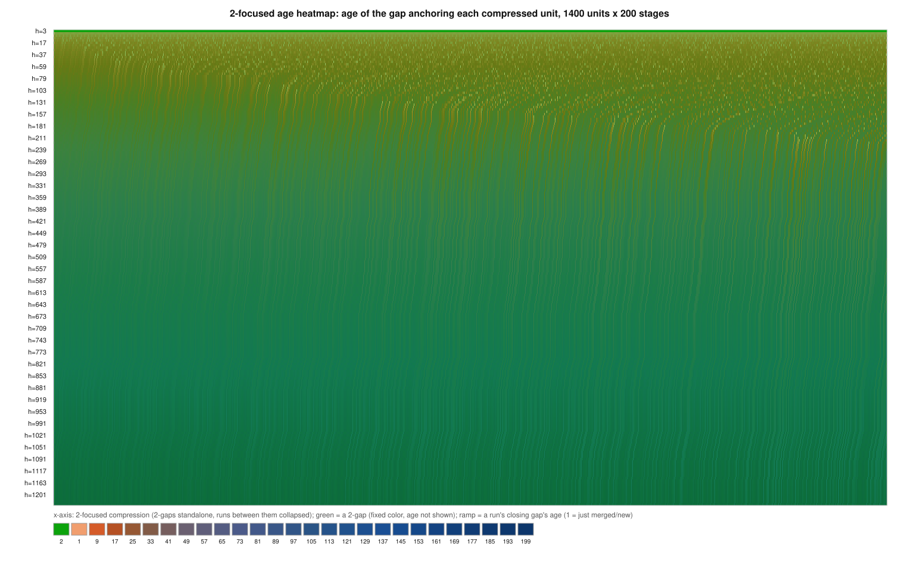
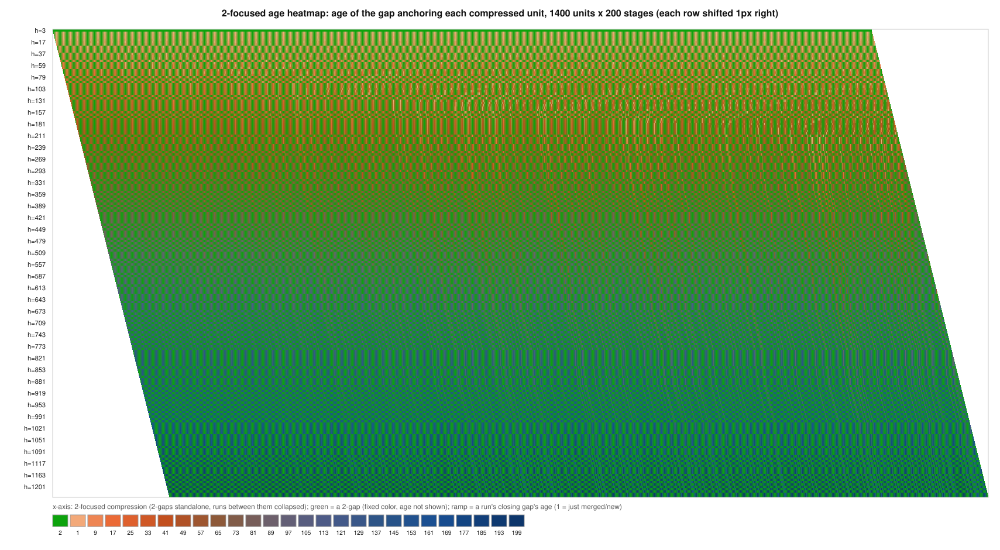
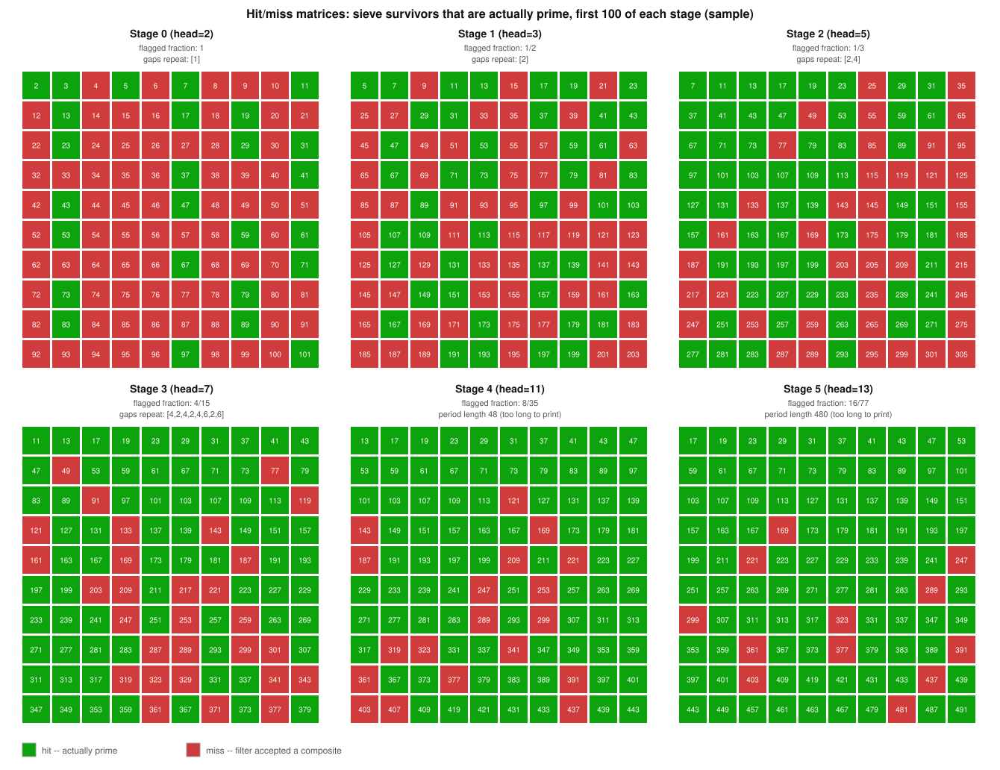
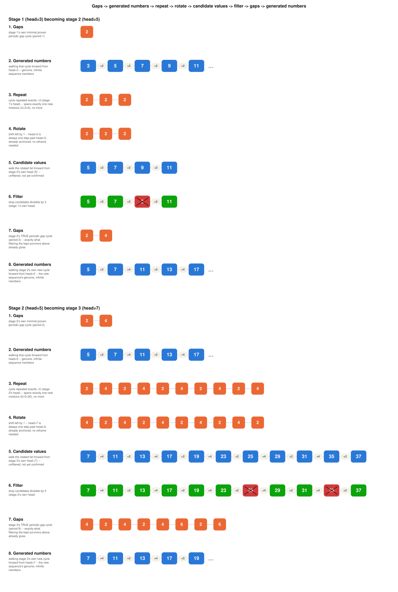

# Gap Heatmap Preview

Rendering test: these are the same SVGs described in
[`../README.md`](../README.md), shown here in sequence via plain markdown
image syntax to confirm GitHub renders them inline (see discussion there
about `Content-Disposition` only affecting direct raw-file navigation, not
embedded images).

## `gap-heatmap.svg`

One row per stage, one pixel per gap. Color = gap value, sequential ramp,
histogram-equalized. Red pixel = the first survivor in that row that isn't
actually prime (`head^2`).

## `gap-heatmap-staggered.svg`

Same data, each row shifted 1px further right than the last (cosmetic only).

## `gap-heatmap-diff-simple-shift.svg`

Naive version: one constant per-row offset, no merge tracking.

## `gap-heatmap-merges.svg`

Per-cell: how many old gaps fed into this one (1 = copied unchanged, 2+ =
merged).

## `gap-heatmap-age.svg`

Per-cell: how many consecutive stages a gap has survived without being
merged.

## `gap-heatmap-age-staggered.svg`

Staggered variant of the age view.

## `gap-heatmap-2focused.svg`

"2-Focused Compression": every 2-gap kept as its own cell (green), runs of
non-2-gaps between consecutive 2-gaps collapsed into one summed cell (blue
ramp).

## `gap-heatmap-2focused-staggered.svg`

Staggered variant of the 2-focused view.

## `gap-heatmap-2focused-age.svg`

Combines the two views above: x-axis is the 2-focused compression, color is
age. A standalone 2-gap always renders as the same fixed green (age not
shown); only merged runs use the age ramp — otherwise a 2-gap and a
similarly-young run become indistinguishable.

## `gap-heatmap-2focused-age-staggered.svg`

Staggered variant of the 2-focused age view.

## `gap-two-frequency.svg`

Line chart: fraction of gaps equal to 2, per stage. Declines sharply from
100% (stage 1) toward roughly 10%.

## `gap-two-cluster-size.svg`

Line chart: average and max *distance* between consecutive 2-gaps (summed
runs, via `compress_around_two`, not individual gaps), per stage. Average
grows steadily (4 → ~125); max grows much faster still (4 → ~1450).

## `hit-miss-matrices.svg`

From `hit_miss_heatmap.py` (reads the small committed sample CSV, not the
full dataset): six 10×10 grids, one per early stage, each cell green (prime)
or red (composite the filter let through).

## `stage-transition-repeat-filter-rotate.svg`

From `stage_transition_diagram.py` (pure computation, no data file at all):
one or more stage transitions as eight literal steps — Gaps → Generated
numbers → Repeat → Rotate → Candidate values → Filter → Gaps → Generated
numbers.

