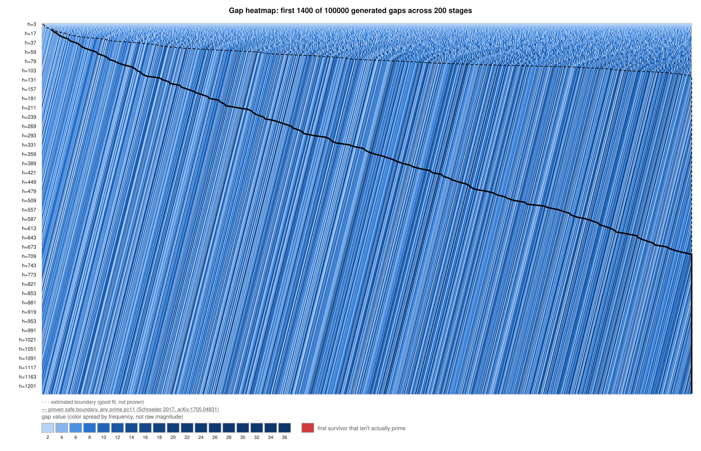
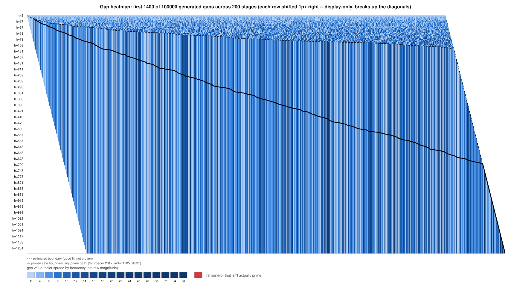
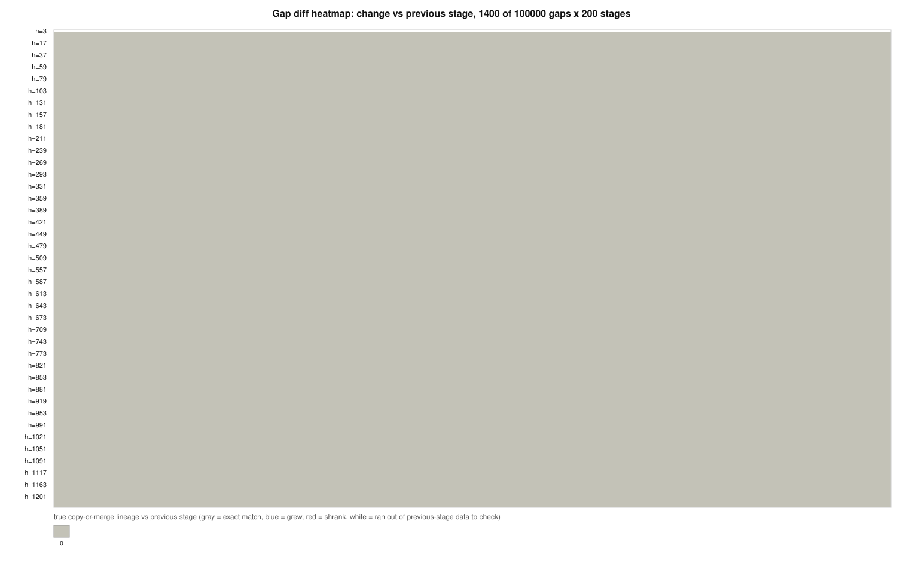
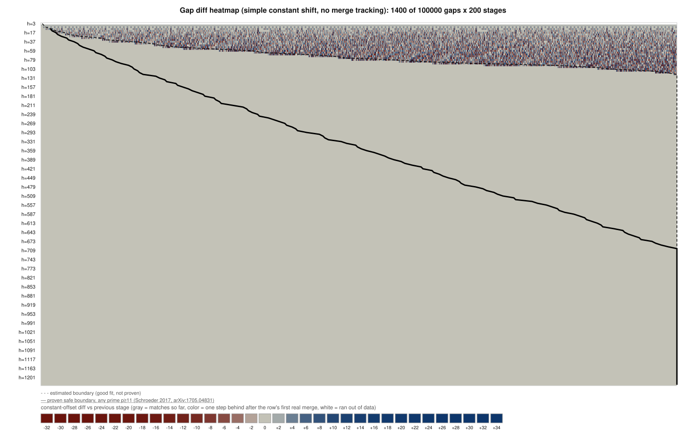
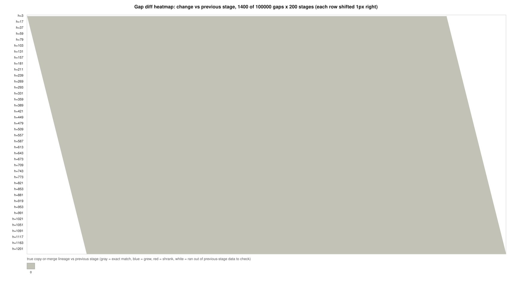
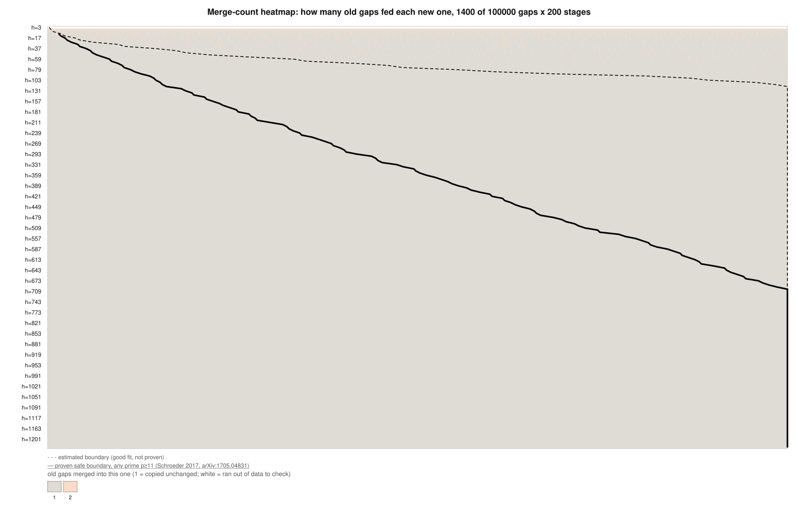
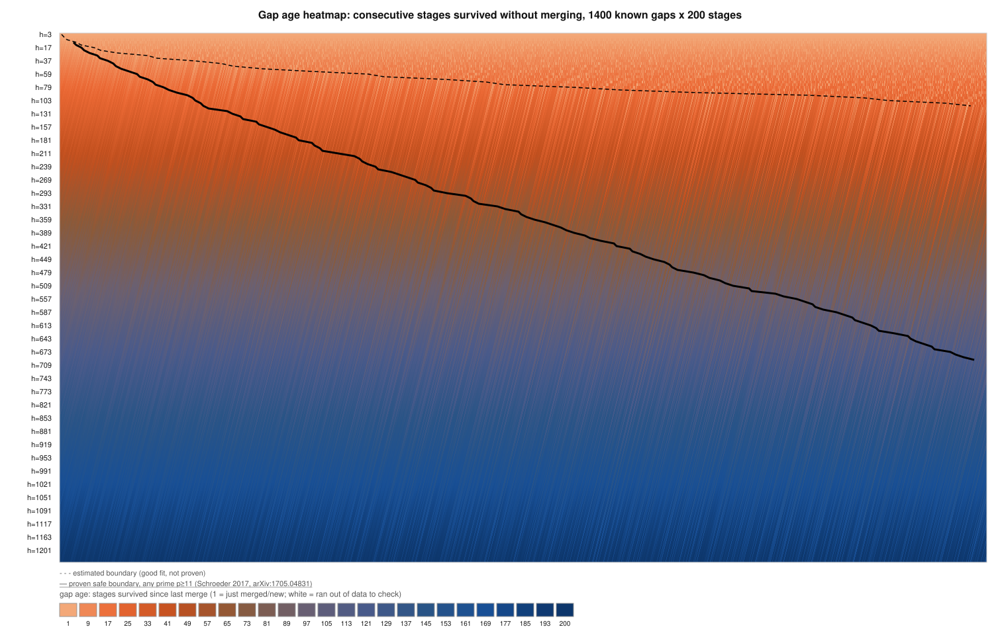
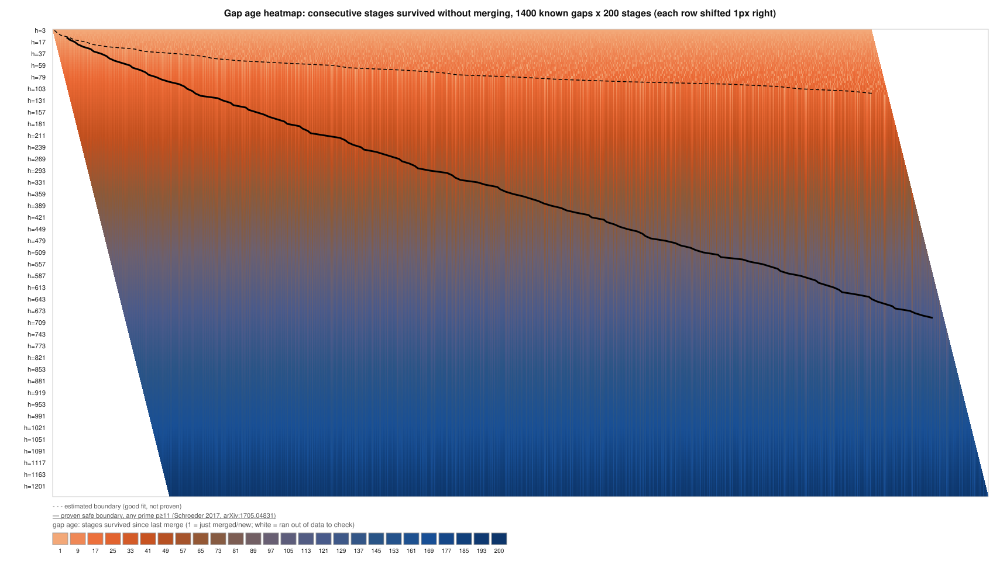
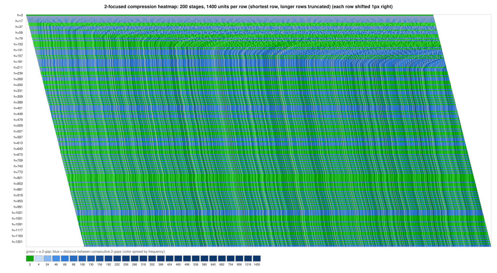

# Gap Heatmap Preview

Rendering test: these are the same SVGs described in
[`../README.md`](../README.md), shown here in sequence via plain markdown
image syntax to confirm GitHub renders them inline (see discussion there
about `Content-Disposition` only affecting direct raw-file navigation, not
embedded images).

## `gap-heatmap.svg`

One row per stage, one pixel per gap. Color = gap value, sequential ramp,
histogram-equalized. Red pixel = the first survivor in that row that isn't
actually prime (`head^2`).

## `gap-heatmap-staggered.svg`

Same data, each row shifted 1px further right than the last (cosmetic only).

## `gap-heatmap-diff.svg`

Row-to-row diff using the true copy-or-merge lineage. Flat gray almost
everywhere — the copy-or-merge theorem forces the diff to be exactly 0
wherever it can be computed.

## `gap-heatmap-diff-simple-shift.svg`

Naive version: one constant per-row offset, no merge tracking.

## `gap-heatmap-diff-staggered.svg`

Staggered variant of the diff view.

## `gap-heatmap-merges.svg`

Per-cell: how many old gaps fed into this one (1 = copied unchanged, 2+ =
merged).

## `gap-heatmap-age.svg`

Per-cell: how many consecutive stages a gap has survived without being
merged.

## `gap-heatmap-age-staggered.svg`

Staggered variant of the age view.

## `gap-heatmap-2focused.svg`

"2-Focused Compression": every 2-gap kept as its own cell (green), runs of
non-2-gaps between consecutive 2-gaps collapsed into one summed cell (blue
ramp).

## `gap-heatmap-2focused-staggered.svg`

Staggered variant of the 2-focused view.

