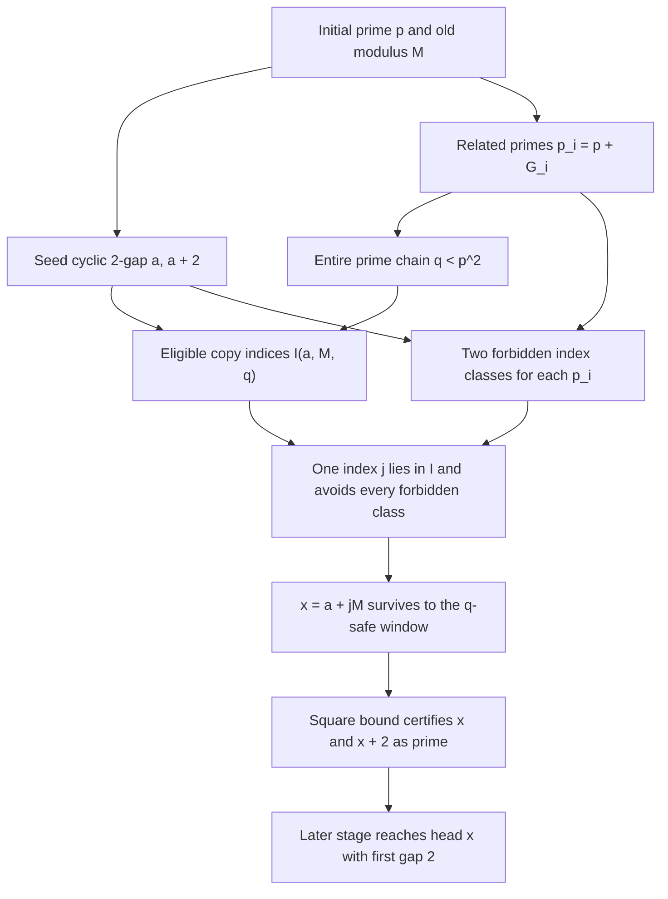

# Candidate Property: Infinitely Many Perfect Sieve Scenarios

**Status:** Submitted for independent mathematical verification.

The finite certificate theorem in this document is expected to be provable
from the stated assumptions. The assertion that such certificates occur
infinitely often is an open claim and is not presented as proved or
Stainless-verified.

## Reader Background

This document assumes only the definitions and results introduced in:

- [Formal Verification of the Sieve Sequence](../../articles/chapter6/sieve-sequence.md)
- [Sieve Gap Survival: A Math-Only Follow-Up](../../articles/draft/draft-sieve-gap-survival-math.md)

All notation specific to this property is defined below.

## 1. Purpose

The final event of interest is a sieve stage whose first gap after its head is
`2`. If that stage has head `x`, its first two accepted values are then

```math
x\qquad\text{and}\qquad x+2.
```

The sieve-sequence head is prime. Once both values are known to be prime, this
event is a twin-prime pair.

It is unnecessary to prove that every stage has such an event. It is also
unnecessary for one candidate gap to survive forever. The proposed strategy is
to identify rare finite scenarios in which one repeated copy of an earlier
cyclic 2-gap survives only the filters needed to enter a square-safe window.
Once it enters that window, both endpoints are certified prime and its later
arrival at the head is automatic.

The infinitude target is therefore:

```math
\text{perfect finite scenarios occur at unbounded absolute coordinates.}
```

## 2. Initial Sieve Stage

Let the initial stage have prime head

```math
p_0=p\ge3.
```

Every prime smaller than `p` is already an installed filter. Define their
product

```math
M=\prod_{r<p}r,
```

where `r` ranges over primes.

Acceptance by the initial stage is periodic with value period `M`. If `v` is
accepted, then every value `v+jM` is accepted by the same old filters.

## 3. Seed Cyclic 2-Gap

Choose a residue `a` such that

```math
\gcd(a,M)=1
\qquad\text{and}\qquad
\gcd(a+2,M)=1.
```

Because `2` divides `M`, the intermediate value `a+1` is rejected. Thus
`(a,a+2)` represents a cyclic 2-gap for the old filter set.

Its repeated absolute copies are

```math
(x_j,x_j+2)
=
(a+jM,\ a+2+jM),
```

where `j` is an integer chosen so that the displayed values are positive and
lie in the interval under consideration.

## 4. Consecutive Prime Chain From One Initial Prime

Let

```math
p_0<p_1<\cdots<p_k=q
```

be consecutive primes, with `k>=1`. Define the consecutive prime gaps

```math
g_i=p_{i+1}-p_i
\qquad(0\le i<k)
```

and their cumulative sums

```math
G_0=0,
\qquad
G_i=\sum_{t=0}^{i-1}g_t
\qquad(1\le i\le k).
```

Every prime in the chain is therefore related to the same initial prime:

```math
\boxed{p_i=p+G_i.}
```

The filters that the chosen copy must survive are exactly

```math
p_0,p_1,\ldots,p_{k-1}.
```

The final prime `p_k=q` is the head of the certification stage and is not yet
an installed filter at that stage.

The number of required filters is `k`, equivalently

```math
k=\pi(q)-\pi(p).
```

## 5. Common Initial Square Horizon

The proposed perfect scenario additionally requires the complete prime chain
to fit below the initial square boundary:

```math
\boxed{q=p_k<p^2.}
```

Using the cumulative gap representation, this is equivalent to

```math
\boxed{G_k<p^2-p.}
```

This condition places every prime needed to describe the finite filter chain
inside one value horizon determined by the initial prime `p`.

For a fixed chain length `k`, this square containment is eventually automatic.
Bertrand's postulate gives

```math
p_{i+1}<2p_i,
```

and therefore

```math
p_k<2^k p.
```

Hence

```math
p>2^k
\quad\Longrightarrow\quad
p_k<2^k p<p^2.
```

If a particular finite gap word `(g_0,...,g_{k-1})` is fixed, square
containment is even simpler: its total `G_k` is fixed, so
`G_k<p^2-p` holds for every sufficiently large initial prime `p`.

This square-horizon condition is a useful restriction on the proposed perfect
scenario. It is not, by itself, a proof that the required prime chain or
surviving copy occurs.

## 6. Copy Indices That Reach The Certification Window

The safe window at the final head `q` is

```math
[q,q^2).
```

Both endpoints of the repeated 2-gap must lie in this half-open window:

```math
q\le a+jM
```

and

```math
a+jM+2<q^2.
```

Therefore the geometrically eligible copy indices are the integers in

```math
I(a,M,q)=
\left[
\left\lceil\frac{q-a}{M}\right\rceil,
\left\lfloor\frac{q^2-3-a}{M}\right\rfloor
\right].
```

The interval contains an eligible copy exactly when its lower endpoint does
not exceed its upper endpoint.

## 7. Exact Filter Conditions For One Copy

Fix one filter prime

```math
p_i=p+G_i
\qquad(0\le i<k).
```

It destroys copy `j` exactly when it divides one endpoint:

```math
p_i\mid a+jM
```

or

```math
p_i\mid a+2+jM.
```

No `p_i` divides `M`, because `M` contains only primes smaller than `p`.
Therefore `M` has a multiplicative inverse modulo every `p_i`. The two
destruction conditions are equivalent to

```math
j\equiv-aM^{-1}\pmod{p_i}
```

or

```math
j\equiv-(a+2)M^{-1}\pmod{p_i}.
```

These are two distinct copy-index classes because an odd prime cannot divide
the endpoint difference `2`.

Define the indices allowed by the complete prime chain as

```math
\mathcal A(a,M,p,q)
=
\left\{
j:
\begin{array}{l}
j\not\equiv-aM^{-1}\pmod{p_i},\\
j\not\equiv-(a+2)M^{-1}\pmod{p_i},\\
\text{for every }0\le i<k
\end{array}
\right\}.
```

This definition preserves the deterministic distribution supplied by
repetition. The filters are not allowed to remove arbitrary copies; each one
removes only its two specified index classes.

## 8. Definition Of One Perfect Scenario

A tuple

```math
\mathcal S=(p,M,a,k,g_0,\ldots,g_{k-1},q,j)
```

is called a **perfect sieve scenario** when all of the following conditions
hold.

### PS1. Valid Initial Stage

`p>=3` is prime, `M` is the product of all primes smaller than `p`, and the
stage accepts exactly the integers coprime to `M`.

### PS2. Valid Seed 2-Gap

```math
\gcd(a,M)=\gcd(a+2,M)=1.
```

### PS3. Consecutive Prime Chain

```math
p_i=p+G_i
```

are consecutive primes for `0<=i<=k`, with `p_0=p` and `p_k=q`.
The chain length satisfies `k>=1`.

### PS4. Common Square-Horizon Containment

```math
q<p^2,
```

equivalently `G_k<p^2-p`.

### PS5. Safe-Window Copy Placement

```math
j\in I(a,M,q).
```

Equivalently, `q<=a+jM` and `a+jM+2<q^2`.

### PS6. Complete Finite-Batch Survival

```math
j\in\mathcal A(a,M,p,q).
```

Equivalently, neither endpoint is divisible by any prime
`p_0,...,p_{k-1}`.

The two substantive sets in the definition can be combined into one compact
condition:

```math
\boxed{
I(a,M,q)\cap\mathcal A(a,M,p,q)\ne\varnothing.
}
```

## 9. Finite Perfect-Scenario Theorem

**Claim to verify.** Every perfect sieve scenario produces an eventual sieve
stage whose head has first gap `2`.

Let

```math
x=a+jM.
```

PS1 and PS2 show that `x` and `x+2` survive every filter smaller than `p`.
PS3 and PS6 show that they also survive every filter from `p` through the last
prime below `q`. Thus both values are accepted at the stage with head `q`.

PS5 gives

```math
q\le x
\qquad\text{and}\qquad
x+2<q^2.
```

Any composite integer below `q^2` has a prime divisor smaller than `q`.
Because both endpoints survived every such prime filter, both are prime.

The sieve sequence advances through consecutive prime heads. It eventually
reaches head `x`. At that stage, `x+2` is still accepted because it is prime,
while `x+1` is rejected because it is even. Therefore the first gap after head
`x` is exactly `2`.

Notice that the candidate only had to survive `k` filters. Once the stage with
head `q` certified the pair as prime, no additional survival hypothesis was
needed.

### Worked Finite Example

Take

```math
p=5,
\qquad
M=2\cdot3=6,
\qquad
a=5.
```

The pair `(5,7)` is a cyclic 2-gap modulo `6`. Choose a chain of length `k=1`:

```math
p_0=5,
\qquad
g_0=2,
\qquad
p_1=q=7.
```

The common square-horizon condition holds because `7<5^2`. Choose `j=4`.
Then

```math
x=a+jM=5+4\cdot6=29,
```

so the repeated pair is `(29,31)`. It lies in the certification window because

```math
7\le29
\qquad\text{and}\qquad
31<7^2.
```

The finite filter chain contains only prime `5`, and neither `29` nor `31` is
divisible by `5`. Thus `j=4` is allowed. Stage `7` certifies both endpoints as
prime, and the sieve later reaches head `29` with first gap `2`.

This example verifies the shape of one certificate. It provides no evidence by
itself that unboundedly many certificates exist.

## 10. Infinite Perfect-Scenario Property

The property submitted for expert investigation is the following.

```math
\boxed{
\begin{aligned}
&\textbf{Infinite Perfect-Scenario Property:}\\
&\text{There exists an infinite sequence of perfect sieve scenarios}
\ \mathcal S_1,\mathcal S_2,\ldots\\
&\text{whose certified coordinates}
\ x_n=a_n+j_nM_n
\text{ satisfy }x_n\longrightarrow\infty.
\end{aligned}
}
```

The scenarios may use different initial primes, seed gaps, chain lengths, gap
words, certification heads, and copy indices. They may be arbitrarily rare.
No positive density is required.

If this property is true, the finite theorem produces infinitely many distinct
head 2-gaps and hence infinitely many twin-prime pairs.

## 11. Stronger Template Version

Experts may also investigate the stronger possibility that one fixed finite
scenario shape recurs infinitely often. For example, fix a chain length `k`
and a cumulative-gap or modular-signature pattern, then ask whether infinitely
many initial primes `p` realize that pattern together with PS1 through PS6.

An exact fixed prime-gap word is a particularly strong restriction. Proving
that an arbitrary admissible fixed word of consecutive prime gaps recurs
infinitely often may require an unproved prime-constellation theorem. The
expert review should therefore distinguish:

- a fixed exact gap word;
- a finite family of acceptable gap words;
- a modular-signature pattern realizable by many different gap words;
- completely variable rare scenarios as allowed by Section 10.

The weakest version sufficient for infinitude is the last one.

## 12. Equivalent Covering Form

For a proposed scenario, each filter prime contributes two forbidden residue
classes of copy indices. Let

```math
\mathcal F(a,M,p,q)
=
\bigcup_{i=0}^{k-1}
\left\{
j:
j\equiv-aM^{-1}
\text{ or }
j\equiv-(a+2)M^{-1}
\pmod{p_i}
\right\}.
```

Then PS6 says `j` is outside `F`, and the perfect-scenario condition is

```math
\boxed{
I(a,M,q)\not\subseteq\mathcal F(a,M,p,q).
}
```

Thus the open infinitude question can be phrased as follows:

```text
Do the two forbidden copy-index classes contributed by each related prime
fail to cover the eligible safe-window copy indices for infinitely many
unbounded scenarios?
```

This formulation is deterministic. It does not assume random or uniform
placement of the repeated gaps.

## 13. Dependency Diagram



## 14. Required Expert Verification

The mathematical review should answer each question separately.

1. Does the repeated-copy representation `(a+jM,a+2+jM)` correctly preserve
   acceptance by every old filter?
2. Are the two forbidden copy-index classes for each new prime derived
   correctly and always distinct?
3. Does the interval `I(a,M,q)` have the correct inclusive endpoints for the
   half-open safe window `[q,q^2)`?
4. Does the cumulative-gap identity `p_i=p+G_i` correctly encode the complete
   consecutive-prime chain?
5. Is `q<p^2` equivalent to `G_k<p^2-p`, and is the fixed-length consequence
   from Bertrand's postulate correct?
6. Are PS1 through PS6 sufficient to show that both endpoints survive every
   prime filter below `q`?
7. Does square-safe acceptance prove both endpoints prime with no missing
   boundary case?
8. Once primality is established, does next-head correctness imply eventual
   arrival at head `x` with first gap `2`?
9. Does requiring `x_n` to be unbounded ensure that infinitely many successful
   scenarios correspond to infinitely many distinct twin-prime pairs?
10. Is the Infinite Perfect-Scenario Property merely sufficient for twin-prime
    infinitude, or equivalent to it after choosing appropriate earlier stages?
11. Which restrictions on a recurring prime-gap or modular-signature template
    would make the infinitude claim stronger than necessary?
12. Can any known theorem rule out complete forbidden-class coverage for an
    infinite subsequence of these related-prime scenarios?

## 15. Claims Not Made

This document does not claim any of the following:

- that every safe window contains a surviving 2-gap;
- that a positive proportion of prime heads produce perfect scenarios;
- that one fixed prime-gap word recurs infinitely often;
- that complete-period CRT density automatically applies to a short window;
- that rotation randomly redistributes 2-gaps;
- that the Infinite Perfect-Scenario Property has already been proved;
- that the Twin Prime Conjecture has been proved.

The document isolates a finite certificate and asks whether certificates of
that form occur at unbounded coordinates.
