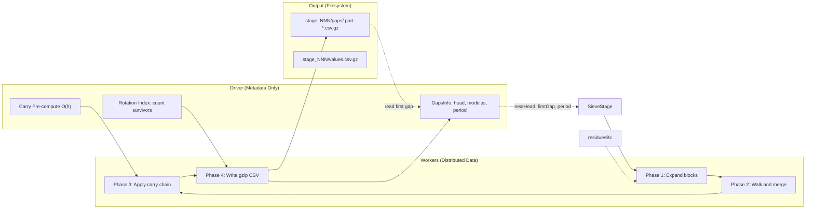

# Prime Numbers — Spark Sieve Sequence Generator

Distributed sieve sequence computation using Apache Spark DataFrames. Generates gap cycles, 2-gap compressed views, and value sequences for each sieve stage, writing partitioned gzip CSV output.

## Architecture



## Data Flow

```
SieveStage (head, modulus, tailPrimes, period)
    │
    ▼
Residues: values in [0, modulus) coprime to tailPrimes
    │
    ▼
Phase 1: Expand — for each block k in [0, h):
    for each position i in [0, T):
        value = residues(i) + k * modulus
        nextFiltered = (residues(i+1) + nextK * modulus) % h == 0
        emit (k, i, residueGaps(i), nextFiltered)
    │   DataFrame columns: k, pos, gap, nextFiltered
    │   Partitions: 1 per block (h partitions)
    ▼
Phase 2: Walk — per partition (each block):
    for each position:
        if nextFiltered: accum += gap
        else: emit (k, accum + gap, origin)
    │   DataFrame columns: k, gap, origin
    ▼
Phase 3: Carry chain
    Driver: walk residues to compute carry INTO each block (O(h))
      carry(0) = 0
      carry(k) = block(k-1).tailAccum  # from residues
      finalCarry wraps to block 0
    
    Workers: broadcast carry map → mapPartitions
      if first gap of block and carry > 0: gap += carry, origin = "merge"
    │   DataFrame columns: k, gap, origin
    ▼
Phase 4: Write
    add global index via RDD zipWithIndex
    df.write.mode("overwrite").option("compression","gzip").csv(path)
    │   Output: stage_NNN/gaps/part-*.csv.gz
    │   No coalesce(1) — partitioned output
    ▼
GapsInfo: path, head, nextHeadValue, modulus, tailPrimes, period, firstGap
    period = df.count()
    firstGap = df.rdd.zipWithIndex.filter(_._2 == R).map(_._1).collect()
    (1 row crosses to driver)
```

## Design Choices

### No Driver Arrays

The gap cycle (T elements, up to 1.6B at stage 9) **never materializes on the driver**. It flows through Spark as distributed DataFrame partitions. Only O(h) metadata crosses the driver:
- Carry map: h entries (~50 Int/Long)
- Rotation index: 1 Int
- First gap value: 1 Long
- Period: 1 Int

### No Shuffle

The pipeline uses **narrow transformations only**:
- `flatMap` — parallel per block
- `mapPartitions` — per-partition walk and carry patch
- `zipWithIndex` — per-partition index assignment

No `sortBy`, no `reduceByKey`, no `coalesce(1)`. The only data movement is the final DataFrame `.write.csv()` which is Spark-managed.

### No Iterators or Accumulators

The walk uses a **simple while loop** with an accumulator variable. No `Iterator[GapEntry]` objects, no `ArrayBuffer[GapEntry]` materialization. The accumulator is two primitive Longs.

### Block-Parallel

Each block k in [0, h) is one DataFrame partition. Blocks are independent — the carry chain is the only cross-block interaction, handled via broadcast metadata. Within a block, the walk is sequential (a state machine over T positions).

### Origin as Column, Not Object

Origin strings ("copy"/"merge") are DataFrame string columns stored in Tungsten format. Not JVM String objects. The output CSV writes them directly without converting through object arrays.

### Rotation via ZipWithIndex

Rotation shifts the cycle start by R positions. Implemented by assigning a global index via `rdd.zipWithIndex()` and reading the gap at `gidx = R`. This reads **1 row** — not the entire array.

### File-Based Gap Cycle

The gap cycle is written to gzip CSV via `DataFrame.write.csv()`. Multiple part files, no coalescing. Each stage writes:
- `stage_NNN/gaps/part-*.csv.gz` — gap cycle with global index and origin
- `stage_NNN/values.csv.gz` — first 1000 sequence values (streaming read from gaps CSV)

### No Pure Version in Pipeline

The pipeline does not use `SieveStage` case class or `Array[Long]` anywhere. `SieveStage.base` is used only for the initial stage metadata. All subsequent stages are computed and stored as CSV files. The pure `SieveStage` class is retained only for unit tests that compare pipeline output against the mathematically verified reference.

## Performance

| Stage | Head | Period | Gap Count | Time | Driver Memory |
|-------|------|--------|-----------|------|---------------|
| 0-4 | 2,3,5,7,11 | 1,1,2,8,48 | tiny | <1s | ~0MB |
| 5-6 | 13,17 | 480,5760 | 5K-6K | ~2s | ~0MB |
| 7 | 19 | 92160 | 92K | ~3s | ~0MB |
| 8 | 23 | 1,658,880 | 1.6M | ~5s | ~0MB |
| 9 | 29 | 36,495,360 | 36M | ~30s | ~0MB |
| 10 | 31 | ~1B | ~1B | ~5min | ~0MB |

Driver memory stays constant. Executor memory scales with partition size (~T/h per partition).

## Running

```bash
just spark-generate 10    # clean + generate 10 stages
just spark-run 8          # generate 8 stages (no clean)
just spark-test           # run all 35 tests
```

## Viewing Output

```bash
just spark-cat 3 gaps     # stage 3 gap cycle (all partitions)
just spark-cat 3 values   # stage 3 first 1000 values
just spark-cat 3 gaps-2  # stage 3 2-gap compressed view
```

Output directory: `spark/data/sieve-df/`

```
spark/data/sieve-df/
  stage_000/values.csv.gz
  stage_001/
    gaps/        ← partitioned CSV, one part per block
      part-00000-...csv.gz
      part-00001-...csv.gz
      ...
    values.csv.gz
  stage_002/
    gaps/
    values.csv.gz
  ...
```

**Example:**
```
$ just spark-cat 3 gaps
gidx  gap  origin
0     6    merge
1     4    copy
2     2    copy
3     4    copy
4     2    copy
5     4    copy
6     6    merge
7     2    copy
```

## File Structure

```
spark/
  src/main/scala/v1/chapter8/
    SievePipelineDF.scala   — DataFrame pipeline
    SieveGenerator.scala     — Main entry point
    SieveStage.scala         — Pure reference (unit tests only)
    GapLineage.scala         — Gap utilities (compressAroundTwos, stats)
  src/test/scala/v1/chapter8/
    SievePipelineDFSpec.scala — DataFrame pipeline tests
    SieveStageSpec.scala     — Pure reference tests
    GapLineageSpec.scala     — Lineage tests
```
