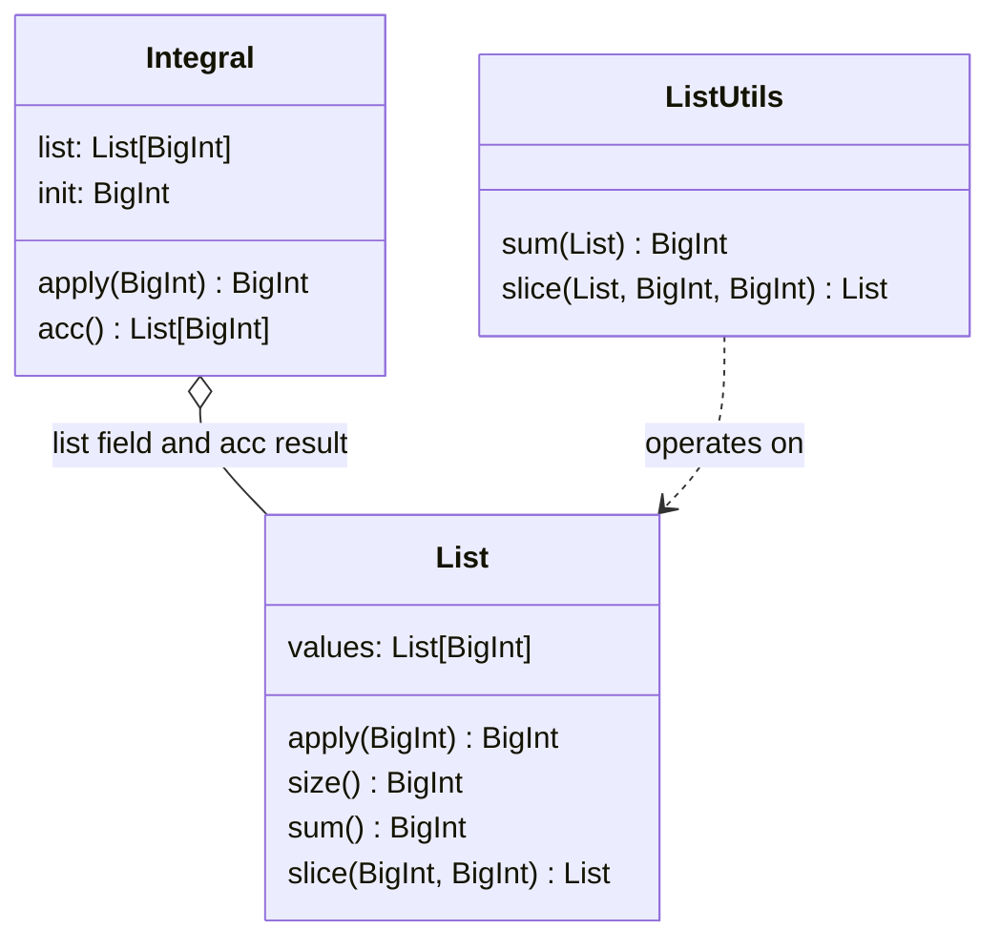

# integral.md pre-conversion fixes — review proposal

**Created:** 2026-09-06
**Status:** Fixes 3 + 5 applied; fixes 1 + 2 held (see decisions below);
  fix 4 (diagram) rejected. Content ready for LaTeX conversion.
**Type:** Content-readiness review for the planned `feature/article/integral`
arXiv conversion (integral-first sequencing, author decision 2026-09-06)

## Why this review exists

The cycle article's abstract and bibliography cite the integral article, so
`feature/article/integral` will be created and merged before the (already
complete, local-only) cycle release is pushed/merged. Before the integral
Markdown becomes the frozen source edition for its LaTeX conversion, the
open findings from
`tickets/active/chapter4-cycle-integral-md-rigor-audit-2026-08-21.md`
(verified 2026-09-06 to still apply to the current file) should be decided
on. This file proposes exact edits for each finding so the author can
approve, adjust, or reject each one individually.

All proposed edits are Markdown-only. No Scala source, test, or build
behavior changes — so no Scala/Stainless gates apply; the LaTeX
compile/parity gates apply later, during the conversion itself.

## Proposed fix 1 — surface the shared lemma (§4.3 and §5.3) [substantive]

**Finding:** "Incremental Change Matches List Value" (§4.3) and
"Accumulated Delta Consistency" (§5.3) each end with a verification
sentence citing `IntegralProperties::assertAccDiffMatchesList` as if two
independent facts were verified. In reality one lemma body proves both
deltas together; only Appendix A.6 admits this, so a main-body reader sees
two apparently independent verified facts.

**Current §4.3 ending (lines ~277–280):**

```markdown
This property is verified in the [
  IntegralProperties::assertAccDiffMatchesList
](https://github.com/thiagomata/prime-numbers/blob/master/src/main/scala/v1/chapter3/list/integral/properties/IntegralProperties.scala). The full Scala verification code is in Appendix A.3.
```

**Proposed §4.3 ending:**

```markdown
This property is verified, together with the accumulated-delta consistency
of Section 5.3, in the single lemma [
  IntegralProperties::assertAccDiffMatchesList
](https://github.com/thiagomata/prime-numbers/blob/master/src/main/scala/v1/chapter3/list/integral/properties/IntegralProperties.scala). The full Scala verification code is in Appendix A.3.
```

**Proposed §5.3 ending (same change, mirrored — lines ~497–500):**

```markdown
This property is verified, together with the incremental-change property
of Section 4.3, in the single lemma [
  IntegralProperties::assertAccDiffMatchesList
](https://github.com/thiagomata/prime-numbers/blob/master/src/main/scala/v1/chapter3/list/integral/properties/IntegralProperties.scala). The full Scala verification code is in Appendix A.6.
```

**Scope boundary:** the Scala lemma stays one body (no code change); the
fix is disclosure in the main-text prose, surfacing the appendix admission.

## Proposed fix 2 — honest verification description (§4.4) [substantive]

**Finding:** "Final Element Equals Full Sum" (§4.4) frames the identity as
a trivial corollary of §4.2 (substitute `k = n-1`), but the cited lemma
`assertLastEqualsSum` does not call the §4.2 lemma at all — per its code
(Appendix A.4) it is a separate structural induction on `list.size`
(single-element base case, tail-integral inductive step). The two-line
"proof" shown in the article is not the proof that was verified.

**Current §4.4 (lines ~289–300):**

```markdown
This follows directly from [Section 4.2](#42-integral-equals-sum-until-position), which proves $I_k = init + \sum_{i=0}^{k} x_i$ for all $k$:

```math
k = n - 1 \implies I_{n-1} = init + \sum_{i=0}^{n-1} x_i \\
\therefore \\
I_{n-1} = init + \sum_{i=0}^{n-1} x_i \quad \blacksquare
```

This property is verified in the [
  IntegralProperties::assertLastEqualsSum
](https://github.com/thiagomata/prime-numbers/blob/master/src/main/scala/v1/chapter3/list/integral/properties/IntegralProperties.scala). The full Scala verification code is in Appendix A.4.
```

**Proposed §4.4 (math block unchanged; lead-in and verification sentence
reworded):**

```markdown
Mathematically, this is the $k = n-1$ instance of [Section 4.2](#42-integral-equals-sum-until-position), which proves $I_k = init + \sum_{i=0}^{k} x_i$ for all $k$:

```math
k = n - 1 \implies I_{n-1} = init + \sum_{i=0}^{n-1} x_i \\
\therefore \\
I_{n-1} = init + \sum_{i=0}^{n-1} x_i \quad \blacksquare
```

The Stainless verification is independent of that substitution: [
  IntegralProperties::assertLastEqualsSum
](https://github.com/thiagomata/prime-numbers/blob/master/src/main/scala/v1/chapter3/list/integral/properties/IntegralProperties.scala) establishes the identity by its own structural induction on the list size (single-element base case, tail-integral inductive step), not by instantiating the Section 4.2 lemma. The full Scala verification code is in Appendix A.4.
```

This keeps the mathematical narrative (the corollary observation) while
stating accurately what the verifier actually checked.

## Proposed fix 3 — References [1] wording [minor]

**Finding:** "Unpublished manuscript." in reference [1] is inconsistent
with the house reference style of cycle.md/list.md.

**Current (lines ~666–669):**

```markdown
Mata, T. H. (2026). *Using Formal Verification to Prove Properties of Lists Recursively Defined*. Unpublished manuscript.  
Available at: [https://github.com/thiagomata/prime-numbers/blob/master/articles/chapter3/list.md](https://github.com/thiagomata/prime-numbers/blob/master/articles/chapter3/list.md)
```

**Proposed (drop the middle sentence, matching cycle.md's style):**

```markdown
Mata, T. H. (2026). *Using Formal Verification to Prove Properties of Lists Recursively Defined*.  
Available at: [https://github.com/thiagomata/prime-numbers/blob/master/articles/chapter3/list.md](https://github.com/thiagomata/prime-numbers/blob/master/articles/chapter3/list.md)
```

## Proposed fix 4 — add the rule-20 classDiagram (§3) [minor, content addition]

**Finding:** the repo's article checklist (rule 20) names integral articles
as needing a Mermaid `classDiagram` for their multi-variant definitions;
`integral.md` has zero mermaid blocks.

**Proposed placement:** after the §3 intro sentence "Two representations
are equivalent." (mirroring cycle.md's §3 diagram placement), before §3.1.

**Proposed diagram (draft — members to be cross-checked against the actual
`List`/`ListUtils` Scala before insertion; nothing invented):**



**Open design question for the author:** this minimal draft shows the data
classes only. An alternative (closer to cycle.md's annotated style) adds a
note-style relation for the two §5 representations, e.g.
`Integral ..> Integral : apply (recursive view) vs acc (accumulated view)`,
or the two §3 definitional views could be described in the caption text
instead. The LaTeX pipeline renders whatever is chosen via the established
mermaid→PNG route.

## Proposed fix 5 — `:=` in definitional blocks (§3.1, §3.2, §5.1) [minor]

**Finding:** definitions use `=` where the house convention (LEARNINGS
14.13) uses `:=` for definitions, notation conventions, and local aliases.

**Exact lines proposed to change (`=` → `:=`):**

- §3.1: `I_{k} = init + \sum_{i=0}^{k} L_i` → `I_{k} := init + \sum_{i=0}^{k} L_i`
- §3.2 alias block: `I &= \text{Integral}(L, init)` → `I &:= ...` and
  `n &= |L|` → `n &:= |L|` (both are local aliases; flagging for decision)
- §3.2 cases block: `I_k =` → `I_k :=`
- §5.1 cases block: `acc(L, init) =` → `acc(L, init) :=`

Ordinary equality steps in proofs and statements elsewhere stay `=`.

## Already fixed since the audit (no action needed)

- The two bare unnumbered `### Stainless Verification` headers (after
  §4.5/§4.6) no longer exist in the current file.
- §4 now opens with a framing sentence ("These identities connect each
  recursively defined integral value...").

## Deliberately not proposed

- No change to the audit's "§6.9 Direct Construction from Survivors" thin
  proof — that belonged to the pre-split `integral-cycle.md`; current
  `integral.md` has no §6.9.
- No Scala changes of any kind (the shared lemma stays one body; fixes are
  prose-level).
- No changes to the proofs' mathematical content — only disclosure,
  wording, notation, and the diagram.

## Decision recorded (2026-09-06)

For each item: approve / adjust / reject.

1. Fix 1 — §4.3/§5.3 shared-lemma disclosure sentences — **ON HOLD** (not sure; kept in doc)
2. Fix 2 — §4.4 verification-sentence rewording — **ON HOLD** (not sure; kept in doc)
3. Fix 3 — drop "Unpublished manuscript." from References [1] — **APPLIED** (2026-09-06)
4. Fix 4 — add §3 classDiagram — **REJECTED** (author: "no, at least not the suggested diagram")
5. Fix 5 — `:=` conversions (all four sub-items including §3.2 alias block) — **APPLIED** (2026-09-06)

## Sequence after the decision

Steps 1–2 now complete (branch created, fixes 3 + 5 applied on the new
branch). Next: active conversion ticket, scaffold, unit-by-unit conversion,
release, merge.

## Open items

- **Chapter 4 verification log anomaly:** `logs/verify-ch-4-v1-chapter4-_.log`
  was missing from the working tree when a backup was attempted
  (2026-09-06), although it is committed on `feature/article/cycle`
  (commit `6951fbfb`) and git status was clean. The integral release's
  Appendix B will retrieve it from that commit via `git show` when needed.
- Root strays `sections/` and `references.bib` — deleted by author
  (2026-09-06).
